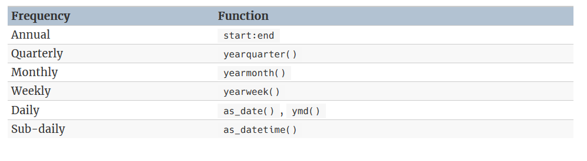

# Time series graphics  

```{r, echo = FALSE}
knitr::opts_chunk$set(cache = TRUE)
```


## `tsibble` objects  

```{r}
library(tsibble)
library(tsibbledata)
library(feasts) 
library(lubridate)
library(patchwork)
```

```{r}
x <- tsibble(Year = 2015:2019, Observation = c(123, 39, 78, 52, 110), 
             index = Year)

x
```


Multiple time series, `key`:  

```{r}
olympic_running
```

`key` must be specified in one of the following form:  

```{r, echo = FALSE}

```


### manipulation  

tidyverse-based manipulation

```{r}
PBS

PBS %>%
  filter(ATC2 == "A10")

# index column is automatically selected
PBS %>%
  filter(ATC2=="A10") %>%
  select(Concession, Type, ATC1)
```

All key variable must be explicitly selected, that means we must at least select `Concession` and `Type` in the case above, since `ATC2` and `ATC1` are no longer `key` variables after `filter(ATC == "A10")`

```{r}
PBS %>% 
    filter(ATC2 == "A10") %>% 
    as_tibble() %>% 
    count(Concession, Type, ATC1)
```

As to `summarize()`, `index` is automatically used as the grouping variable:  

```{r}
PBS %>%
  filter(ATC2 == "A10") %>%
  select(Month, Concession, Type, Cost) %>%
  summarise(total_cost = sum(Cost))
```

The  `mutate()`, here we change the units from dollars to millions of dollars:
```{r}
PBS %>%
  filter(ATC2 == "A10") %>%
  select(Month, Concession, Type, Cost) %>%
  summarise(total_cost = sum(Cost)) %>%
  mutate(cost = total_cost / 1e6) -> a10

a10
```

### importing  

```{r}
prison <- vroom::vroom("https://OTexts.com/fpp3/extrafiles/prison_population.csv")

prison <-  prison %>%
  mutate(quarter = yearquarter(date)) %>%
  select(-date) %>%
  as_tsibble(key = c(state, gender, legal, indigenous), index = quarter)

prison
```

## Time plots  

```{r}
(melsyd_economy <- ansett %>%
  filter(Airports == "MEL-SYD", Class == "Economy"))

melsyd_economy %>%
  autoplot(Passengers) +
  labs(title = "Ansett economy class passengers", subtitle = "Melbourne-Sydney") +
  xlab("Year")
```

`autoplot()` automatically produces an appropriate plot of whatever you pass to it in the first argument.  
When there are multiple time series in a `tsibble()`, they are plotted separately:  

```{r, cache = TRUE}
olympic_running %>% autoplot(.vars = Time)
```


## Patterns of time series: trend, seasonal and cyclic

**Trend**:  
    A trend exists when there is a *long-term* increase or decrease in the data. It does not have to be linear. Sometimes we will refer to a trend as “changing direction”, when it might go from an increasing trend to a decreasing trend.    
    
**Seasonal**:  
    A seasonal pattern occurs when a time series is affected by seasonal factors such as the time of the year or the day of the week. Seasonality is always of a *fixed and known period*(within a season, a year, etc.).
    
**Cyclic**:  
    A cycle occurs when the data exhibit rises and falls that are *not of a fixed frequency*. These fluctuations are usually due to economic conditions, and are often related to the “business cycle”. The duration of these fluctuations is usually at least 2 years.   
    
    
> Many people confuse cyclic behaviour with seasonal behaviour, but they are really quite different. If the fluctuations are not of a fixed frequency then they are cyclic; if the frequency is unchanging and associated with some aspect of the calendar, then the pattern is seasonal. In general, the average length of cycles is longer than the length of a seasonal pattern, and the magnitudes of cycles tend to be more variable than the magnitudes of seasonal patterns.  

(As we will see soon, `gg_season()` provides a useful tool in distinguishing between seasonal and cyclic patterns.)

It's crucial to first identify the time series patterns in the data, and then choose a method that is able to capture the patterns properly.  

An example of combined patterns: 

```{r, echo = FALSE}
knitr::include_graphics("images/patterns.png")
```


* topleft: storng seasonality, cyclic period in 6 - 10 years, no trend  
* topright: decreasing trend, no trend or cyclic
* bottomleft: increasing trend, seasonality (perhaps on a yearly basis?) 
* bottomright: random fluctuation  

## Seasonal plots  

A seasonal plot is similar to a time plot except that the data are plotted against the individual “seasons” in which the data were observed. A seasonal plot allows the underlying seasonal pattern to be seen more clearly, and is especially useful in identifying years in which the pattern changes.

```{r}
# y can be automatically chosen
a10 %>% gg_season(y = cost, labels = "both") +
  ylab("$ million") +
  ggtitle("Seasonal plot: antidiabetic drug sales") 
```

Here `labels = "both"` means labels of years are displayed on both sides of the plot.  

In this case, it is clear that there is a plummet in sales in January each year. And there is an aberrant decrease in March 2008, since most years would see an increase from Feb to Mar.  


A way to reproduce the plot generated by `gg_season()`:  

```{r}
a10 %>%
  mutate(month = month(Month),
         year = year(Month)) %>%  # accessor function from lubridate package
  as_tibble() %>%
  group_by(year, month) %>% 
  summarize(cost = sum(cost)) %>% 
  ggplot() + 
  geom_line(aes(month, cost, color = year, group = year))
```

### Multiple seasonal periods: `period` in `gg_season()`  

Where the data has more than one seasonal pattern, the `period` argument can be used to select which seasonal plot is required. The `vic_elec` data contains half-hourly electricity demand for the state of Victoria, Australia. We can plot the daily pattern, weekly pattern or yearly pattern as follows.

daily:   
```{r, cache = TRUE}
vic_elec %>% gg_season(period = "day")
```

weekly: 

```{r, cache = TRUE}
vic_elec %>% gg_season(period = "week")
```

yearly: 
```{r, cache = TRUE}
# this plot in fact contains 4 lines
vic_elec %>%
  gg_season(period = "year") + 
  theme(legend.position = "top")
```

Different from `autoplot()`, when `gg_season()` and the `gg_subseries()` (later introduced) encounter multiple time series, they are displayed in facets. 


##  Seasonal subseries plots  
An alternative plot that emphasises the seasonal patterns is where the data for each season are collected together by facet.  

```{r}
a10 %>%
  gg_subseries(cost) +
    ylab("$ million") +
    xlab("Year") +
    ggtitle("Seasonal subseries plot: antidiabetic drug sales")
```

**The blue horizontal lines indicate the means for each month**. This form of plot enables the underlying seasonal pattern to be seen clearly, and also shows the changes in seasonality over time. It is especially useful in identifying changes within particular seasons. In this example, the plot is not particularly revealing; but in some cases, this is the most useful way of viewing seasonal changes over time.  

### Example: Australian holiday tourism  

`holiday_tourism` contains holiday tourists from 1998 to 2017, deaggregated by `Region`, `State`:  

```{r}
holiday_tourism <- tourism %>% 
  filter(Purpose == "Holiday") %>%
  select(-Purpose)

holiday_tourism 
```

Then we can get total visitors by states(i.e., ignoring regions), and then plot it using `autoplot()`, note this is a multiple time series:  

```{r}
holidays <- holiday_tourism %>%
  group_by(State) %>% # no nedd to specify group_by(Quarter, Region)
  count(wt = Trips, name = "trips") %>%
  ungroup()

holidays %>%  
  autoplot() +
  ylab("thousands of trips") + xlab("Year") +
  ggtitle("Australian domestic holiday nights")
```

Time plots of each series shows that there is strong seasonality for most states, but that the seasonal peaks do not coincide.   

To see the timing of the seasonal peaks in each state, we can use a season plot.

```{r, cache = TRUE, fig.height = 10, fig.width = 7.5}
holidays %>% 
  gg_season(trips) +
  ylab("thousands of trips") +
  ggtitle("Australian domestic holiday nights")
```

Here it is clear that the southern states of Australia (Tasmania, Victoria and South Australia) have strongest tourism in Q1 (their summer), while the northern states (Queensland and the Northern Territory) have the strongest tourism in Q3 (their dry season).  

The corresponding subseries plots are shown below:  

```{r, fig.height = 8, fig.width = 8, cache = TRUE}
holidays %>%
  gg_subseries(trips) + 
  ylab("thousands of trips") +
  ggtitle("Australian domestic holiday nights")
```

This figure makes it evident that Western Australian tourism has jumped markedly in recent years, while Victorian tourism has increased in Q1 and Q4 but not in the middle of the year.

## Visualization between time series  

While `autoplot()`, `gg_season()` and `gg_subseries()` is instrumental in visualizing individual time series, it is also useful to explore relationships between time series.   

`vic_elec` half-hourly electricity `Demand` (in Gigawatts) and `Temperature` (in degrees Celsius), for 2014 in Victoria, Australia. The temperatures are for Melbourne, the largest city in Victoria, while the demand values are for the entire state. Addition to draw two separate time series, we can make a scatter plot to see relationship between the two:   

```{r, cache = TRUE}
library(ggpointdensity)
vic_elec %>% 
  ggplot() + 
  geom_pointdensity(aes(Demand, Temperature)) + 
  scale_color_viridis_c()
```

### scatterplot matrices  

When there are several potential predictor variables, it is useful to plot each variable against each other variable. Consider the eight time series shown below, showing quarterly visitor numbers across states and territories of Australia.

```{r, fig.height = 7.5, fig.width = 8, cache = TRUE}
visitors <- tourism %>%
  group_by(State) %>%
  summarise(trips = sum(Trips))
visitors %>%
  ggplot(aes(x = Quarter, y = trips)) +
    geom_line() +
    facet_grid(vars(State), scales = "free_y") +
    ylab("Number of visitor nights each quarter (millions)")
```
To better illustrate how number of visitors in different states are related, we could draw a scatterplot matrix by `GGally；:ggpairs()`

```{r, fig.width = 8, fig.height = 7}
library(GGally)
visitors %>%
  pivot_wider(names_from = State, values_from = trips) %>% 
  ggpairs(columns = 2:9)
```

## Lag plots  

Lag plot is another useful tool in discerning seaonality, which display $y_t$ against $y_{t-k}$ in a time series, $k$ being a constant for each individual plot.  

Here we use the Australian beer production data to make a lag plot, in `gg_lag()`, `lags` determines different values of $k$ displayed (defaults to `1:9`) and `geom` types of geometry:  

```{r, cache = TRUE}
recent_production <- aus_production %>%
  filter(year(Quarter) >= 1992)

recent_production %>%
  gg_lag(y = Beer, lags = 1:9, geom = "point")
```

It's no surprise that strong relationship is detected for $k = 4$ and $k = 8$, since in these 2 panels data points are collected from the same quarter, and from this pattern strong seasonality of beer production can be found.    

### Autocorrelation

Just as correlation measures the extent of a linear relationship between two variables, autocorrelation measures the linear relationship between lagged values of a time series. 


There are several autocorrelation coefficients, corresponding to each panel in the lag plot. For example, $r_1$ measures the relationship between $y_t$ and $y_{t−1}$, $r_2$ measures the relationship between $y_t$ and $y_{t−2}$ and so on.  

As correlation coefficient (pearson) is defined as: 

$$
r_{x, y} = \frac{\sum{(x_t - \bar{x})(y_t - \bar{y})}}{\sqrt{\sum{(x_t - \bar{x}})^2} \times {\sqrt{\sum{(y_t - \bar{y}})^2}}}
$$

given $x_t = y_t$ and $y_t = y_{t-k}$ we get the autocorrelation coefficient: 

$$
r_k = r_{y_t,y_{t-k}} = \frac{\sum{(y_t - \bar{y})(y_{t-k} - \bar{y})}}{\sum{(y_t - \bar{y})^2}}
$$

The autocorrelation coefficients make up the *autocorrelation function* or **ACF**.  

The autocorrelation coefficients for the beer production data can be computed using the `ACF(.data, lag_max)` function, with `lag_max` defaulting to $10 \times \log{\frac{N}{M}}$ where $N$ is the number of observations and $M$ the number of series..  

```{r}
recent_production %>% ACF(Beer)
```


Similarly, the `ACF()` result could be plotted by `autoplot()`, which is oftern referred to as **correlogram**:     

```{r}
recent_production %>% 
  ACF(Beer) %>%
  autoplot()
```


In this graph:

* $r_4$ is higher than for the other lags. This is due to the seasonal pattern in the data: the peaks tend to be four quarters apart and the troughs tend to be four quarters apart.  
* $r_2$ is more negative than for the other lags because troughs tend to be two quarters behind peaks.  
* The dashed blue lines indicate whether the correlations are significantly different from zero.

This seasonal pattern could also be visualized by `gg_season()`` 
```{r, fig.show = "hold", out.width = "100%"}
recent_production %>% gg_season()
recent_production %>% gg_subseries()
```

### Trend and seasonality in ACF plots  


When data have a trend, the autocorrelations for small lags tend to be large and positive because observations nearby in time are also nearby in size. So the ACF of trended time series tend to have positive values that slowly decrease as the lags increase.

When data are seasonal, the autocorrelations will be larger for the seasonal lags (at multiples of the seasonal frequency) than for other lags.

When data are both trended and seasonal, you see a combination of these effects, as shown below in the case of `a10`. 
```{r}
a10 %>% ACF(cost, lag_max = 48) %>% autoplot()
```


```{r}
a10 %>% autoplot()
```


Let's check with autocorrelation :  

```{r, fig.height = 8, fig.width = 7.5}
p1 <- y %>% gg_lag(geom = "point") + ggtitle("Lag plot forGaussian white noise")
p2 <- y %>% ACF() %>% autoplot() + ggtitle("ACF plot for Gaussian white noise")
p3 <- z %>% gg_lag(geom = "point") + ggtitle("Lag plot for Other white noise")
p4 <- z %>% ACF() %>% autoplot() + ggtitle("ACF plot Other white noise")

p1 + p2 + p3 + p4 
```

**For white noise series, we expect each autocorrelation to be close to zero.** Of course, they will not be exactly equal to zero as there is some random variation. For a white noise series, we expect $95%$ of the spikes in the `ACF` to lie within $±2/\sqrt{T}$ where $T$  is the length of the time series. It is common to plot these bounds on a graph of the `ACF` (the blue dashed lines above). If one or more large spikes are outside these bounds, or if substantially more than 5% of spikes are outside these bounds, then the series is probably not white noise.

In this example, $T = 50$ and so the bounds are at $±2/\sqrt{50} = \pm 0.28$. All of the autocorrelation coefficients lie within these limits, confirming that the data are white noise.    

## Calendar plots

```{r}
# remotes::install_github("earowang/sugrrants")
library(sugrrants)
```

## TSstudio
