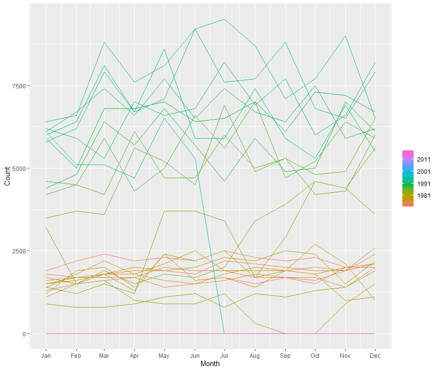

# Time series decomposition

```{r}
library(tsibble)
library(tsibbledata)
library(fable)
library(feasts)
library(lubridate)
```

```{r}
print_retail <- aus_retail %>%
  filter(Industry == "Newspaper and book retailing") %>%
  index_by(Year = year(Month)) %>%
  summarise(Turnover = sum(Turnover))

aus_economy <- global_economy %>%
  filter(Code == "AUS")
```


```{r, cache = TRUE}
print_retail %>%
  left_join(aus_economy, by = "Year") %>% 
  mutate(Turnover_adj = Turnover / CPI) %>%
  pivot_longer(c(Turnover, Turnover_adj), 
               names_to = "type", values_to = "Turnover") %>%
  ggplot() + 
  geom_line(aes(Year, Turnover)) + 
  facet_wrap(~ type, scales = "free_y")
```


## Moving averages  

A moving average of order $m$ can be written as:  

$$
\bar{T}_t = \frac{1}{m}\sum_{j = -k}^{k}{y_{t+j}}
$$ 
$m = 2k + 1$

For example, a moving average of order 5 will select a data point, takes 2 points before it and 2 points after it and compute the average of these 5 points.  

In practice, for top or bottom observations where are no value in either the first or last $(m - 1) / 2$ position, the original value will be used to avoid `NULL` for border observations. To suppress this behaviour, use `.complete = TRUE` in `slide_` functions.  

```{r}
library(slider)
slide(1:5, ~ mean(.x), .before = 2, .after = 2)
slide(1:5, ~ mean(.x), .before = 2, .after = 2, .complete = TRUE)
```


In the book `slide_` functions from `tsibble` packaege are used to do sliding window calculation, which will be superseded by the `slider` package in the future. For this reason I will try to make some replacements whenever there is a need for sliding window functions

```{r}
library(slider)
aus_exports <- global_economy %>%
  filter(Country == "Australia") %>%
  mutate(
    `5-MA` = slide_dbl(Exports, ~ mean(.x), .before = 2, .after = 2)
  ) %>%
  pivot_longer(c(Exports, `5-MA`), names_to = "type", values_to = "Export")

aus_exports %>%
  ggplot(aes(Year, Export, color = type)) +
  geom_line() + 
  scale_color_manual(values = c("red", "black"))
```

Notice that the trend-cycle (in <span style="color: red;">red</span>) is smoother than the original data and captures the main movement of the time series without all of the minor fluctuations. The order of the moving average determines the smoothness of the trend-cycle estimate. In general, a larger order means a smoother curve. Figure below shows the effect of changing the order of the moving average for the Australian exports data.  

```{r, echo = FALSE}
knitr::include_graphics("images/ma.png")
```

Simple moving averages such as these are usually of an odd order (e.g., $3$, $5$, $7$, etc.). This is so they are symmetric: in a moving average of order $m = 2k + 1$, the middle observation, and $k$ observations on either side, are averaged. But if m was even, it would no longer be symmetric.  

### Moving averages of moving averages   

When $m$ is even, we could still compute a $m-MA$ though losing symmetry. A $4-MA$ can be defined as :  

$$
\hat{T}_t = \frac{1}{4}(y_{t-1} + y_t + y_{t+1} + y_{t+2})
$$

**It is possible to apply a moving average to a moving average. One reason for doing this is to make an even-order moving average symmetric.**

For example, we might take a moving average of order $4$, and then apply another moving average of order $2$ to the results. And the final result, $2\times 4 -MA$ can be written as:  

$$
\begin{align}
\hat{T}_t &= \frac{1}{2}[
                        \frac{1}{4}(
                          y_{t-2} + 
                          y_{t-1} + 
                          y_t + 
                          y_{t+1}) + 
                        \frac{1}{4}(y_{t-1} + 
                          y_{t} + 
                          y_{t + 1} + 
                          y_{t+2})] \\
          &= \frac{1}{8}y_{t-2} + 
             \frac{1}{4}y_{t-1} +  
             \frac{1}{4}y_{t} + 
             \frac{1}{4}y_{t+1} + 
             \frac{1}{8}y_{t+2}
\end{align}
$$

Now we can see that $2\times 4 -MA$ is an **weighted average** of 5 values centered on $y_t$, and is symmetric.  

Other combinations of moving averages are also possible. For example, a $3 \times 3-MA$ is often used, and consists of a moving average of order $3$ followed by another moving average of order $3$. **In general, an even order MA should be followed by an even order MA to make it symmetric.** Similarly, an odd order MA should be followed by an odd order $MA$.

In general, a $2×m-MA$ is equivalent to a weighted moving average of order $m+1$ where all observations take the weight $1/m$, except for the first and last terms which take weights $1/(2m)$

### Estimating the trend-cycle component with seasonal data

The most common use of centred moving averages is for estimating the trend-cycle from seasonal data. Consider the $2\times 4- MA$:   
$$
\hat{T}_t = \frac{1}{8}y_{t-2} + 
            \frac{1}{4}y_{t-1} +  
            \frac{1}{4}y_{t} + 
            \frac{1}{4}y_{t+1} + 
            \frac{1}{8}y_{t+2}
$$
When applied to quarterly data, each quarter of the year is given equal weight as the first and last terms apply to the same quarter in consecutive years. Consequently, the seasonal variation will be averaged out and the resulting values of $\hat{T}_t$ will have little or no seasonal variation remaining. A similar effect would be obtained using a $2×8-MA$ or a $2×12-MA$ to quarterly data.

As is noted above, a $2×m-MA$ is equivalent to a weighted $m + 1 -MA$, which handles a $m$ seasonal period when $m$ is even. **So, if the seasonal period is even and of order $m$, we use a $2×m-MA$ to estimate the trend-cycle. If the seasonal period is odd and of order $m$, we use a $m-MA$ to estimate the trend-cycle.**

In `aus_livestock` data we can see some sort of seasonality:  

```r
aus_livestock %>%
  filter(Animal == "Pigs", State == "Australian Capital Territory") %>%
  gg_season()
```
```{r, echo = FALSE}

```


Since it is collected monthly, we can use a $2\times12-MA$ to average out the seasonality:  

```{r, cache = TRUE}
capital_livestock_ma <- aus_livestock %>% 
  filter(Animal == "Pigs", State == "Australian Capital Territory") %>%
  mutate(`2-MA` = slide_dbl(Count, ~ mean(.x), .before = 1),
         `12x2-MA` = slide_dbl(`2-MA`, ~ mean(.x), .before = 5, .after = 6)) %>% 
  select(-`2-MA`) %>% 
  pivot_longer(4:5, names_to = "type", values_to = "count")

capital_livestock_ma %>% 
  ggplot(aes(Month, count, color = type)) + 
  geom_line() + 
  scale_color_manual(values = c("red", "gray"))
```


### Weighted moving averages  

Combinations of moving averages result in weighted moving averages. For example, the $2\times4-MA$ discussed above is equivalent to a weighted $5-MA$ with weights given by $[\frac{1}{8},\frac{1}{4},\frac{1}{4},\frac{1}{4},\frac{1}{8}]$. In general, a weighted $m-MA$ can be written as   

$$
\hat{T}_t = \sum_{j = -k}^{k}{a_jy_{t+j}}
$$

where $m = 2k + 1$. It is important that the weights all sum to one and that they are symmetric so that $a_j=a_{−j}$. The simple $m-MA$ is a special case where all of the weights are equal to $1/m$.  

A major advantage of weighted moving averages is that they yield a smoother estimate of the trend-cycle. Instead of observations entering and leaving the calculation at full weight, their weights slowly increase and then slowly decrease, resulting in a smoother curve.


## Classical decomposition  

```{r}
us_retail_employment <- fpp3::us_employment %>%
  filter(year(Month) >= 1990, Title == "Retail Trade") %>%
  select(-Series_ID)
```

```{r, cache = TRUE}
classical_dcmp <- us_retail_employment %>% 
  model(classical = feasts:::classical_decomposition(Employed, type = "additive")) %>%
  components()

classical_dcmp %>% autoplot()
```


## X11 decomposition 

Only monthly and quarterly.  


`feasts:::X11(Employed, type = "additive")` makes specifications about a X11 additive model, and `model()` were called to estimate it, and `components()` gives $\hat{T}_t$, $\hat{S}_t$ and $\hat{R}_t$ for each observation.  

```{r, cache = TRUE}
x11_dcmp <- us_retail_employment %>%
  model(x11 = feasts:::X11(Employed, type = "additive")) %>% 
  components()

x11_dcmp
```

Note that observations at top (and bottom) now have valid `trend` estimate and therefore `seasonal`, `irregular` and `seasonal_adjust` are no longer `NA`.  

Next plot shows the trend-cycle component and the seasonally adjusted data, along with the original data.

```{r, fig.width = 9} 
x11_dcmp %>%
  ggplot(aes(x = Month)) +
  geom_line(aes(y = Employed, colour = "Data")) +
  geom_line(aes(y = season_adjust, colour = "Seasonally Adjusted")) +
  geom_line(aes(y = trend, colour = "Trend")) +
  xlab("Year") + ylab("Persons (thousands)") +
  ggtitle("Total employment in US retail") +
  scale_colour_manual(values = c("gray","blue","red"),
             breaks = c("Data","Seasonally Adjusted","Trend"))
```


```{r, cahce = TRUE}
x11_dcmp %>% autoplot()
```


It can be useful to use seasonal plots and seasonal sub-series plots of the seasonal component. These help us to visualise the variation in the seasonal component over time. In this case, there are only small changes over time.  

```{r, cache = TRUE}
x11_dcmp %>%
  gg_subseries(seasonal)
```


To campare these x11 and classical model, we can specify multiple models in `models`, this plot shows that the estimated seasonal effect of x11 model have deviated a bit in the recent decade and that the classical model are truncated on both sides, though this two models may not practically have a meaningful difference in this case.  

```{r, cache = TRUE, fig.height = 8, fig.width = 9}
us_retail_employment %>% 
    model(classical = feasts:::classical_decomposition(Employed, type = "additive"),
          x11 = feasts:::X11(Employed, type = "additive")) %>% 
    components() %>%  
    autoplot()
```

## SEATS decomposition  


The procedure works only with quarterly and monthly data. So seasonality of other kinds, such as daily data, or hourly data, or weekly data, require an alternative approach.    

Only monthly and quarterly.  

```{r, cache = TRUE}
seats_dcmp <- us_retail_employment %>% 
  model(seats = feasts:::SEATS(Employed)) %>% 
  components()

seats_dcmp %>% 
  autoplot() + 
  ggtitle("SEATS decomposition of total US retail employment")
```

## STL decomposition  

STL is a versatile and robust method for decomposing time series. STL is an acronym for “Seasonal and Trend decomposition using Loess”, while Loess is a method for estimating nonlinear relationships.  

STL has several advantages over the classical, SEATS and X11 decomposition methods:

* Unlike SEATS and X11, STL will handle any type of seasonality, not only monthly and quarterly data.  
* The seasonal component is allowed to change over time, and the rate of change can be controlled by the user.  
* The smoothness of the trend-cycle can also be controlled by the user.  
* It can be robust to outliers (i.e., the user can specify a robust decomposition), so that occasional unusual observations will not affect the estimates of the trend-cycle and seasonal components. They will, however, affect the remainder component.  

```{r}
us_retail_employment %>%
  model(STL(
    Employed ~ trend(window = 7) + season(window = Inf), robust = TRUE)) %>%
  components() %>%
  autoplot()
```


## Exercises  

