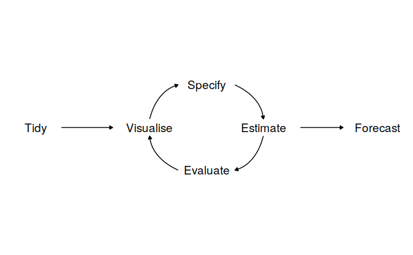
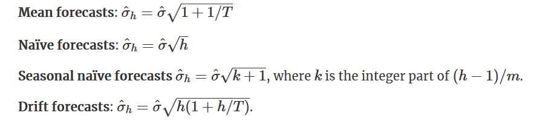

# The forecaster's toolbox   

```{r}
library(tsibble)
library(tsibbledata)
library(fable)
library(feasts)
library(lubridate)
library(patchwork)
```


## A tidy forecasting workflow  

```{r, echo = FALSE}
knitr::opts_chunk$set(cache = TRUE)
```


```{r, echo = FALSE}

```


### Data preparation (tidy)  

Simplified by `tidyverse` and `tsibble`

### Visualize   

```{r}
global_economy %>%
  filter(Country == "Sweden") %>%
  autoplot(GDP) +
  scale_y_continuous(labels = scales::label_number_si()) + 
  ggtitle("GDP for Sweden") + ylab("$US billions")
```

### Define a model (specify)  

A model defination  

```{r}
TSLM(GDP ~ trend())
```

`TSLM()` specifies a time series linear model, discussed more in \@ref(time-series-regression-models).  

Similar to `tidymodels` where we specify a linear model for regression: 

```{r}
library(parsnip)
linear_reg() %>% 
  set_engine("lm") %>% 
  set_mode("regression")
```

### Train the model (estimate)  

```{r}
ge_fit <- global_economy %>% 
  model(trend_model = TSLM(GDP ~ trend()))

ge_fit
```

### Check model performance (evaluate)  

More discussed in \@ref(evaluating-model-accuracy)


### Produce forecasts (forecast)  

`forecast()` similar to `predict()`: 

```{r}
ge_forecast <- ge_fit %>% 
  forecast(h = "3 years") # h means horizon

ge_forecast
```

Here ourl trend model consists of only a trend variable ${1, 2, \dots, T}$, which can be known in advance when producing forecasts. In this case `forecast()` only needs `h` for a forecast horizon. There are also cases when we need to specify the `new_data` argument, which will be a  `tsibble` containing future information used to forecast.

```{r}
ge_forecast %>% 
  filter(Country == "Sweden") %>% 
  autoplot(global_economy) + 
  scale_y_continuous(labels = scales::label_number_si()) + 
  ggtitle("GDP for Sweden")
```

## Some simple forecasting methods  

Some forecasting methods are extremely simple and surprisingly effective. We will use four simple forecasting methods as benchmarks throughout this book.

To illustrate them, we will use quarterly Australian clay brick production between 1970 and 2004.  

```{r}
bricks <- aus_production %>% filter_index("1970" ~ "2004")
bricks
```

### Mean method  

Here, the forecasts of **all future values** are equal to the **average** (or “mean”) of the historical data. If we let the historical data be denoted by $y_1,…,y_T$, then we can write the forecasts as 

$$
\hat{y}_{T+H | T} = \frac{1}{T}\sum_{1}^{T}{y_t}
$$

`MEAN()` specifies an average model:  

```{r}
bricks %>% 
  model(MEAN(Bricks)) %>% 
  forecast(h = "5 years") %>% 
  autoplot(bricks)
```

### Naive method

For naive forecasts, we simply set **all forecasts** to be the value of the **last observation**. That is,   

$$
\hat{y}_{T+H | T} = y_T
$$ 

This method works remarkably well for many economic and financial time series. 
 
Because a naive forecast is optimal when data follow a random walk (see Section \@ref(stationarity)), these are also called **random walk** forecasts.   

`NAIVE()` specifies a naive model:  

```{r, message = TRUE}
bricks %>% 
  model(NAIVE(Bricks)) %>% 
  forecast(h = "5 years") %>% 
  autoplot(bricks)
```

### Seasonal naive method  

Seasonal naïve method

A similar method is useful for highly seasonal data. In this case, we set each forecast to be equal to the last observed value from the same season of the year (e.g., the same month of the previous year). Formally, the forecast for time $T+h$ is written as 

$$
\hat{y}_{T+H | T} = y_{T + H - m(k + 1)}
$$

where $m$ is for seaonsal period (e.g., 12 for monthly data, 4 for quarterly data), and $k$ is the interger part of $(h - 1) / m$  

```{r}
bricks %>% 
  model(SNAIVE(Bricks ~ lag("year"))) %>% 
  forecast(h = "5 years") %>% 
  autoplot(bricks, level = NULL)
```


The `lag()` function is optional here as bricks is monthly data and so a seasonal naïve model will need a one-year lag. However, for some time series there is more than one seasonal period, and then the required lag must be specified.  


### Drift method  

A variation on the naive method is to allow the forecasts to increase or decrease over time, where the amount of change over time (called the **drift**, which is the slope of the line between the first and last obeservation) is set to be the average change seen in the historical data. Thus the forecast for time T+h is given by:  


$$
y_{T+h} - y_{T} = \frac{y_{T} - y_1}{T - 1}[(T + h) - T) 
$$

$$
y_{T+h} = y_T + h(\frac{y_{T} - y_1}{T - 1})
$$


```{r}
bricks %>% 
  model(NAIVE(Bricks ~ drift())) %>%
  forecast(h = "10 years") %>% 
  autoplot(bricks, level = NULL)
```


### Australian quarterly beer production  

```{r}
beer_fit <- aus_production %>% 
  filter_index("1992 Q1" ~ "2006 Q4") %>% 
  model(Mean = MEAN(Beer),
        naive = NAIVE(Beer),
        seasonal_naive = SNAIVE(Beer))

beer_fit %>% 
  forecast(h = 14) %>%  # 14 quarters
  autoplot(aus_production %>% filter_index("1992 Q1" ~ "2006 Q4"), level = NULL) + 
  autolayer(aus_production %>% filter_index("2007 Q1" ~ .), color = "black")
```


In this case, only the seasonal naïve forecasts are close to the observed values from 2007 onwards.


### Example: Google’s daily closing stock price  


```{r}
# Re-index based on trading days
google_stock <- gafa_stock %>%
  filter(Symbol == "GOOG") %>%
  mutate(day = row_number()) %>%
  update_tsibble(index = day, regular = TRUE)
# Filter the year of interest
google_2015 <- google_stock %>% 
  filter(year(Date) == 2015)
# Fit the models
google_fit <- google_2015 %>%
  model(
    Mean = MEAN(Close),
    naive = NAIVE(Close),
    drift = NAIVE(Close ~ drift())
  )

# Produce forecasts for the 19 trading days in January 2015
google_fc <- google_fit %>% forecast(h = 19)
# A better way using a tsibble to determine the forecast horizons
google_jan_2016 <- google_stock %>%
  filter(yearmonth(Date) == yearmonth("2016 Jan"))
google_fc <- google_fit %>% forecast(google_jan_2016)

# Plot the forecasts
google_fc %>%
  autoplot(google_2015, level = NULL) +
    autolayer(google_jan_2016, Close, color='black') +
    ggtitle("Google stock (daily ending 31 Dec 2015)") +
    xlab("Day") + ylab("Closing Price (US$)") +
    guides(colour=guide_legend(title="Forecast"))
```
Sometimes one of these simple methods will be the best forecasting method available; but in many cases, **these methods will serve as benchmarks rather than the method of choice**. That is, any forecasting methods we develop will be compared to these simple methods to ensure that the new method is better than these simple alternatives. If not, the new method is not worth considering.  


## Fitted values and residuals  

Each observation in a time series can be forecast using all previous observations. We call these **fitted values** and they are denoted by $\hat{y}_{t|t−1}$, meaning the forecast of yt based on observations $y_1,\dots,y_t−1$ . We use these so often, we sometimes drop part of the subscript and just write $\hat{y}_t$ instead of $\hat{y}_{t|t−1}$. Fitted values always involve one-step forecasts.  

Actually, fitted values are often not true forecasts because any parameters involved in the forecasting method are estimated using all available observations in the time series, including future observations. For example, if we use the average method, the fitted values are given by 

$$
\hat{y}_t= \hat{c} 
$$
where $\hat{c} = \frac{1}{T}\sum_{t = 1}^{T}y_t$, meaning that it is computed across **all available observations**, including those at times after $t$. 

Similarly, for the drift method, the drift parameter is estimated using all available observations. In this case, the fitted values are given by 

$$
\hat{y}_t = y_{t-1} + \hat{c} 
$$
where $\hat{c} = \frac{y_T - y_1}{T-1}$, the "overall slope".

In both cases, there is a parameter to be estimated from the data. The “hat $\hat{}$” above the $c$ reminds us that this is an estimate. **When the estimate of $c$ involves observations after time $t$, the fitted values are not true forecasts.** On the other hand, naïve or seasonal naïve forecasts do not involve any parameters, and so fitted values are true forecasts in such cases.  

### Residuals  

$$
e_t = y_t - \hat{y}_t
$$


```{r}
augment(beer_fit)
```

## Residual diagnostics  

A good forecasting method will yield residuals with the following properties:  

1. The residuals are **uncorrelated.** If there are correlations between residuals, then there is information left in the residuals which should be used in computing forecasts.  
2. The residuals have **zero mean**(i.e., $E(e_t) = 0$. If the residuals have a mean other than zero, then the forecasts are biased.  

Any forecasting method that does not satisfy these properties can be improved. However, that does not mean that forecasting methods that satisfy these properties cannot be improved. It is possible to have several different forecasting methods for the same data set, all of which satisfy these properties. Checking these properties is important in order to see whether a method is using all of the available information, but it is not a good way to select a forecasting method.

If either of these properties is not satisfied, then the forecasting method can be modified to give better forecasts. Adjusting for bias is easy: if the residuals have mean $m$
, then simply add $m$ to all forecasts and the bias problem is solved. Fixing the correlation problem is harder, and we will not address it until Chapter 10.  

In addition to these essential properties, it is useful (but not necessary) for the residuals to also have the following two properties.

> 3. The residuals have **constant variance**.  
> 4. The residuals are **normally distributed**.

These two properties make the calculation of prediction intervals easier (see Section 5.5 for an example). However, a forecasting method that does not satisfy these properties cannot necessarily be improved. Sometimes applying a Box-Cox transformation may assist with these properties, but otherwise there is usually little that you can do to ensure that your residuals have constant variance and a normal distribution. Instead, an alternative approach to obtaining prediction intervals is necessary. Again, we will not address how to do this until later in the book.  

### White noise

A time series is (discrete) white noise if its values are (see mathematical definition in Section \@ref(ch9-white-noise)): 

1. independent
2. identically distributed with a mean of zero  

Using time series terms, a white noise should have mean 0, no autocorrelation and no seasonality.  

We often assume a more stringent form of white noise, that is **Gaussian white noise**:  

$$
\varvarepsilon_t \stackrel{iid}{\sim} N(0, \sigma^2)
$$


```{r, fig.show = "hold", out.width = "50%", fig.align = "default"}
# stimulate Guassian and other white nosie
set.seed(2020)
y <- tsibble(sample = 1:50, wn = rnorm(50), index = sample)
z <- tsibble(sample = 1:50, 
             wn = 2 * rbinom(50, size = 1, prob = 0.5) -1 , 
             index = sample)

y %>% 
  autoplot() + 
  ggtitle("Gaussian white noise")


z %>% 
  autoplot() + 
  ggtitle("Other white noise")
```

Let's check the autocorrelation of a white noise:  

```{r, fig.height = 8, fig.width = 7.5}
p1 <- y %>% gg_lag(geom = "point") + ggtitle("Lag plot forGaussian white noise")
p2 <- y %>% ACF() %>% autoplot() + ggtitle("ACF plot for Gaussian white noise")
p3 <- z %>% gg_lag(geom = "point") + ggtitle("Lag plot for Other white noise")
p4 <- z %>% ACF() %>% autoplot() + ggtitle("ACF plot Other white noise")

p1 + p2 + p3 + p4 
```

Since white noise are uncoorelated, we expect each autocorrelation coefficient of any order to be close to zero. Of course, they will not be exactly equal to zero as there is some random variation. For a white noise series, we expect $95%$ of the spikes in the `ACF` plot to lie within $±2/\sqrt{T}$ where $T$  is the length of the time series. It is common to plot these bounds on a graph of the `ACF` (the blue dashed lines above). If one or more large spikes are outside these bounds, or if substantially more than $5\%$ of spikes are outside these bounds, then the series is probably not white noise.

In this example, $T = 50$ and so the bounds are at $±2/\sqrt{50} = \pm 0.28$. All of the autocorrelation coefficients lie within these limits, confirming that the data are white noise.    

Why white noise matters? Researchers generally assume that white noise is not predictable, and contains no information related to the respose of interest. It follows that we would expect that residuals computed according to a specific model to be white noise. This means the valuable part of model extract information from the data to such an extent that we do not care what's left.   

If residuals $\varepsilon_1, \varepsilon_2, \dots, \varepsilon_t$ violates any of the rules of white noise, then there is still valuable information buried under the resiuals, which we will imporve our models to capture. We have not a 'best' model at hand until residuals become unpredictable, in other words, white noise.  

### Example: Forecasting the Google daily closing stock price  

We will continue with the Google daily closing stock price example from the previous chapter. For stock market prices and indexes, the best forecasting method is often the naïve method. That is, each forecast is simply equal to the last observed value, or $\hat{y}_t = y_{t−1}$. Hence, the residuals are simply equal to the difference between consecutive observations:   

$$
e_t = y_t - \hat{y}_t = y_t - y_{t-1} 
$$

The following graph shows the Google daily closing stock price for trading days during 2015. The large jump corresponds to 17 July 2015 when the price jumped 16% due to unexpectedly strong second quarter results.  

```{r}
google_2015 %>% autoplot(Close) +
  labs(x = "Day",
       y = "Closing Price (US$)",
       title = "Google Stock in 2015")
```


Remeber what an ideal set of residuals shoule be like: they should have mean 0 and constant variance, and behave uncorrelated. In most cases we also want residuals to be normally distributed:

```{r}
aug <- google_2015 %>% 
  model(NAIVE(Close)) %>% 
  augment()

# mean, variance
aug %>% 
  autoplot(.resid) + 
  labs(title = "Residuals from naïve method",
       x = "Day",
       y = "")

# distribution
aug %>% 
  ggplot() + 
  geom_histogram(aes(.resid))

# correlation
aug %>% 
  ACF(.resid) %>%
  autoplot()
```

Shorthand function `gg_tsresiduals()`:  

```{r}
google_2015 %>%
  model(naive = NAIVE(Close)) %>% 
  gg_tsresiduals()
```

A qq plot to detect distribution:  

```{r}
aug %>% 
  ggplot(aes(sample = .resid)) + 
  stat_qq() + 
  stat_qq_line()
```


Some useful functions for general diagonisis from the [performance](https://easystats.github.io/performance/) are mentioned in Section \@ref(the-performance-package)

### Portmanteau tests for autocorrelation  

In order to evaluate estimated time series models, it is important to know
whether the residuals of the model really have the properties of a white noise, in particular, whether they are uncorrelated. Thus, the null hypothesis to be tested is

$$
H_0 : r_k = 0, k = 1, 2, ...
$$

In order to build formal statistical tests to overcome undue reliance on ACF plots, we test whether the first $h$ autocorrelations are significantly different from what would be expected from a white noise process. A test for a group of autocorrelations is called a **portmanteau test**, from a French word describing a suitcase containing a number of items.  

One such test is the **Box-Pierce** test, based on the following statistic:  

$$
Q = T \sum_{k = 1}^{h}{r^2_k}
$$


where $h$ is the maximum lag being considered and $T$ is the number of observations. If each $r_k$ is close to zero, then $Q$ will be small. If some $r_k$ values are large (positive or negative), then $Q$ will be large. It is suggested that use $h = 10$ for non-seasonal data and $h = 2m$ for seasonal data, where $m$ is the period of seasonality. However, the test is not good when $h$ is large, so if these values are larger than $T/5$, then use $h=T/5$.  

A related (and more accurate) test is the **Ljung-Box test**, based on 

$$
Q^* = T(T + 2)\sum_{k = 1}^{h}{(T-K)^{-1}}r_k^2
$$

If the autocorrelations did come from a white noise series, then both $Q$ and $Q^*$ follows a  distribution of $\chi^2_{h - K}$ where $K$ is the number of parameters in the model. For model where there is no parameter to estimate (such as naive model), we simply set $K = 0$. For a regular time series rather than residuals that come from a particular model, we also set $K = 0$. Note that in `ljung_box()`, argument `dof` specifies `K`, rather than `h - K`  

```{r}
# lag = h and dof = K
aug %>% features(.resid, box_pierce, lag = 10, dof = 0)

aug %>% features(.resid, ljung_box, lag = 10, dof = 0)
```

For both $Q$ and $Q^∗$, the results are not significant. Thus, we can conclude that the residuals are not distinguishable from a white noise series.  

To see details of these tests, see Section \@ref(tests-for-autocorrelation-and-normality)

## Prediction intervals {#predict-interval}


A prediction interval gives an interval within which we expect $y_t$ to lie with a specified probability. For example, **assuming that the residuals are normally distributed**, a 95% prediction interval for the h-step forecast is :  

$$
y_{T+h | h} \pm 1.96\hat{\sigma}_h
$$

where $\hat{\sigma}_h$ is an estimate of the standard deviation of the h-step forecast distribution.  

More generally, a prediction interval can be written as :  


$$
y_{T+h | h} \pm c\hat{\sigma}_h
$$

where $c$ depends on the coverage probability (i.e., $Z_\alpha$ when $1 - \alpha$ means the critical level and residuals are normally distributed).  


### One-step prediction intervals  

**When forecasting one step ahead, the standard deviation of the forecast distribution is almost the same as the standard deviation of the residuals.** (In fact, the two standard deviations are identical if there are no parameters to be estimated, as is the case with the naïve method. For forecasting methods involving parameters to be estimated, the standard deviation of the forecast distribution is slightly larger than the residual standard deviation, although this difference is often ignored.)  

So for a naive model's prediction interval at $y_{T+1}$

$$
\hat{y}_{T + 1} \pm Z_\alpha\hat{\sigma}
$$

where 

$$
\hat{\sigma} = \sqrt{\frac{1}{n}\sum_{t = 1}^{T}{R_t^2}}
$$

### Multi-step prediction intervals  

A common feature of prediction intervals is that they increase in length as the forecast horizon increases. The further ahead we forecast, the more uncertainty is associated with the forecast, and thus the wider the prediction intervals. That is, σh usually increases with $h$ (although there are some non-linear forecasting methods that do not have this property).

To produce a prediction interval, it is necessary to have an estimate of $\sigma_h$
. As already noted, for one-step forecasts ($h = 1$), the residual standard deviation provides a good estimate of the forecast standard deviation $\sigma_1$. For multi-step forecasts, a more complicated method of calculation is required. **These calculations assume that the residuals are uncorrelated**.  

For the **four benchmark methods**, it is possible to mathematically derive the forecast standard deviation under the assumption of uncorrelated residuals. If $\sigma_h$ denotes the standard deviation of the h-step forecast distribution, and $\hat{\sigma}$ is the residual standard deviation, then we can use the following expressions.  

```{r, echo = FALSE}

```

Note that when $h = 1$ and T is large, these all give the same approximate value $\hat{\sigma}$.

Prediction intervals can easily be computed for you when using the fable package. For example, here is the output when using the naïve method for the Google stock price.  


```{r}
google_2015 %>%
  model(NAIVE(Close)) %>%
  forecast(h = 10) %>%
  hilo(level = 95) %>% 
  unnest(`95%`)
```


The `hilo()` function converts the forecast distributions into intervals. By default, 80% and 95% prediction intervals are returned, here I aks only for a 95% interval via the `level` argument.  

### Prediction intervals from bootstrapped residuals  

Assuming future errors will be similar to past errors, we can replace $e_{T+1}, e_{T+2}, \dots$ by sampling from the collection of errors we have seen in the past (i.e., the residuals). Thus we could get "future" $y_{T+1}, y_{T+2}, \dots$ by $\hat{y}_{T+1} + e_{T+1}, \hat{y}_{T+2} + e_{T+2}, \dots$.  

Since sampling could generate different sets of future residuals, we thus get different paths of $y_{T+1}, y_{T+2}, \dots$. And we can then derive the $1 - \alpha$ prediction interval simply by calculating a correspoing percentile based on each $\hat{y}_{T+1}, \hat{y}_{T+2}, \dots$ and numerous simulated path.  

`generate()` lets us see some possible futures:  

```{r}
google_fit <- google_2015 %>% 
  model(NAIVE(Close))

sim <- google_fit %>% 
  generate(h = 30, times = 5, bootstrap = TRUE) 

sim
```
Here we have generated five possible sample paths for the next 30 trading days. The `.rep` variable provides a new key for the tsibble. The plot below shows the five sample paths along with the historical data.  

```{r}
ggplot(google_2015) + 
  geom_line(aes(day, Close)) + 
  geom_line(aes(day, .sim, color = factor(.rep)), data = sim) + 
  ggtitle("Google closing stock price") +
  guides(col = FALSE)
```


This is all built into the `forecast()` function so we do not need to call generate() directly:  

```{r}
google_bootstrap_fc <- google_fit %>% forecast(h = 30, bootstrap = TRUE)
google_bootstrap_fc
```


Notice that the forecast distribution is now represented as a simulation with **5000 sample paths**. Because there is no normality assumption, the prediction intervals are not symmetric.  

```{r}
google_bootstrap_fc %>% 
  autoplot(google_2015) + 
  ggtitle("Bootstrapped prediction interval")
```


## Evaluating model accuracy  

### Forecast errors 

$$
e_{T+h} = y_{T+h} - \hat{y}_{T+h | T}
$$

where ${y_1\, \dots, y_T}$ is the traing set and ${y_{T+1}, y_{T+2}\dots}$ the testing set.  


### Scale dependent errors 

The two most commonly used scale-dependent measures are based on the absolute errors or squared errors:   

$$
\begin{align}
Mean \,absolute \,error: MAE &= mean(|e_t|) \\
Root \,square \,mean \,error: RMSE &= \sqrt{mean(e_t^2)} \\
\end{align}
$$


### Percentage errors 

The percentage error is given by $p_t = 100e_t/y_t$. Percentage errors have the advantage of being **unit-free**, and so are frequently used to compare forecast performances between data sets. The most commonly used measure is: 

$$
Mean \,absolute \,error: MAE = mean(|p_t|)
$$
Measures based on percentage errors have the disadvantage of being infinite or undefined if $y_t = 0$ for any $t$ in the period of interest, and having extreme values if any $y_t$ is close to zero. **Another problem with percentage errors that is often overlooked is that they assume the unit of measurement has a meaningful zero**. For example, a percentage error makes no sense when measuring the accuracy of temperature forecasts on either the Fahrenheit or Celsius scales, because temperature has an arbitrary zero point. They also have the disadvantage that they put a heavier penalty on negative errors than on positive errors.   

This observation led to the use of the so-called “symmetric” MAPE (sMAPE) which was used in the M3 forecasting competition. It is defined by 

$$
sMAPE = mean(200|y_t - \hat{y}_t| / (y_t + \hat{y}_t))
$$

However, if $y_t$ is close to zero, $\hat{y}_t$ is also likely to be close to zero. Thus, the measure still involves division by a number close to zero, making the calculation unstable. Also, the value of sMAPE can be negative, so it is not really a measure of “absolute percentage errors” at all.

Hyndman & Koehler [-@hyndman2006another] recommend that the sMAPE not be used. It is included here only because it is widely used, although it is not used in this book.

### Scaled errors 

Scaled errors were proposed by Hyndman & Koehler as an alternative to using percentage errors when comparing forecast accuracy across series with different units. They proposed scaling the errors based on the *training* MAE from a simple forecast method.  

For a non-seasonal time series, a useful way to define a scaled error uses naive forecasts:   

$$
q_j = \frac{e_j}{\frac{1}{T-1}\sum_{t = 2}^{T}{|y_t - y_{t-1}|}}
$$


Because the numerator and denominator both involve values on the scale of the original data, $q_j$ is independent of the scale of the data. A scaled error is less than one if it arises from a better forecast than the average naive forecast computed on the training data. Conversely, it is greater than one if the forecast is worse than the average naive forecast computed on the training data.

For seasonal time series, a scaled error can be defined using seasonal naive forecasts:   

$$
q_j = \frac{e_j}{\frac{1}{T-m}\sum_{t = m+1}^{T}{|y_t - y_{t-m}|}}
$$


The *mean absolute scaled error* is simply  

$$
MASE = mean(|q_j|)
$$


### Examples: beer production 

```{r}
recent_production <- aus_production %>% filter(year(Quarter) >= 1992)
beer_train <- recent_production %>% filter(year(Quarter) <= 2007)

beer_fit <- beer_train %>%
  model(
    Mean = MEAN(Beer),
    `Naïve` = NAIVE(Beer),
    `Seasonal naïve` = SNAIVE(Beer),
    Drift = RW(Beer ~ drift())
  )

beer_fc <- beer_fit %>%
  forecast(h = 10)

beer_fc %>%
  autoplot(filter(aus_production, year(Quarter) >= 1992), level = NULL) +
  xlab("Year") + ylab("Megalitres") +
  ggtitle("Forecasts for quarterly beer production") +
  guides(colour=guide_legend(title = "Models"))
```


```{r}
accuracy(beer_fc, recent_production)
```

It is obvious from the graph that the seasonal naïve method is best for these data, although it can still be improved, as we will discover later. Sometimes, different accuracy measures will lead to different results as to which forecast method is best. However, in this case, all of the results point to the seasonal naïve method as the best of these three methods for this data set.

To take a non-seasonal example, consider the Google stock price. The following graph shows the closing stock prices from 2015, along with forecasts for January 2016 obtained from three different methods.  

```{r}
google_fit <- google_2015 %>%
  model(
    Mean = MEAN(Close),
    `Naïve` = NAIVE(Close),
    Drift = RW(Close ~ drift())
  )

google_jan_2016 <- google_stock %>%
  filter(yearmonth(Date) == yearmonth("2016 Jan"))

google_fc <- google_fit %>%
  forecast(google_jan_2016)

google_fc %>% 
  autoplot(rbind(google_2015, google_jan_2016), level = NULL) +
  ggtitle("Google stock price (daily ending 6 Dec 13)") +
  guides(colour=guide_legend(title="Forecast"))

```
Check model accuracy

```{r}
accuracy(google_fc, google_stock)
```

Here, the best method is the naïve method (regardless of which accuracy measure is used).

## Time series cross-validation    

> A more sophisticated version of training/test sets is time series cross-validation. In this procedure, there are a series of test sets, each consisting of a single observation. The corresponding training set consists only of observations that occurred prior to the observation that forms the test set. Thus, no future observations can be used in constructing the forecast. Since it is not possible to obtain a reliable forecast based on a small training set, the earliest observations are not considered as test sets.

```{r, echo = FALSE}
knitr::include_graphics("images/cv.png")
```

The forecast accuracy is computed by averaging over the test sets. 

With time series forecasting, one-step forecasts may not be as relevant as multi-step forecasts. In this case, the cross-validation procedure based on a rolling forecasting origin can be modified to allow multi-step errors to be used. Suppose that we are interested in models that produce good 4-step-ahead forecasts. Then the corresponding diagram is shown below.  

```{r, echo = FALSE}
knitr::include_graphics("images/cv_multi.png")
```

 `stretch_tsibble()` generates multiple folds as we specified: (may subject to change, I havn't found a corresponding function in the **slider** package, perhaps `vfold_cv` from **rsample** in the future?)

```{r}
# demonstrate `stretch_tsibble()` on a small subset
google_2015 %>%
  slice(1:7) %>% 
  stretch_tsibble(.init = 3, .step = 1) %>%  # initial window size = 3, incremental step = 1
  as_tibble()
```


```{r}
google_2015_cv <- google_2015 %>%
  slice(1:(n()-1)) %>%
  stretch_tsibble(.init = 3, .step = 1)

google_cv_fc <- google_2015_cv %>%
  model(RW(Close ~ drift())) %>%
  forecast(h = 1)

# for one step forecast, no need to specify "by" in `accuracy()`
google_cv_fc %>% accuracy(google_2015)

# residual accuracy
google_2015 %>% model(RW(Close ~ drift())) %>% accuracy()
```

As expected, the accuracy measures from the residuals are smaller, as the corresponding “forecasts” are based on a model fitted to the entire data set, rather than being true forecasts.  


### Example: Forecast horizon accuracy with cross-validation   

The code below evaluates the forecasting performance of 1- to 8-step-ahead drift forecasts. The plot shows that the forecast error increases as the forecast horizon increases, as we would expect.  
```{r}
google_2015_tr <- google_2015 %>%
  slice(1:(n() - 8)) %>%
  stretch_tsibble(.init = 3, .step = 1)

fc <- google_2015_tr %>%
  model(RW(Close ~ drift())) %>%
  forecast(h = 8) %>%
  group_by(.id) %>%
  mutate(h = row_number()) %>%
  ungroup()
```


```{r}
# by indicates accuracy should be averaged over same "h"
fc %>%
  accuracy(google_2015, by = "h")
```


```{r}
fc %>%
  accuracy(google_2015, by = "h") %>%   
  ggplot(aes(x = h, y = RMSE)) + 
  geom_point()
```

## Forecasting using transformations  

Box cox transformation is mentioned at \@ref(box-cox). When forecasting from a model with transformations, we first produce forecasts of the transformed data. Then, we need to reverse the transformation (or *back-transform*) to obtain forecasts on the original scale. The reverse Box-Cox transformation is given by  

\begin{equation}
y_t =  
\begin{cases}
\exp{(w_t)} & \text{if} \;\lambda = 0 \\
(\lambda w_t + 1)^{1/\lambda} & \text{otherwise}
\end{cases}
\end{equation}


### Prediction intervals with transformations  

If a transformation has been used, then the prediction interval is first computed on the transformed scale, then the end points are back-transformed to give a prediction interval on the original scale. This approach preserves the probability coverage of the prediction interval, although it will no longer be symmetric around the point forecast.

The back-transformation of prediction intervals is done automatically for **fable** models, provided that you have used a transformation in the model formula.

Transformations sometimes make little difference to the point forecasts but have a large effect on prediction intervals.

### Forecasting with constraints  

One common use of transformations is to ensure the forecasts remain on the appropriate scale. For example, log transformations constrain the forecasts to stay positive (because the back transformation is $\exp(w_t)$).

Another useful transformation is the **scaled logit**, which can be used to ensure that the forecasts are kept within a specific interval. A scaled logit that ensures the forecasted values are between $a$
and $b$ (where $a < b$) is given by:  

$$
w_t = f(y_t) = \log{\frac{y_t -a}{b - y_t}}
$$

Inverting this transformation gives the appropriate back-transformation of:

$$
y_t = \frac{a + be^{w_t}}{1 + e^{w_t}} = \frac{(b - a)e^{w_t}}{1 + e^{w_t}} + a
$$

To use this transformation when modelling, we can create a new transformation with the `new_transformation()` function, which is essentially a **function factory**. This allows us to define two functions that accept the same parameters, where the observations are provided as the first argument. The first the argument of `new_transformation()`, `transformation` shoule be a function taht is used to transform the data, the second `inverse` is used to back-transform forecasts:  

```{r}
scaled_logit <- new_transformation(
  transformation = function(x, lower = 0, upper = 1) {
    log(x - lower) / (upper - x)
  },
  inverse = function(x, lower = 0, upper = 1) {
    (upper - lower) * exp(x) / (1 + exp(x)) + lower
  }
)
```

Take the beer data for example, suppose we want to constrain the forecast production of beer into a $(300, 400)$ interval:  

```{r, fig.show = "hold", out.width = "50%", fig.align = "default"}
beer_production <- aus_production %>% 
  filter_index("1992 Q1" ~ "2006 Q4") %>% 
  select(Quarter, Beer)


beer_production %>% 
  model(SNAIVE(scaled_logit(Beer, 300, 400))) %>% 
  forecast(h = 8) %>% 
  autoplot(beer_production, level = NULL) + 
  ggtitle("Scaled logit transformation")

beer_production %>% 
  model(SNAIVE(Beer)) %>% 
  forecast(h = 8) %>% 
  autoplot(beer_production, level = NULL) + 
  ggtitle("No transformation")
```


### Bias adjustments  

One issue with using mathematical transformations such as Box-Cox transformations is that **the back-transformed point forecast will not be the mean of the forecast distribution.** In fact, it will usually be the median of the forecast distribution (assuming that the distribution on the transformed space is symmetric). For many purposes, this is acceptable, but occasionally the mean forecast is required. For example, you may wish to add up sales forecasts from various regions to form a forecast for the whole country. But medians do not add up, whereas means do. (the mean of multiple means is the mean of the whole)  

For a Box-Cox transformation, the **back-transformed mean** is given by:  

\begin{equation}
y_t =           (\#eq:bias-adjusted)
\begin{cases}
\exp{(w_t)}[1 + \frac{\sigma_h^2}{2}] & \text{if} \; \lambda = 0 \\
(\lambda w_t + 1)^{1/\lambda}[1 + \frac{\sigma_h^2{1 - \lambda}}{2(\lambda w_t + 1)^2}] & \text{otherwise}
\end{cases}
\end{equation}

where $\sigma_h^2$ is the h-step forecast variance on the transformed scale. The larger the forecast variance, the bigger the difference between the mean and the median. Estimation of $\sigma_h^2$ is mentioned in \@ref(predict-interval)

The difference between the simple back-transformed forecast given by Equation \@ref(eq:box-cox) and the mean by equation \@ref(eq:bias-adjusted) is called the **bias**. When we use the mean, rather than the median, we say the point forecasts have been **bias-adjusted**.

```{r}
eggs <- fma::eggs %>% as_tsibble()
eggs

eggs_fit <- eggs %>% model(RW(log(value) ~ drift()))

eggs_fc <- eggs_fit %>% 
  forecast(h = 50) 

eggs_fc_biased <- eggs_fit %>% 
  forecast(h = 50, bias_adjust = FALSE) 

eggs %>% autoplot(value) +
  autolayer(eggs_fc_biased, level = 80) +
  autolayer(eggs_fc, colour = "red", level = NULL)
```


The blue line in shows the forecast medians while the red line shows the forecast means. Notice how the skewed forecast distribution pulls up the point forecast when we use the bias adjustment.  

**Bias adjustments will be applied by default in the `fable` package**. To produce point forecasts that are not bias adjusted (giving forecast medians rather than means), use the argument `bias_adjust = FALSE` in `forecast()`.  

## Forecasting with decomposition

Times series decomposition (discussed in Chpater \@ref(time-series-decomposition)) can be a useful step in producing forecasts.  

Assuming an additive decomposition, the decomposed time series can be written as 

$$
y_t = \hat{A}_t + \hat{S}_t
$$


where $\hat{A}_t = \hat{T}_t + \hat{R}_t$ is the seasonally adjusted component.   

To forecast a decomposed time series, we forecast the seasonal component, $\hat{S}_t$, and the seasonally adjusted component $\hat{A}_t$, separately. It is usually assumed that the seasonal component is unchanging, or changing extremely slowly, so it is forecast by simply taking the last year of the estimated component. **In other words, a seasonal naïve method is used for the seasonal component.**  

**To forecast the seasonally adjusted component, any non-seasonal forecasting method may be used.** For example, a random walk with drift model, or Holt’s method (discussed in Chapter 8), or a non-seasonal ARIMA model (discussed in Chapter 9), may be used.  

### Example: Employment in the US retail sector  

```{r}
us_retail_employment <- fpp3::us_employment %>%
  filter(year(Month) >= 1990, Title == "Retail Trade")

retail_employment_dcmp <- us_retail_employment %>%
  model(STL(Employed ~ trend(window = 7), robust = TRUE)) %>%
  components() %>%
  select(-.model)

retail_employment_dcmp %>%
  model(NAIVE(season_adjust)) %>%
  forecast(h = 10) %>%
  autoplot(retail_employment_dcmp) + ylab("New orders index") +
  ggtitle("Naive forecasts of seasonally adjusted data")
```

This shows naïve forecasts of the seasonally adjusted electrical equipment orders data. These are then “reseasonalised” by adding in the seasonal naïve forecasts of the seasonal component. 

This is made easy with the `decomposition_model()` model function, which allows you to compute forecasts via any additive decomposition, using other model functions to forecast each of the decomposition’s components. The first argument of `decomposition_model()` specifies a decomposition method we want to use, and the rest determines models on resulting components. Seasonal components of the model will be forecasted automatically using `SNAIVE()` if a different model isn’t specified. The function will also do the reseasonalising for you, **ensuring that the resulting forecasts of the original data are shown** below   

```{r}
us_retail_employment %>% 
  model(stlf = decomposition_model(
    STL(Employed ~ trend(window = 7), robust = TRUE),
    RW(season_adjust ~ drift())
  )) %>%
  forecast() %>% 
  autoplot(us_retail_employment)
```

The prediction intervals shown in this graph are constructed in the same way as the point forecasts. That is, the upper and lower limits of the prediction intervals on the seasonally adjusted data are “reseasonalised” by adding in the forecasts of the seasonal component.

As well as the drift method, any other appropriate forecasting method can be used to model the seasonally adjusted component.
