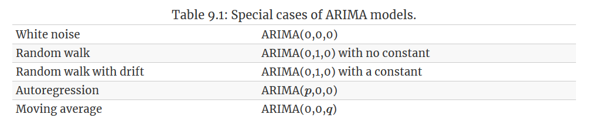

# ARIMA models 


```{r}
library(tsibble)
library(tsibbledata)
library(fable)
library(feasts)
library(lubridate)
library(pins)
library(slider)
```

## Differencing  

All processes (AR, MA, ARMA) disscussed in Chapter \@ref(stationary) belong to a larger family called *linear stationary processes*. This means our models would normally be confined to a stataionry data-generating system.  

By **differencing**, we compute the differences between consecutive observations, and this has been shown as a easy but effective way to make a non-stationary time series stationary. While transformations such as logarithms can help to stabilise the variance of a time series, differencing can help stabilise the mean of a time series by removing changes in the level of a time series, and therefore eliminating (or reducing) trend and seasonality.  

Suppose there is a undelying linear trend behind the observed time series
$$
y_t = \beta_0 + \beta_1t + \epsilon_t  
$$
where $\epsilon_t$ is white noise. The first difference is defined as 

$$
\begin{split}
y'_t &= y_t - y_{t-1} \\
     &= (\beta_0 + \beta_1t + \epsilon_t) - [\beta_0 + \beta_1(t-1) + \epsilon_{t-1}] \\ 
     &= \beta_1 + (\epsilon_t - \epsilon_{t-1})

\end{split}
$$

Note that $y'_t$ satisfies all stationary conditions, $\text{E}(y'_t) =0$, $\text{Var}(y'_t) = 2\sigma^2$, $\text{Cov}(y'_t, y'_{t+k}) = 0$. So it can be modelled as previously discussed.  

Another example is a (biased) random walk process \@ref(random-walk), where the first difference is 

$$
y'_t = c + \epsilon_t
$$

### Second-order differencing  

Occasionally the differenced data will not appear to be stationary and it may be necessary to difference the data a second time to obtain a stationary series: 

$$
\begin{aligned}
y''_t &= (y_t - y_{t-1}) - (y_{t-1} - y_{t-2}) \\
      &= y_t - 2y_{t-1} +  y_{t-2}
\end{aligned}
$$
In practice, it is almost never necessary to go beyond second-order differences.  

### Seasonal differencing 

A seasonal difference is the difference between an observation and the previous observation from the same season. So 

$$
y'_t = y_t - y_{t-m}
$$

If seasonally differenced data appear to be white noise, then an appropriate model for the original data is   

$$
y_t = y_{t-m} + \epsilon_t
$$
Forecasts from this model are equal to the last observation from the relevant season. That is, this model gives seasonal naïve forecasts, introduced in Section \@ref(some-simple-forecasting-methods).

And second seasonal difference is 

$$
\begin{split}
y''_t &= y't - y'_{t-1} \\
      &= (y_t - y_{t-m}) - (y_{t-1} - y_{t-1-m}) \\ 
      &= y_t - y_{t-1} - y_{t-m} + y_{t-1-m}
\end{split}
$$


When both seasonal and first differences are applied, it makes no difference which is done first—the result will be the same. However, **if the data have a strong seasonal pattern, it is recommended that seasonal differencing be done first**, because the resulting series will sometimes be stationary and there will be no need for a further first difference. If first differencing is done first, there will still be seasonality present. 

Sometimes it is necessary to take both a seasonal difference and a first difference to obtain stationary data, as is shown below. Here, the data are first transformed using logarithms (second panel), then seasonal differences are calculated (third panel). The data still seem somewhat non-stationary, and so a further lot of first differences are computed (bottom panel).

```{r, fig.height = 8, fig.width = 7}
PBS %>%
  filter(ATC2 == "H02") %>%
  summarize(Cost = sum(Cost) / 1e6) %>%
  transmute(
     sales = Cost,
     sales_log = log(Cost),
     seasonal_difference = log(Cost) %>% difference(lag = 12),
     double_difference = log(Cost) %>% difference(lag = 12) %>% difference(lag = 1)
  ) %>% 
  pivot_longer(-Month, names_to = "measure") %>% 
  mutate(measure = fct_relevel(measure, 
                               c("sales", 
                                 "sales_log", 
                                 "seasonal_difference", 
                                 "double_difference"))) %>%
  ggplot() + 
  geom_line(aes(Month, value)) + 
  facet_wrap(~ measure, ncol = 1, scales = "free_y") + 
  labs(title = "Corticosteroid drug sales", x = "Year", y = NULL)
```


### Unit root tests

One way to determine more objectively whether differencing is required is to use a **unit root test**. These are statistical hypothesis tests of stationarity that are designed for determining whether differencing is required. 

A number of unit root tests are available, which are based on different assumptions and may lead to conflicting answers. Here we use the Kwiatkowski-Phillips-Schmidt-Shin (KPSS) test implemented by `urca::ur.kpss()`. In this test, the null hypothesis is that the data are stationary, and we look for evidence that the null hypothesis is false. Consequently, small p-values suggest that differencing is required.   

```{r}
google_2015 <- gafa_stock %>%
  filter(Symbol == "GOOG") %>%
  mutate(day = row_number()) %>%
  update_tsibble(index = day, regular = TRUE) %>% 
  filter(year(Date) == 2015)

google_2015 %>%
  features(Close, unitroot_kpss)
```

The test statistic is much bigger than the 1% critical value, indicating that the null hypothesis is rejected. That is, the data are not stationary. We can difference the data, and apply the test again.  

```{r}
google_2015 %>%
  mutate(Close = difference(Close, 1)) %>% 
  features(Close, unitroot_kpss)
```

This time, the test statistic is tiny, and well within the range we would expect for stationary data. So we can conclude that the differenced data are stationary.  

This process of using a sequence of KPSS tests to determine the appropriate number of first differences is carried out using the `unitroot_ndiffs()` feature. 

```{r}
# 1st difference is needed
google_2015 %>% 
  features(Close, unitroot_ndiffs)
```

A similar feature for determining whether seasonal differencing is required is `unitroot_nsdiffs()`, which uses the measure of seasonal strength introduced in Section \@ref(stl-features). Recall that the strength of seasonality $F_s$ is defined as 

$$
F_S = \max(0\,, 1- \frac{\text{Var}(R_t)}{\text{Var}(S_t + R_t)})
$$
where $R_t$ is the remainder component and $S_t$ the seasonal component. No seasonal differences are suggested if $F_S < 0.64$, otherwise one seasonal difference is suggested.

We can apply `unitroot_nsdiffs()` to the monthly total Australian retail turnover.

```{r}
aus_total_retail <- aus_retail %>%
  summarize(Turnover = sum(Turnover))
aus_total_retail %>%
  mutate(log_turnover = log(Turnover)) %>% 
  features(log_turnover, unitroot_nsdiffs)
```


```{r}
aus_total_retail %>%
  mutate(log_turnover = log(Turnover) %>% difference(12)) %>%
  features(log_turnover, unitroot_ndiffs)
```


Because `unitroot_nsdiffs()` returns 1 (indicating one seasonal difference is required), we apply the `unitroot_ndiffs()` function to the seasonally differenced data. These functions suggest we should do both a seasonal difference and a first difference.  


```{r}
aus_total_retail %>% 
  mutate(log_turnover = log(Turnover) %>% 
           difference(12) %>%
           difference(1)) %>% 
  autoplot(log_turnover)
```


## Non-seasonal ARIMA models 


If we combine differencing with autoregression and a moving average model, we obtain a non-seasonal ARIMA model. ARIMA is an acronym for **A**uto**R**egressive **I**ntegrated **M**oving **A**verage (in this context, “integration” is the reverse of differencing). The full model can be written as   

\begin{equation}
(\#eq:arima)
y'_t =c + \phi_1y_{t-1} + \cdots + \phi_py_{t-p} + \theta_1\epsilon_{t-1} + \cdots \theta_q\epsilon_{t-q} + \epsilon_t  
\end{equation}

We call this an ARIMA(p, d, q) model, where 
$$
\begin{aligned}
p &= \text{order of the autoregressive part} \\
d &= \text{degree of first differencing involved} \\
q &= \text{order of the moving average part}
\end{aligned}
$$

The same stationarity and invertibility conditions that are used for autoregressive and moving average models also apply to an ARIMA model.

Many of the models we have already discussed are special cases of the ARIMA model

```{r, echo = FALSE}

```
Once we start combining components in this way to form more complicated models, it is much easier to work with the backshift notation. For example, Equation \@ref(eq:arima) can be written in backshift notation as 

$$
(1 - \phi_1B - \cdots - \phi_pB^p)(1 - B)^dy_t = c + (1 + \theta_1B + \cdots + \theta_1B^q)\epsilon_t
$$

## US consumption expenditure


```{r}
us_change <- read_csv(pin("https://otexts.com/fpp3/extrafiles/us_change.csv")) %>% 
  mutate(time = yearquarter(Time)) %>% 
  as_tsibble(index = time)  

us_change %>% 
  autoplot(Consumption) +
  labs(x = "Year", 
       y = "Quarterly percentage change", 
       title = "US consumption")
```

The following R code was used to select a model automatically. 

```{r}
us_change_fit <- us_change %>% 
  model(ARIMA(Consumption ~ PDQ(0, 0, 0)))

us_change_fit %>% report()
```

This is an ARIMA(1, 0, 3) model:   

$$
y_t = 0.307 + 0.589y_{t-1} - 0.352\epsilon_{t-1} + 0.085 \epsilon_{t-2} + 0.174 \epsilon_{t-3} + \epsilon_t
$$

```{r}
# forecasst
us_change_fit %>% 
  forecast(h = 10) %>% 
  autoplot(slice(us_change, (n()-80):n()))
```


### Understanding ARIMA models  


The constant $c$ has an important effect on the long-term forecasts obtained from these models.

- If $c = 0$ and $d = 0$ , the long-term forecasts will go to zero.

- If $c = 0$ and $d = 1$, the long-term forecasts will go to a non-zero constant.

- If $c = 0$ and $d = 2$, the long-term forecasts will follow a straight line.

- If $c \not= 0$ and $d = 0$, the long-term forecasts will go to the mean of the data.

- If $c \not= 0$ and $d = 1$ , the long-term forecasts will follow a straight line.

- If $c \not= 0$ and $d = 2$, the long-term forecasts will follow a quadratic trend.  

The value of $d$ also has an effect on the prediction intervals — the higher the value of $d$, the more rapidly the prediction intervals increase in size. For $d = 0$, the long-term forecast standard deviation will go to the standard deviation of the historical data, so the prediction intervals will all be essentially the same.  

In the case of `us_change_fit`, $c \not= 0$ and $d = 0$, long-term forecasts go to the mean of the data. 

The value of $p$ is important if the data show cycles. To obtain cyclic forecasts, it is necessary to have $p \ge 2$, along with some additional conditions on the parameters. For an AR(2) model, cyclic behaviour occurs if $\phi_1^2 + 4\phi_2<0$. In that case, the average period of the cycles is  

$$
\frac{2\pi}{\arccos[-\phi_1(1 - \phi_2) / 4\phi_2]}
$$


## Estimation and order selection  


Recall how ACF and PACF plot would help us pick an appropriate AR(p) or MA(q) model. 
```{r, echo = FALSE}
knitr::include_graphics("images/AR_MA_decision.png")
```

However, for ARIMA models, **ACF and PACF plots are only helpful when one of $p$ and $q$ is zero**. If $p$ and $q$ are both positive, then the plots do not help in finding suitable values of $p$ and $q$. (Think of an ARMA(p, q) process, neither its autocorrelation nor its partial autocorrelation function breaks off)

The data may follow an ARIMA(p, d, 0) model if the ACF and PACF plots of the differenced data show the following patterns:

- the ACF is exponentially decaying or sinusoidal;

- there is a significant spike at lag p in the PACF, but none beyond lag p  

The data may follow an ARIMA(0,d,q) model if the ACF and PACF plots of the differenced data show the following patterns: 

- the PACF is exponentially decaying or sinusoidal;

- there is a significant spike at lag q in the ACF, but none beyond lag q.  

```{r}
us_change %>% ACF(Consumption) %>% autoplot()
us_change %>% PACF(Consumption) %>% autoplot()
```

The pattern in the first three spikes is what we would expect from an ARIMA(3, 0, 0), as the PACF tends to decrease. So in this case, the ACF and PACF lead us to think an ARIMA(3, 0, 0) model might be appropriate.   

We also specify particular values of `pdq()` and `PDQ()` that ARIMA can search for. For example, to search the best non-seasonal ARIMA model with $p \in \{1,2,3\}$, $q \in \{0, 1, 2\}$ and $d = 1$, you could use `ARIMA(y ~ pdq(1:3, 1, 0:2) + PDQ(0, 0, 0))`. We will consider seasonal ARIMA models in Section \@ref(seasonal-arima-models).

```{r}
us_change_fit2 <- us_change %>% 
  model(ARIMA(Consumption ~ PDQ(0, 0, 0) + pdq(3, 0, 0)))

us_change_fit2 %>% report()
```

This model is actually slightly better than the model identified by `ARIMA()` (with an AICc value of 340.67 compared to 342.08). The `ARIMA()` function did not find this model because it does not consider all possible models in its search. Use `stepwise = FALSE` and `approximation = FALSE` to expand search region 

```{r}
us_change_fit3 <- us_change %>%
  model(ARIMA(Consumption ~ PDQ(0,0,0),
              stepwise = FALSE, approximation = FALSE))

report(us_change_fit3)
```

## Estimation and order selection  

### MLE

Once the model order has been identified (i.e., the values of p, d and q), we need to estimate the parameters $c, \phi_1, \dots, \phi_p, \theta_1, \dots, \theta_q$. When R estimates the ARIMA model, it uses MLE. For ARIMA models, MLE is similar to the least squares estimates that would be obtained by minimising 

$$
\sum_{t=1}^{T}{\epsilon_t^2}
$$

### Information Criteria  

Akaike’s Information Criterion (AIC), which was useful in selecting predictors for regression, is also useful for determining the order of an ARIMA model. It can be written as   

$$
\text{AIC} = -2\log{L} + 2(p + q + k + 1)
$$

where $L$ is the likelihood of the data. Note that the last term in parentheses is the number of parameters in the model (including $\sigma^2$, the variance of the residuals). 

For ARIMA models, the corrected AIC can be written as   

$$
\text{AIC}_c = AIC + \frac{2(p + q + k + 1)(p + q + k + 2)}{T - p -q -k -2}
$$


and the Bayesian Information Criterion can be written as   

$$
\text{BIC} = \text{AIC} + (\log{T} - 2)(p + q + k + 1)
$$

**It is important to note that these information criteria tend not to be good guides to selecting the appropriate order of differencing ($d$) of a model**, but only for selecting the values of $p$ and $q$. This is because the differencing changes the data on which the likelihood is computed, making the AIC values between models with different orders of differencing not comparable. So we need to use some other approach to choose $d$, and then we can use the AICc to select $p$ and $q$.

## The `ARIMA()` function  

