# Dynamic regression models 


```r
library(tsibble)
library(tsibbledata)
library(fable)
library(feasts)
library(lubridate)
library(pins)
```

The time series models in the previous two chapters allow for the inclusion of information from past observations of a series, but **not** for the inclusion of other information (external variables) that may also be relevant.  On the other hand, the regression models in Chapter \@ref(time-series-regression-models) allow for the inclusion of a lot of relevant information from predictor variables, but do not allow for the subtle time series dynamics that can be handled with ARIMA models. In this chapter, we consider how to extend ARIMA models in order to allow other information to be included in the models.


In Chapter 7 we considered the time series linear model: 

$$
y_t = \beta_0 + \beta_1x_{1t} + \beta_2x_{2t} + \dots + \beta_kx_{kt} + \varepsilon_t
$$

where $\varepsilon_t$ is usually assumed to be an uncorrelated error term (i.e., it is white noise). We considered tests such as the Breusch-Godfrey test for assessing whether the resulting residuals were significantly correlated. A regression model showing high $R^2$ as well as high $\hat{\sigma}^2$ is likely to be a spurious regression (Section \@ref(spurious-regression)).  

In this chapter, we will allow the errors from a regression to contain autocorrelation. Such **correlated errors** are denoted by $\eta_t$. The error series $\eta_t$ is assumed to follow an ARIMA model. For example, if $\eta_t$ follows an ARIMA(1, 1, 1) model, we can write  

$$
y_t = \beta_0 + \beta_1x_{1t} + \beta_2x_{2t} + \dots + \beta_kx_{kt} + \eta_t \\
(1 - \phi_1B)(1 - B)\eta_t = (1 - \theta_1B)\varepsilon_t
$$

where $\varepsilon_t$ is a white noise series.

Notice that the model has two error terms here — the error from the regression model, which we denote by $\eta_t$, and the error from the ARIMA model, which we denote by $\varepsilon_t$. Only the ARIMA model errors are assumed to be white noise.  

## Estimation  

When we estimate the parameters from the model, we need to minimise the sum of squared εt values. If we minimise the sum of squared $\eta_t$ values instead (which is what would happen if we estimated the regression model ignoring the autocorrelations in the errors), then several problems arise. 

1. $\hat{\beta}_0, \dots, \hat{\beta}_k$ are no longer the best estimates, as some information has been ignored in the calculation  

2. Any statistical tests associated with the model (e.g., t-tests on the coefficients) will be incorrect. 

3. The $\text{AIC}_c$ values of the fitted models are no longer a good guide as to which is the best model for forecasting.  

4. In most cases, the $p$-values associated with the coefficients will be too small, and so some predictor variables will appear to be important when they are not. This is known as “spurious regression” (see Section \@ref(spurious-regression)). 

Minimising the sum of squared $\eta_t$ values avoids these problems. Alternatively, maximum likelihood estimation can be used; this will give similar estimates of the coefficients.  

An important consideration when estimating a regression with ARMA errors is that **all of the variables in the model must first be stationary**. Thus, we first have to check that $y_t$ and all of the predictors $x_{1t}, \dots ,x_{kt}$ appear to be stationary. If we estimate the model when any of these are non-stationary, the estimated coefficients will not be consistent estimates (and therefore may not be meaningful).  

We therefore first difference the non-stationary variables in the model. It is often desirable to maintain the form of the relationship between $y_t$ and the predictors, and consequently it is common to difference all of the variables if any of them need differencing. The resulting model is then called a “**model in differences**”, as distinct from a “model in levels”, which is what is obtained when the original data are used without differencing.  

If all of the variables in the model are stationary, then we only need to consider ARMA errors for the residuals. It is easy to see that a regression model with ARIMA(p, d, q) errors is equivalent to regression model in d-differences with ARMA(p, q) errors. For example, we obtain from a univariate regression model with ARIMA(1, 1, 1) errors that

\begin{equation}
(\#eq:arima-error)
y_t = \beta_0 + \beta_1x_t + \eta_t  \\
(1 - \phi_1B)(1 - B)\eta_t = c + (1 + \theta_1B)\varepsilon_t \\ 
\end{equation}


Expand the second equation we get

$$
\eta_t' = c + \phi_1\eta_{t-1}' + \theta_1\varepsilon_{t-1} + \varepsilon_t  
$$
Note that $\eta_t'$ can be considered as a ARMA(1, 1) series. 

Difference the first equation in \@ref(eq:arima-error) we get  

$$
y_t' = \beta_1x_t' + \eta_t'
$$
This is now a linear model with outcome $y_t'$, predictor $x'_t$ and ARMA(1, 1) error $\eta_t'$. Let $\eta_t = \eta_t'$, the differenced model can be written as 

\begin{equation}
(\#eq:arma-error)
y_t' = \beta_1x_t' + \eta_t  \\
(1 - \phi_1B)\eta_t = c + (1 + \theta_1B)\varepsilon_t{
\end{equation}

The model in differences \@ref(eq:arma-error) is equavalent to our former undifferenced model \@ref(eq:arima-error), with $\eta_t$ denoting a ARMA(1, 1) and ARIMA(1, 1) errors respectively.  

## Regression with ARIMA errors   

`ARIMA()` will fit a regression model with ARIMA errors if exogenous regressors are included in the formula.
The `pdq()` special specifies the order of the ARIMA error model. If differencing is specified, then the differencing is applied to all variables in the regression model before the model is estimated.  

```r
ARIMA(y ~ x + pdq(1, 1, 0))
```
will fit the model $y_t' = \beta_1x_t' + \eta_t'$ where $\eta_t' = c + \phi_1\eta_{t-1}' + \varepsilon_t$ is an ARMA(1, 0, 0) error. This is equivalent to fitting the model  

$$
y_t = \beta_0 + \beta_1 x + \eta_t \\
(1 - \phi_1B)(1 - B)\eta_t = c + \varepsilon_t
$$

where $\eta_t$ is ARIMA(1, 1, 1) error.  

The `ARIMA()` function can also be used to select the best ARIMA model for the errors. This is done by not specifying the `pdq()` special, `ARIMA(y ~ x)` will find the most approriate $p$, $d$, $q$ for ARIMA error $\varepsilon_t$. If differencing is required, then all variables are differenced during the estimation process, although the final model will be expressed in terms of the original variables.  

The AICc is calculated for the final model, and this value can be used to determine the best predictors. That is, the procedure should be repeated for all subsets of predictors to be considered, and the model with the lowest AICc value selected.  

### Example: US Personal Consumption and Income  


```r
us_change <- readr::read_csv(pin("https://otexts.com/fpp3/extrafiles/us_change.csv")) %>%
  mutate(Time = yearquarter(Time)) %>%
  as_tsibble(index = Time)

us_change %>%
  pivot_longer(c(Consumption, Income), names_to = "var", values_to = "value") %>% 
  ggplot(aes(Time, value)) + 
  geom_line() + 
  facet_wrap(~ var, nrow = 2) + 
  labs(title = "Quarterly changes in US consumption and personal income",
       x = "Time",
       y = NULL)
```

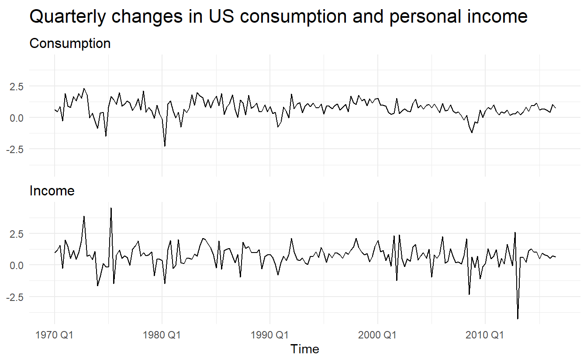

We start by fitting a time series regression model, without ARIMA error: 


```r
us_change_lm <- us_change %>% 
  lm(Consumption ~ Income, data = .) 

glance(us_change_lm)
#> # A tibble: 1 x 11
#>   r.squared adj.r.squared sigma statistic p.value    df logLik   AIC   BIC
#>       <dbl>         <dbl> <dbl>     <dbl>   <dbl> <int>  <dbl> <dbl> <dbl>
#> 1     0.159         0.154 0.603      35.0 1.58e-8     2  -170.  345.  355.
#> # ... with 2 more variables: deviance <dbl>, df.residual <int>

us_change %>% 
  ggplot(aes(Income, Consumption)) + 
  geom_point() + 
  geom_smooth(method = "lm", se = FALSE)
```

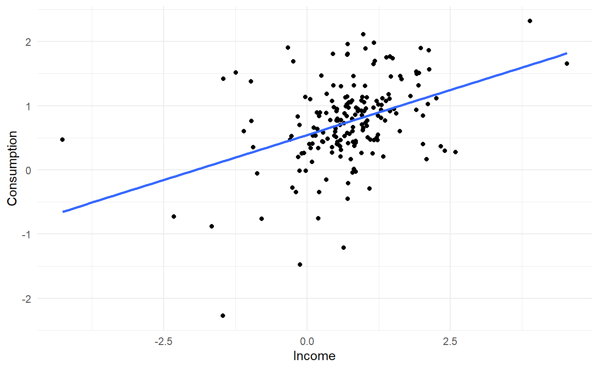

The linear model fit the data rather poorly ($R^2 = 0.16$). We then fit a regression model with ARIMA errors


```r
us_change_dynamic <- us_change %>% 
  model(ARIMA(Consumption ~ Income))

us_change_dynamic %>% report()
#> Series: Consumption 
#> Model: LM w/ ARIMA(1,0,2) errors 
#> 
#> Coefficients:
#>         ar1     ma1     ma2  Income  intercept
#>       0.692  -0.576  0.1984  0.2028     0.5990
#> s.e.  0.116   0.130  0.0756  0.0461     0.0884
#> 
#> sigma^2 estimated as 0.3219:  log likelihood=-157
#> AIC=326   AICc=326   BIC=345
```

The data are clearly already stationary (as we are considering percentage changes rather than raw expenditure and income), so there is no need for any differencing. The fitted model is 


$$
y_t = 0.6 + 0.2 \text{Income} + \eta_t \\
\eta_t = 0.69\eta_{t-1} - 0.58\varepsilon_{t-1} + 0.2\varepsilon_{t-2} + \varepsilon_t \\
\varepsilon_t \sim NID(0, 0.32)
$$
We can recover estimates of both the ηt and εt series using the `residuals()` function.


```r
# regression errors
residuals(us_change_dynamic, type = "regression")
#> # A tsibble: 187 x 3 [1Q]
#> # Key:       .model [1]
#>   .model                         Time  .resid
#>   <chr>                         <qtr>   <dbl>
#> 1 ARIMA(Consumption ~ Income) 1970 Q1 -0.180 
#> 2 ARIMA(Consumption ~ Income) 1970 Q2 -0.376 
#> 3 ARIMA(Consumption ~ Income) 1970 Q3 -0.0373
#> 4 ARIMA(Consumption ~ Income) 1970 Q4 -0.822 
#> 5 ARIMA(Consumption ~ Income) 1971 Q1  0.895 
#> 6 ARIMA(Consumption ~ Income) 1971 Q2  0.0194
#> # ... with 181 more rows
# arima errors
residuals(us_change_dynamic, type = "innovation")
#> # A tsibble: 187 x 3 [1Q]
#> # Key:       .model [1]
#>   .model                         Time  .resid
#>   <chr>                         <qtr>   <dbl>
#> 1 ARIMA(Consumption ~ Income) 1970 Q1 -0.167 
#> 2 ARIMA(Consumption ~ Income) 1970 Q2 -0.320 
#> 3 ARIMA(Consumption ~ Income) 1970 Q3  0.0720
#> 4 ARIMA(Consumption ~ Income) 1970 Q4 -0.694 
#> 5 ARIMA(Consumption ~ Income) 1971 Q1  1.05  
#> 6 ARIMA(Consumption ~ Income) 1971 Q2  0.142 
#> # ... with 181 more rows
# augment returns arima errors
augment(us_change_dynamic)
#> # A tsibble: 187 x 5 [1Q]
#> # Key:       .model [1]
#>   .model                         Time Consumption .fitted  .resid
#>   <chr>                         <qtr>       <dbl>   <dbl>   <dbl>
#> 1 ARIMA(Consumption ~ Income) 1970 Q1       0.616   0.783 -0.167 
#> 2 ARIMA(Consumption ~ Income) 1970 Q2       0.460   0.780 -0.320 
#> 3 ARIMA(Consumption ~ Income) 1970 Q3       0.877   0.805  0.0720
#> 4 ARIMA(Consumption ~ Income) 1970 Q4      -0.274   0.419 -0.694 
#> 5 ARIMA(Consumption ~ Income) 1971 Q1       1.90    0.847  1.05  
#> 6 ARIMA(Consumption ~ Income) 1971 Q2       0.912   0.770  0.142 
#> # ... with 181 more rows
```


```r
bind_rows(
  `Regression Errors` = residuals(us_change_dynamic, type="regression"),
  `ARIMA Errors` = residuals(us_change_dynamic, type="innovation"),
  .id = "type"
) %>%
  ggplot(aes(x = Time, y = .resid)) +
  geom_line() +
  facet_wrap(~ type, scales = "free_y", nrow = 2) +
  labs(x = "year", y = NULL)
```

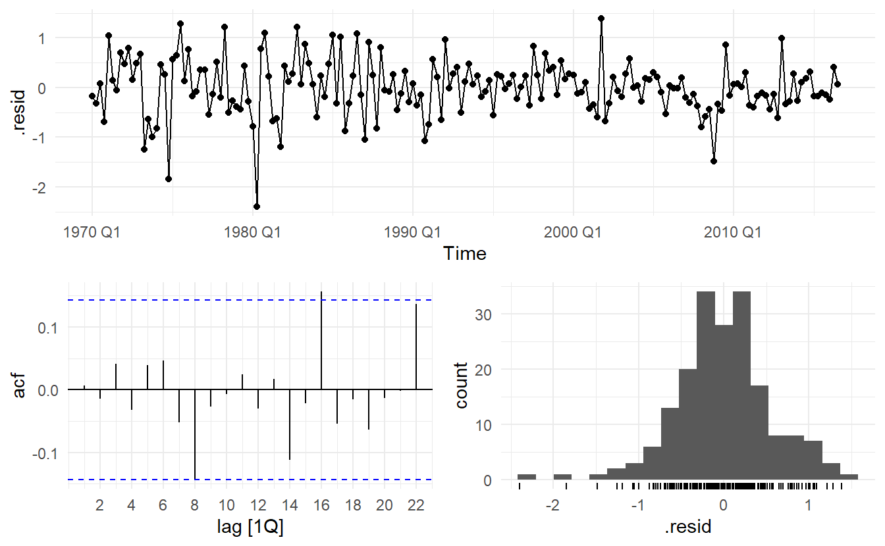
It is the ARIMA errors that should resemble a white noise series.  


```r
us_change_dynamic %>% gg_tsresiduals()
```

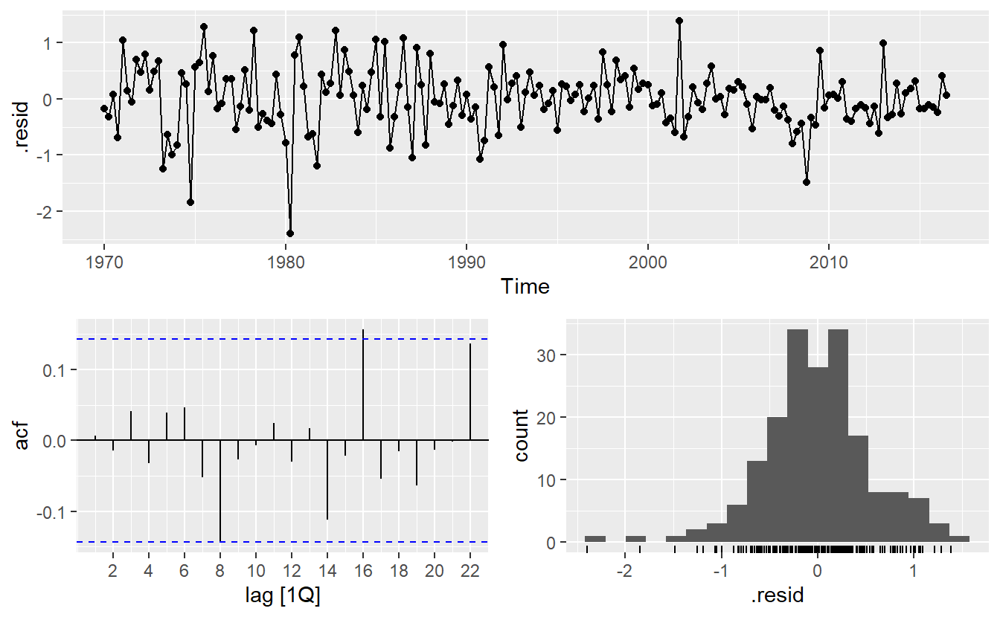


```r
augment(us_change_dynamic) %>%
  features(.resid, ljung_box, dof = 6, lag = 10) # unseasonal data lag = 10, seaonsal data lag = 2m 
#> # A tibble: 1 x 3
#>   .model                      lb_stat lb_pvalue
#>   <chr>                         <dbl>     <dbl>
#> 1 ARIMA(Consumption ~ Income)    6.05     0.196
```

## Forecasting  

To forecast using a regression model with ARIMA errors, we need to forecast the regression part of the model and the ARIMA part of the model, and combine the results. As with ordinary regression models, in order to obtain forecasts we first need to forecast the predictors.  

We continue with the `us_change_dynamic` model, assuming that the future percentage changes in personal disposable income will be equal to the mean percentage change from the last forty years.


```r
us_change_future <- new_data(us_change, 8) %>% 
  mutate(Income = mean(us_change$Income))

us_change_dynamic %>% 
  forecast(new_data = us_change_future) %>% 
  autoplot(us_change, level = 95)
```

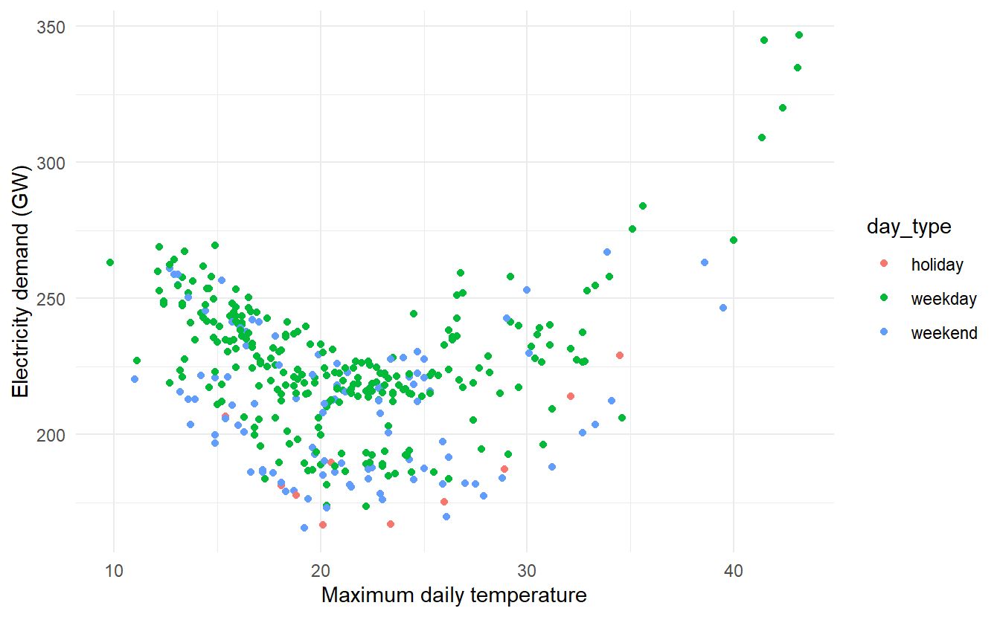

It is important to realise that the prediction intervals from regression models (with or without ARIMA errors) do **not** take into account the uncertainty in the forecasts of the predictors. So they should be interpreted as being conditional on the assumed (or estimated) future values of the predictor variables.  

### Example: Forecasting electricity demand  

Daily electricity demand can be modelled as a function of temperature. As can be observed on an electricity bill, more electricity is used on cold days due to heating and hot days due to air conditioning. The higher demand on cold and hot days is reflected in a u-shape, where daily demand is plotted versus daily maximum temperature  


```r
vic_elec_daily <- vic_elec %>% 
  filter(year(Time) == 2014) %>%
  index_by(date = as_date(Time)) %>%
  summarize(
    demand = sum(Demand) / 1e3,
    temperature = max(Temperature),
    holiday = any(Holiday)
  ) %>% 
  mutate(day_type = case_when(
    holiday == "TRUE" ~ "holiday",
    wday(date) %in% 2:6 ~ "weekday",
    TRUE ~ "weekend"
  ))

vic_elec_daily %>%
  ggplot(aes(temperature, demand, color = day_type)) +
  geom_point() + 
  labs(x = "Maximum daily temperature",
       y = "Electricity demand (GW)")
```

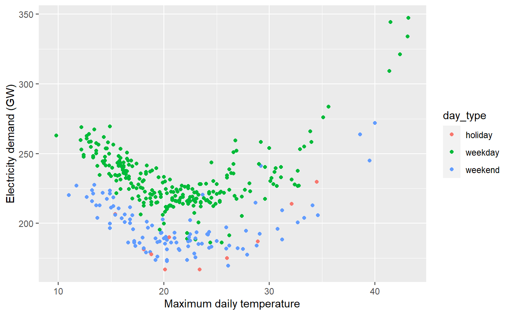

Electricity demand appears to be quadratically related to maximum temperature, whether the day is weekend or not can cause a shift in demand. Therefore, we fit a quadratic regression model with ARMA errors. The model also includes an indicator variable for if the day was a working day or not.  


```r
elec_fit <- vic_elec_daily %>% 
  model(ARIMA(demand ~ temperature + temperature ^ 2 + (day_type == "weekday")))

elec_fit %>% report() 
#> Series: demand 
#> Model: LM w/ ARIMA(3,1,1)(2,0,0)[7] errors 
#> 
#> Coefficients:
#>          ar1      ar2     ar3      ma1    sar1    sar2  temperature
#>       0.8909  -0.2359  0.0670  -0.9369  0.1328  0.1039        1.493
#> s.e.  0.0684   0.0751  0.0586   0.0341  0.0557  0.0561        0.138
#>       day_type == "weekday"TRUE
#>                           30.81
#> s.e.                       1.42
#> 
#> sigma^2 estimated as 106.7:  log likelihood=-1363
#> AIC=2743   AICc=2744   BIC=2779
```

In fact, the estimated $\hat{\eta_t}$ is a SARIMA error, this is due to the fact the `vic_elec_daily` is highly seasonal


```r
vic_elec_daily %>% features(demand, feat_stl)
#> # A tibble: 1 x 9
#>   trend_strength seasonal_streng~ seasonal_peak_w~ seasonal_trough~ spikiness
#>            <dbl>            <dbl>            <dbl>            <dbl>     <dbl>
#> 1          0.772            0.709                0                5     0.803
#> # ... with 4 more variables: linearity <dbl>, curvature <dbl>,
#> #   stl_e_acf1 <dbl>, stl_e_acf10 <dbl>
```


```r
elec_fit %>% gg_tsresiduals()
```

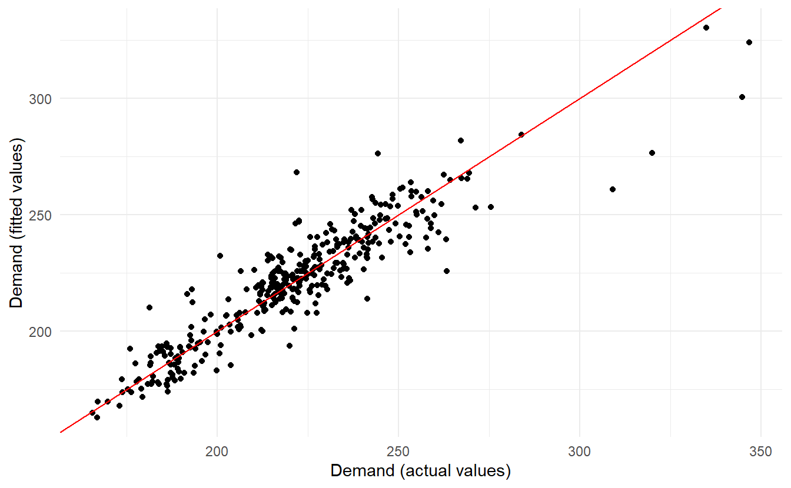

```r

augment(elec_fit) %>%
  features(.resid, ljung_box, dof = 9, lag = 14)
#> # A tibble: 1 x 3
#>   .model                                                       lb_stat lb_pvalue
#>   <chr>                                                          <dbl>     <dbl>
#> 1 "ARIMA(demand ~ temperature + temperature^2 + (day_type == ~    25.0  0.000139
```

The model has some significant autocorrelation in the residuals, which means the prediction intervals may not provide accurate coverage. Also, the histogram of the residuals shows one positive outlier, which will also affect the coverage of the prediction intervals.  


```r
augment(elec_fit) %>% 
  ggplot(aes(demand, .fitted)) + 
  geom_point() + 
  geom_abline(slope = 1, intercept = 0, color = "red") + 
  labs(x = "Demand (actual values)",
       y = "Demand (fitted values)")
```

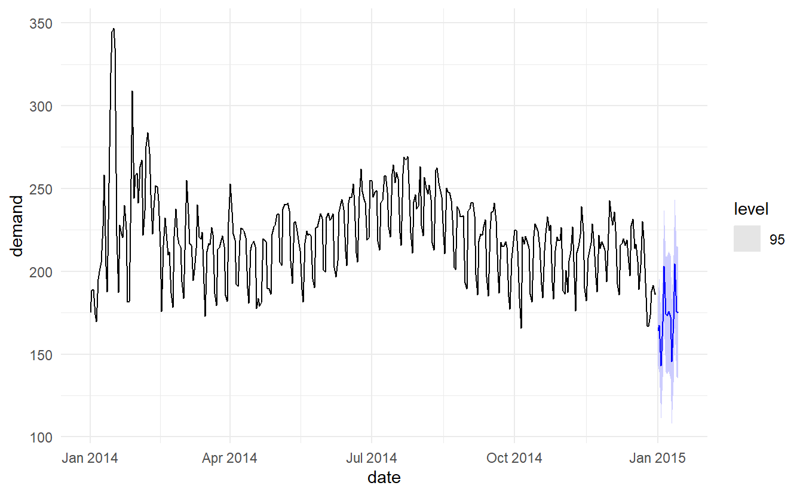

To generate foreccasts, we set the temperature for the next 14 days to a constant 26 degrees.  


```r
vic_elec_future <- new_data(vic_elec_daily, 14) %>%
  mutate(
    temperature = 26,
    holiday = c(TRUE, rep(FALSE, 13)),
    day_type = case_when(
      holiday ~ "Holiday",
      wday(date) %in% 2:6 ~ "Weekday",
      TRUE ~ "Weekend"
    )
  )

elec_fit %>% 
  forecast(new_data = vic_elec_future) %>% 
  autoplot(vic_elec_daily, level = 95)
```

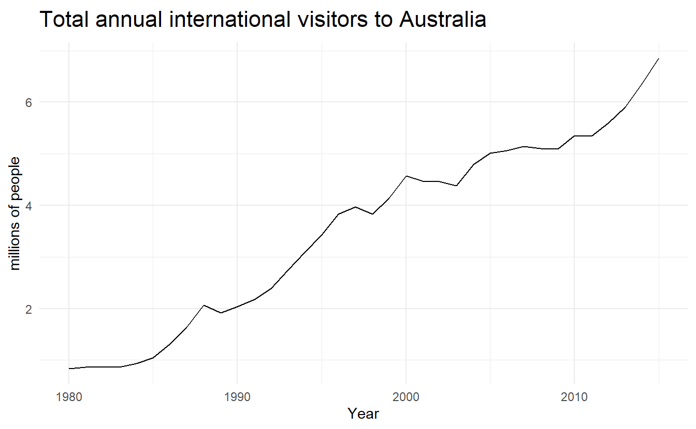

The point forecasts look reasonable for the first two weeks of 2015. The slow down in electricity demand at the end of 2014 (due to many people taking summer vacations) has caused the forecasts for the next two weeks to show similarly low demand values.   


## Deterministic and stochastic trends  

There are two different ways of using a trend variable $t$. 

A **deterministic** trend is obtained using the regression model 

$$
y_t = \beta_0 + \beta_1t + \eta_t
$$

where $\eta_t$ is an **ARMA** process. 

A **stochastic** trend is obtained using the model  

$$
y_t = \beta_0 + \beta_1t + \eta_t
$$
where $\eta_t$ is an **ARIMA** process with $d = 1$. In the latter case, we can difference both sides so that $y'_t = \beta_1 + \eta_t'$, where $\eta_t'$ is an ARMA process. In other words, a stochastic trend can be expressed as 

$$
y_t = \beta_1 + y_{t-1} + \eta_t'
$$
This is similar to a random walk with drift (introduced in Section \@ref(random-walk)), but here the error term is an ARMA process rather than simply white noise.  

Although these models appear quite similar (they only differ in the number of differences that need to be applied to $\eta_t$), their forecasting characteristics are quite different.  


### Example: International visitors to Australia  


```r
aus_visitors <- as_tsibble(fpp2::austa)
aus_visitors %>%
  autoplot(value) +
  labs(x = "Year", 
       y = "millions of people",
       title = "Total annual international visitors to Australia")
```

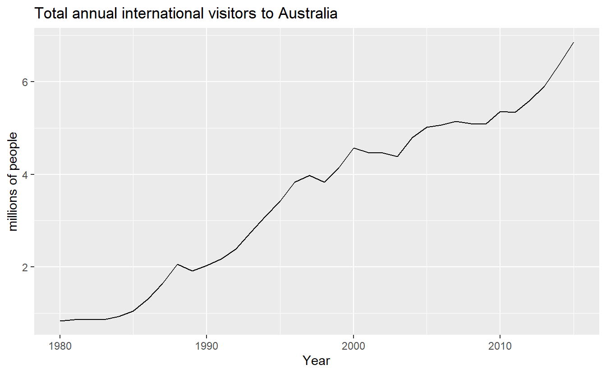

We will fit both a deterministic and a stochastic trend model to these data.  

The deterministic trend model is obtained as follows:


```r
visitors_deterministic <- aus_visitors %>%
  model(ARIMA(value ~ trend() + pdq(d = 0)))

report(visitors_deterministic)
#> Series: value 
#> Model: LM w/ ARIMA(2,0,0) errors 
#> 
#> Coefficients:
#>        ar1     ar2  trend()  intercept
#>       1.11  -0.380   0.1710      0.416
#> s.e.  0.16   0.158   0.0088      0.190
#> 
#> sigma^2 estimated as 0.02979:  log likelihood=13.6
#> AIC=-17.2   AICc=-15.2   BIC=-9.28
```

The estimated growth in visitor numbers is 0.17 million people per year.

Alternatively, the stochastic trend model can be estimated.  


```r
visitors_stochastic <- aus_visitors %>% 
  model(ARIMA(value ~ trend() + pdq(d = 1)))

visitors_stochastic %>% report()
#> Series: value 
#> Model: LM w/ ARIMA(0,1,1) errors 
#> 
#> Coefficients:
#>         ma1  trend()
#>       0.301    0.173
#> s.e.  0.165    0.039
#> 
#> sigma^2 estimated as 0.03376:  log likelihood=10.6
#> AIC=-15.2   AICc=-14.5   BIC=-10.6
```

In this case, the estimated growth in visitor numbers is also 0.17 million people per year. Although the growth estimates are similar, the prediction intervals are not. In particular, stochastic trends have much wider prediction intervals because the errors are non-stationary.


```r
bind_cols(visitors_deterministic, 
          visitors_stochastic) %>%
  rename(`Deterministic trend` = 1, `Stochastic trend` = 2) %>%
  forecast(h = 10) %>%
  autoplot(aus_visitors, level = 95) +
  labs(x = "Year", y = "Visitors to Australia (millions)",
       title = "Forecasts from trend models")
```

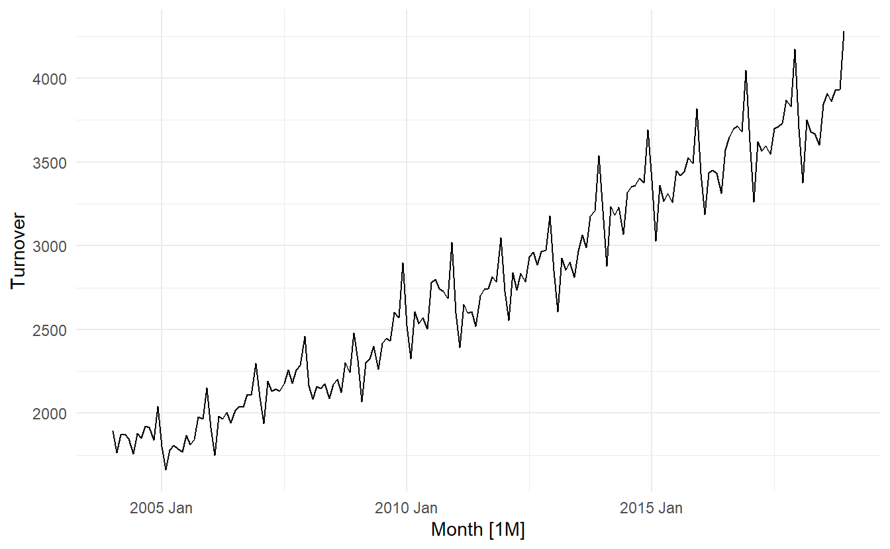

There is an implicit assumption with deterministic trends that the slope of the trend is not going to change over time. On the other hand, stochastic trends can change, and the estimated growth is only assumed to be the average growth over the historical period, not necessarily the rate of growth that will be observed into the future. Consequently, **it is safer to forecast with stochastic trends**, especially for longer forecast horizons, as the prediction intervals allow for greater uncertainty in future growth.   

## Dynamic harmonic regression  

When there are long seasonal periods, a dynamic regression with Fourier terms (Section \@ref(fourier-sereis))is often better than other models we have considered so far.    

Seasonal versions of ARIMA and ETS models are designed for shorter periods such as 12 for monthly data or 4 for quarterly data. The `ETS()` model restricts seasonality to be a maximum period of 24 to allow hourly data but not data with a larger seasonal frequency. The problem is that there are m−1 parameters to be estimated for the initial seasonal states where $m$ is the seasonal period. So for large $m$, the estimation becomes almost impossible.

The `ARIMA()` function will allow a seasonal period up to $m = 350$, but in practice will usually run out of memory whenever the seasonal period is more than about 200. 

In any case, seasonal differencing of high order does not make a lot of sense — for daily data it involves comparing what happened today with what happened exactly a year ago and there is no constraint that the seasonal pattern is smooth.  

So for such time series, we prefer a harmonic regression approach where the seasonal pattern is modelled using Fourier terms with short-term time series dynamics handled by an ARMA error.

The advantages of this approach are:  

- for data with more than one seasonal period, Fourier terms of different frequencies can be included;  

- the smoothness of the seasonal pattern can be controlled by $K$, the number of Fourier sin and cos pairs – the seasonal pattern is smoother for smaller values of $K$;  

- the short-term dynamics are easily handled with a simple ARMA error.  

The only real disadvantage (compared to a seasonal ARIMA model) is that the seasonality is assumed to be fixed — the seasonal pattern is not allowed to change over time. But in practice, seasonality is usually remarkably constant so this is not a big disadvantage except for long time series.  

### Example: Australian eating out expenditure  

In this example we demonstrate combining Fourier terms for capturing seasonality with ARIMA errors capturing other dynamics in the data. For monthly data, we vary $K$ from $1$ to $6$  


```r
aus_cafe <- aus_retail %>%
  filter(
    Industry == "Cafes, restaurants and takeaway food services",
    year(Month) %in% 2004:2018
  ) %>%
  summarise(Turnover = sum(Turnover))

aus_cafe %>% autoplot()
```

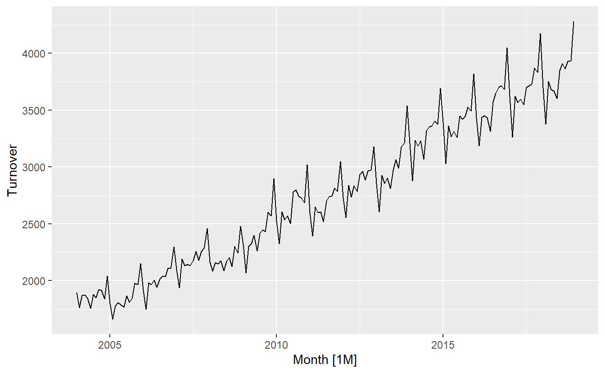

To stablize variance, we instead forecast `log(Turnover)`  


```r
cafe_fit <- model(
    aus_cafe,
    `K = 1` = ARIMA(log(Turnover) ~ fourier(K = 1) + PDQ(0, 0, 0)),
    `K = 2` = ARIMA(log(Turnover) ~ fourier(K = 2) + PDQ(0, 0, 0)),
    `K = 3` = ARIMA(log(Turnover) ~ fourier(K = 3) + PDQ(0, 0, 0)),
    `K = 4` = ARIMA(log(Turnover) ~ fourier(K = 4) + PDQ(0, 0, 0)),
    `K = 5` = ARIMA(log(Turnover) ~ fourier(K = 5) + PDQ(0, 0, 0)),
    `K = 6` = ARIMA(log(Turnover) ~ fourier(K = 6) + PDQ(0, 0, 0))
)

cafe_fit %>% glance()
#> # A tibble: 6 x 8
#>   .model   sigma2 log_lik   AIC  AICc   BIC ar_roots  ma_roots 
#>   <chr>     <dbl>   <dbl> <dbl> <dbl> <dbl> <list>    <list>   
#> 1 K = 1  0.00175     317. -616. -615. -588. <cpl [2]> <cpl [3]>
#> 2 K = 2  0.00107     362. -700. -698. -661. <cpl [5]> <cpl [1]>
#> 3 K = 3  0.000761    394. -763. -761. -725. <cpl [3]> <cpl [1]>
#> 4 K = 4  0.000539    427. -822. -818. -771. <cpl [1]> <cpl [5]>
#> 5 K = 5  0.000317    474. -919. -917. -875. <cpl [2]> <cpl [0]>
#> 6 K = 6  0.000316    474. -920. -918. -875. <cpl [0]> <cpl [1]>
```


```r
cafe_fit %>% 
  forecast(h = "2 years") %>%
  autoplot(aus_cafe) +
  facet_wrap(vars(.model), ncol = 2) +
  guides(colour = FALSE) +
  geom_label(
    aes(x = yearmonth("2007 Jan"), 
        y = 4250, 
        label = str_c("AICc = ", format(AICc))),
    data = glance(cafe_fit)
  ) + 
  theme(legend.position = "bottom")
```

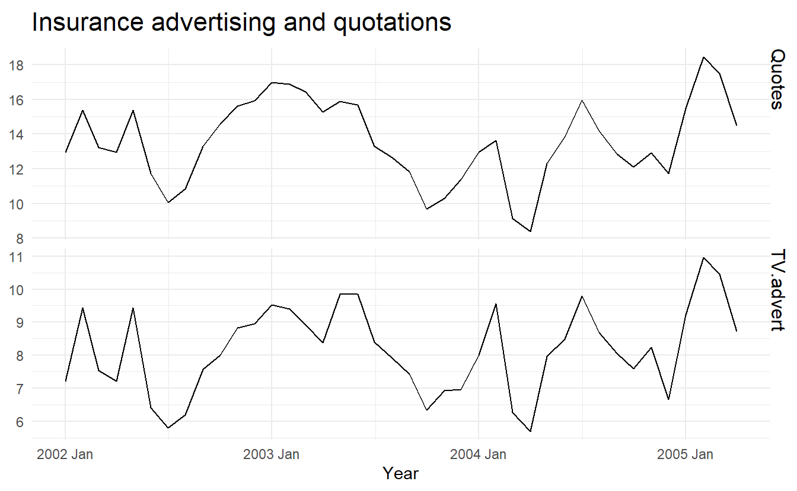


As $K$ increases the Fourier terms capture and project a more “wiggly” seasonal pattern and simpler ARIMA models are required to capture other dynamics. The AICc value is minimised for $K = 5$, with a significant jump going from $K = 4$ to $K = 5$, hence the forecasts generated from this model would be the ones used.

## Lagged predictors  

In Section \@ref(distributed-lags) we introduced distributed lags. In those situations, we need to allow for lagged effects of the predictor. Suppose that we have only one predictor in our model. Then a model which allows for lagged effects can be written as 

$$
y_t + \beta_0 + \gamma_1x_t + \gamma_2x_{t-2} + \cdots + \gamma_kx_{t-k} + \eta_t
$$

where $\eta_t$ is an ARIMA process. The value of $k$ can be selected using the $\text{AIC}_c$, along with the values of $p$ and $q$ for the ARIMA error.  

Note that when comparing models with different lags, we need to set top k observations to `NA`, where k is the maximum lag tried, so that all models use the exact same data.  

### Example: TV advertising and insurance quotations  


```r
insurance <- as_tsibble(fpp2::insurance, pivot_longer = FALSE)

insurance %>%
  pivot_longer(c(Quotes, TV.advert)) %>%
  ggplot(aes(x = index, y = value)) +
  geom_line() +
  facet_grid(vars(name), scales = "free_y") +
  labs(x = "Year", 
       y = NULL,
       title = "Insurance advertising and quotations")
```

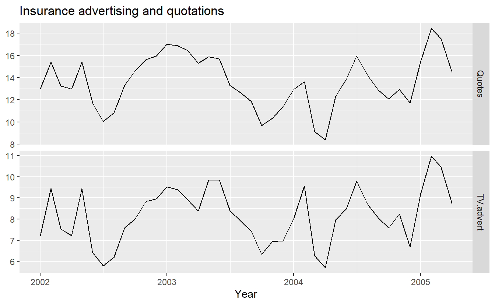


```r
insurance_fit <- insurance %>%
  # Restrict data so models use same fitting period
  mutate(Quotes = c(NA, NA, NA, Quotes[4:40])) %>%
  # Estimate models
  model(
    lag0 = ARIMA(Quotes ~ pdq(d = 0) + TV.advert),
    lag1= ARIMA(Quotes ~ pdq(d = 0) + TV.advert + lag(TV.advert)),
    lag2= ARIMA(Quotes ~ pdq(d = 0) + TV.advert + lag(TV.advert) + lag(TV.advert, 2)),
    lag3= ARIMA(Quotes ~ pdq(d = 0) + TV.advert + lag(TV.advert) + lag(TV.advert, 2) + lag(TV.advert, 3)))

glance(insurance_fit)
#> # A tibble: 4 x 8
#>   .model sigma2 log_lik   AIC  AICc   BIC ar_roots  ma_roots 
#>   <chr>   <dbl>   <dbl> <dbl> <dbl> <dbl> <list>    <list>   
#> 1 lag0    0.265   -28.3  66.6  68.3  75.0 <cpl [2]> <cpl [0]>
#> 2 lag1    0.209   -24.0  58.1  59.9  66.5 <cpl [1]> <cpl [1]>
#> 3 lag2    0.215   -24.0  60.0  62.6  70.2 <cpl [1]> <cpl [1]>
#> 4 lag3    0.206   -22.2  60.3  65.0  73.8 <cpl [1]> <cpl [1]>
```

The best model (with the smallest AICc value) has two lagged predictors; that is, it includes advertising only in the current month and the previous month. So we now re-estimate that model, but using all the available data.    


```r
insurance_best <- insurance %>%
  model(ARIMA(Quotes ~ pdq(d = 0) + TV.advert + lag(TV.advert)))

report(insurance_best)
#> Series: Quotes 
#> Model: LM w/ ARIMA(1,0,2) errors 
#> 
#> Coefficients:
#>         ar1    ma1    ma2  TV.advert  lag(TV.advert)  intercept
#>       0.512  0.917  0.459     1.2527          0.1464       2.16
#> s.e.  0.185  0.205  0.190     0.0588          0.0531       0.86
#> 
#> sigma^2 estimated as 0.2166:  log likelihood=-23.9
#> AIC=61.9   AICc=65.4   BIC=73.7
```


```r
insurance_best %>% 
  augment() %>% 
  features(.resid, ljung_box, dof = 7, lag = 10)
#> # A tibble: 1 x 3
#>   .model                                                  lb_stat lb_pvalue
#>   <chr>                                                     <dbl>     <dbl>
#> 1 ARIMA(Quotes ~ pdq(d = 0) + TV.advert + lag(TV.advert))    3.09     0.379
```


We can calculate forecasts using this model if we assume future values for the advertising variable. If we set the future monthly advertising to 8 units

```r
insurance_future <- insurance %>% 
  new_data(20) %>% 
  mutate(TV.advert = 8)

insurance_best %>% 
  forecast(insurance_future) %>% 
  autoplot(insurance)
```


