# Time series graphics  


## `tsibble` objects  


```r
library(tsibble)
library(tsibbledata)
library(feasts) 
library(lubridate)
library(patchwork)
```


```r
x <- tsibble(Year = 2015:2019, Observation = c(123, 39, 78, 52, 110), 
             index = Year)

x
#> # A tsibble: 5 x 2 [1Y]
#>    Year Observation
#>   <int>       <dbl>
#> 1  2015         123
#> 2  2016          39
#> 3  2017          78
#> 4  2018          52
#> 5  2019         110
```


Multiple time series, `key`:  


```r
olympic_running
#> # A tsibble: 312 x 4 [4Y]
#> # Key:       Length, Sex [14]
#>    Year Length Sex    Time
#>   <dbl> <fct>  <chr> <dbl>
#> 1  1896 100m   men    12  
#> 2  1900 100m   men    11  
#> 3  1904 100m   men    11  
#> 4  1908 100m   men    10.8
#> 5  1912 100m   men    10.8
#> 6  1916 100m   men    NA  
#> # ... with 306 more rows
```

`key` must be specified in one of the following form:  


### manipulation  

tidyverse-based manipulation


```r
PBS
#> # A tsibble: 65,219 x 9 [1M]
#> # Key:       Concession, Type, ATC1, ATC2 [336]
#>        Month Concession  Type   ATC1  ATC1_desc   ATC2  ATC2_desc  Scripts  Cost
#>        <mth> <chr>       <chr>  <chr> <chr>       <chr> <chr>        <dbl> <dbl>
#> 1   1991 7月 Concession~ Co-pa~ A     Alimentary~ A01   STOMATOLO~   18228 67877
#> 2   1991 8月 Concession~ Co-pa~ A     Alimentary~ A01   STOMATOLO~   15327 57011
#> 3   1991 9月 Concession~ Co-pa~ A     Alimentary~ A01   STOMATOLO~   14775 55020
#> 4  1991 10月 Concession~ Co-pa~ A     Alimentary~ A01   STOMATOLO~   15380 57222
#> 5  1991 11月 Concession~ Co-pa~ A     Alimentary~ A01   STOMATOLO~   14371 52120
#> 6  1991 12月 Concession~ Co-pa~ A     Alimentary~ A01   STOMATOLO~   15028 54299
#> # ... with 6.521e+04 more rows

PBS %>%
  filter(ATC2 == "A10")
#> # A tsibble: 816 x 9 [1M]
#> # Key:       Concession, Type, ATC1, ATC2 [4]
#>        Month Concession  Type  ATC1  ATC1_desc   ATC2  ATC2_desc  Scripts   Cost
#>        <mth> <chr>       <chr> <chr> <chr>       <chr> <chr>        <dbl>  <dbl>
#> 1   1991 7月 Concession~ Co-p~ A     Alimentary~ A10   ANTIDIABE~   89733 2.09e6
#> 2   1991 8月 Concession~ Co-p~ A     Alimentary~ A10   ANTIDIABE~   77101 1.80e6
#> 3   1991 9月 Concession~ Co-p~ A     Alimentary~ A10   ANTIDIABE~   76255 1.78e6
#> 4  1991 10月 Concession~ Co-p~ A     Alimentary~ A10   ANTIDIABE~   78681 1.85e6
#> 5  1991 11月 Concession~ Co-p~ A     Alimentary~ A10   ANTIDIABE~   70554 1.69e6
#> 6  1991 12月 Concession~ Co-p~ A     Alimentary~ A10   ANTIDIABE~   75814 1.84e6
#> # ... with 810 more rows

# index column is automatically selected
PBS %>%
  filter(ATC2=="A10") %>%
  select(Concession, Type, ATC1)
#> # A tsibble: 816 x 4 [1M]
#> # Key:       Concession, Type, ATC1 [4]
#>   Concession   Type        ATC1      Month
#>   <chr>        <chr>       <chr>     <mth>
#> 1 Concessional Co-payments A      1991 7月
#> 2 Concessional Co-payments A      1991 8月
#> 3 Concessional Co-payments A      1991 9月
#> 4 Concessional Co-payments A     1991 10月
#> 5 Concessional Co-payments A     1991 11月
#> 6 Concessional Co-payments A     1991 12月
#> # ... with 810 more rows
```

All key variable must be explicitly selected, that means we must at least select `Concession` and `Type` in the case above, since `ATC2` and `ATC1` are no longer `key` variables after `filter(ATC == "A10")`


```r
PBS %>% 
    filter(ATC2 == "A10") %>% 
    as_tibble() %>% 
    count(Concession, Type, ATC1)
#> # A tibble: 4 x 4
#>   Concession   Type        ATC1      n
#>   <chr>        <chr>       <chr> <int>
#> 1 Concessional Co-payments A       204
#> 2 Concessional Safety net  A       204
#> 3 General      Co-payments A       204
#> 4 General      Safety net  A       204
```

As to `summarize()`, `index` is automatically used as the grouping variable:  


```r
PBS %>%
  filter(ATC2 == "A10") %>%
  select(Month, Concession, Type, Cost) %>%
  summarise(total_cost = sum(Cost))
#> # A tsibble: 204 x 2 [1M]
#>       Month total_cost
#>       <mth>      <dbl>
#> 1  1991 7月    3526591
#> 2  1991 8月    3180891
#> 3  1991 9月    3252221
#> 4 1991 10月    3611003
#> 5 1991 11月    3565869
#> 6 1991 12月    4306371
#> # ... with 198 more rows
```

The  `mutate()`, here we change the units from dollars to millions of dollars:

```r
PBS %>%
  filter(ATC2 == "A10") %>%
  select(Month, Concession, Type, Cost) %>%
  summarise(total_cost = sum(Cost)) %>%
  mutate(cost = total_cost / 1e6) -> a10

a10
#> # A tsibble: 204 x 3 [1M]
#>       Month total_cost  cost
#>       <mth>      <dbl> <dbl>
#> 1  1991 7月    3526591  3.53
#> 2  1991 8月    3180891  3.18
#> 3  1991 9月    3252221  3.25
#> 4 1991 10月    3611003  3.61
#> 5 1991 11月    3565869  3.57
#> 6 1991 12月    4306371  4.31
#> # ... with 198 more rows
```

### importing  


```r
prison <- vroom::vroom("https://OTexts.com/fpp3/extrafiles/prison_population.csv")

prison <-  prison %>%
  mutate(quarter = yearquarter(date)) %>%
  select(-date) %>%
  as_tsibble(key = c(state, gender, legal, indigenous), index = quarter)

prison
#> # A tsibble: 3,072 x 6 [1Q]
#> # Key:       state, gender, legal, indigenous [64]
#>   state gender legal    indigenous count quarter
#>   <chr> <chr>  <chr>    <chr>      <dbl>   <qtr>
#> 1 ACT   Female Remanded ATSI           0 2005 Q1
#> 2 ACT   Female Remanded ATSI           1 2005 Q2
#> 3 ACT   Female Remanded ATSI           0 2005 Q3
#> 4 ACT   Female Remanded ATSI           0 2005 Q4
#> 5 ACT   Female Remanded ATSI           1 2006 Q1
#> 6 ACT   Female Remanded ATSI           1 2006 Q2
#> # ... with 3,066 more rows
```

## Time plots  


```r
(melsyd_economy <- ansett %>%
  filter(Airports == "MEL-SYD", Class == "Economy"))
#> # A tsibble: 282 x 4 [1W]
#> # Key:       Airports, Class [1]
#>       Week Airports Class   Passengers
#>     <week> <chr>    <chr>        <dbl>
#> 1 1987 W26 MEL-SYD  Economy      20167
#> 2 1987 W27 MEL-SYD  Economy      20161
#> 3 1987 W28 MEL-SYD  Economy      19993
#> 4 1987 W29 MEL-SYD  Economy      20986
#> 5 1987 W30 MEL-SYD  Economy      20497
#> 6 1987 W31 MEL-SYD  Economy      20770
#> # ... with 276 more rows

melsyd_economy %>%
  autoplot(Passengers) +
  labs(title = "Ansett economy class passengers", subtitle = "Melbourne-Sydney") +
  xlab("Year")
```

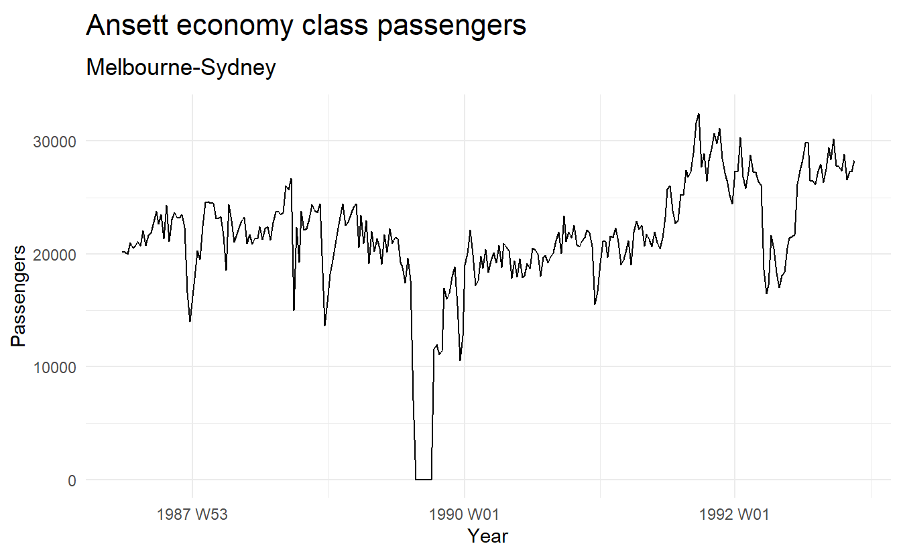

`autoplot()` automatically produces an appropriate plot of whatever you pass to it in the first argument.  
When there are multiple time series in a `tsibble()`, they are plotted separately:  


```r
olympic_running %>% autoplot(.vars = Time)
```

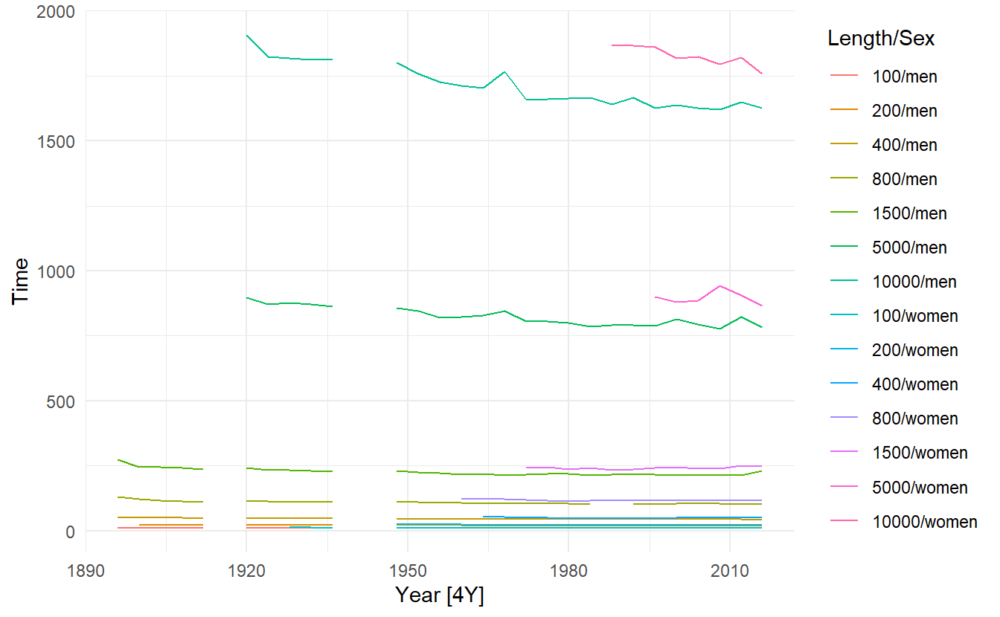


## Patterns of time series: trend, seasonal and cyclic

**Trend**:  
    A trend exists when there is a *long-term* increase or decrease in the data. It does not have to be linear. Sometimes we will refer to a trend as “changing direction”, when it might go from an increasing trend to a decreasing trend.    
    
**Seasonal**:  
    A seasonal pattern occurs when a time series is affected by seasonal factors such as the time of the year or the day of the week. Seasonality is always of a *fixed and known period*(within a season, a year, etc.).
    
**Cyclic**:  
    A cycle occurs when the data exhibit rises and falls that are *not of a fixed frequency*. These fluctuations are usually due to economic conditions, and are often related to the “business cycle”. The duration of these fluctuations is usually at least 2 years.   
    
    
> Many people confuse cyclic behaviour with seasonal behaviour, but they are really quite different. If the fluctuations are not of a fixed frequency then they are cyclic; if the frequency is unchanging and associated with some aspect of the calendar, then the pattern is seasonal. In general, the average length of cycles is longer than the length of a seasonal pattern, and the magnitudes of cycles tend to be more variable than the magnitudes of seasonal patterns.  

(As we will see soon, `gg_season()` provides a useful tool in distinguishing between seasonal and cyclic patterns.)

It's crucial to first identify the time series patterns in the data, and then choose a method that is able to capture the patterns properly.  

An example of combined patterns: 

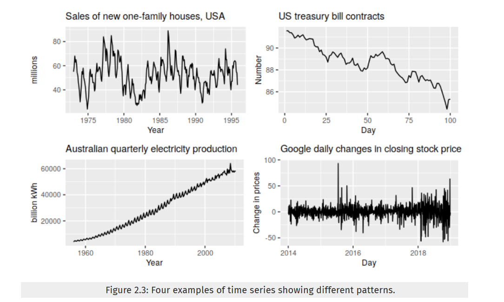


* topleft: storng seasonality, cyclic period in 6 - 10 years, no trend  
* topright: decreasing trend, no trend or cyclic
* bottomleft: increasing trend, seasonality (perhaps on a yearly basis?) 
* bottomright: random fluctuation  

## Seasonal plots  

A seasonal plot is similar to a time plot except that the data are plotted against the individual “seasons” in which the data were observed. A seasonal plot allows the underlying seasonal pattern to be seen more clearly, and is especially useful in identifying years in which the pattern changes.


```r
# y can be automatically chosen
a10 %>% gg_season(y = cost, labels = "both") +
  ylab("$ million") +
  ggtitle("Seasonal plot: antidiabetic drug sales") 
```

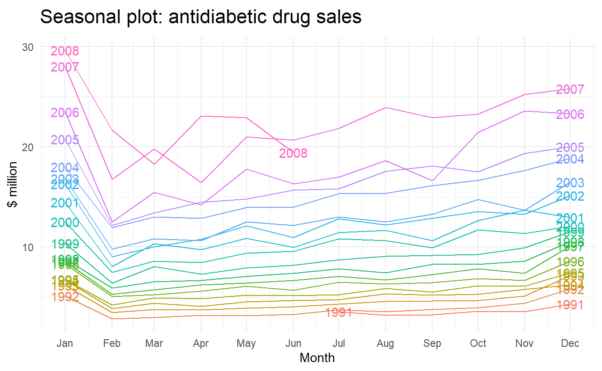

Here `labels = "both"` means labels of years are displayed on both sides of the plot.  

In this case, it is clear that there is a plummet in sales in January each year. And there is an aberrant decrease in March 2008, since most years would see an increase from Feb to Mar.  


A way to reproduce the plot generated by `gg_season()`:  


```r
a10 %>%
  mutate(month = month(Month),
         year = year(Month)) %>%  # accessor function from lubridate package
  as_tibble() %>%
  group_by(year, month) %>% 
  summarize(cost = sum(cost)) %>% 
  ggplot() + 
  geom_line(aes(month, cost, color = year, group = year))
```

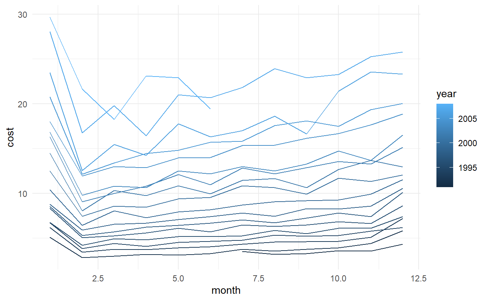

### Multiple seasonal periods: `period` in `gg_season()`  

Where the data has more than one seasonal pattern, the `period` argument can be used to select which seasonal plot is required. The `vic_elec` data contains half-hourly electricity demand for the state of Victoria, Australia. We can plot the daily pattern, weekly pattern or yearly pattern as follows.

daily:   

```r
vic_elec %>% gg_season(period = "day")
```

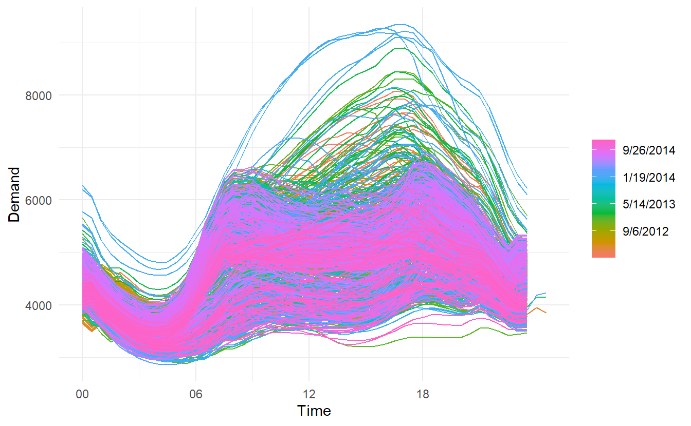

weekly: 


```r
vic_elec %>% gg_season(period = "week")
```

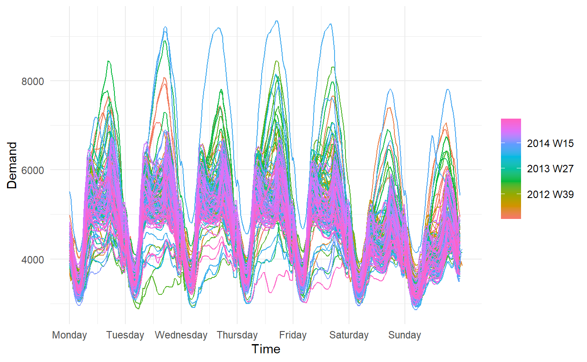

yearly: 

```r
# this plot in fact contains 4 lines
vic_elec %>%
  gg_season(period = "year") + 
  theme(legend.position = "top")
```

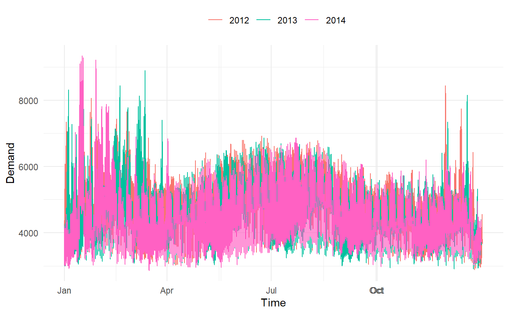

Different from `autoplot()`, when `gg_season()` and the `gg_subseries()` (later introduced) encounter multiple time series, they are displayed in facets. 


##  Seasonal subseries plots  
An alternative plot that emphasises the seasonal patterns is where the data for each season are collected together by facet.  


```r
a10 %>%
  gg_subseries(cost) +
    ylab("$ million") +
    xlab("Year") +
    ggtitle("Seasonal subseries plot: antidiabetic drug sales")
```

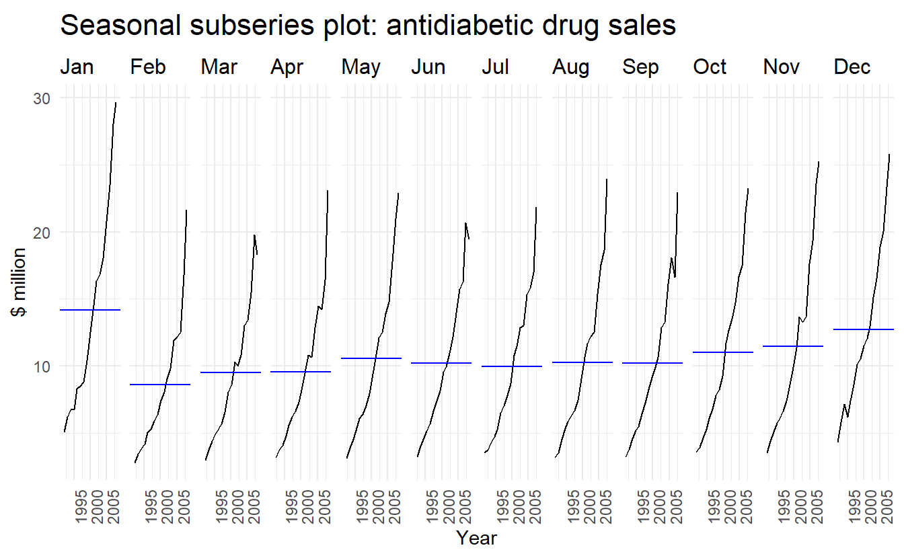

**The blue horizontal lines indicate the means for each month**. This form of plot enables the underlying seasonal pattern to be seen clearly, and also shows the changes in seasonality over time. It is especially useful in identifying changes within particular seasons. In this example, the plot is not particularly revealing; but in some cases, this is the most useful way of viewing seasonal changes over time.  

### Example: Australian holiday tourism  

`holiday_tourism` contains holiday tourists from 1998 to 2017, deaggregated by `Region`, `State`:  


```r
holiday_tourism <- tourism %>% 
  filter(Purpose == "Holiday") %>%
  select(-Purpose)

holiday_tourism 
#> # A tsibble: 6,080 x 4 [1Q]
#> # Key:       Region, State [76]
#>   Quarter Region   State           Trips
#>     <qtr> <chr>    <chr>           <dbl>
#> 1 1998 Q1 Adelaide South Australia  224.
#> 2 1998 Q2 Adelaide South Australia  130.
#> 3 1998 Q3 Adelaide South Australia  156.
#> 4 1998 Q4 Adelaide South Australia  182.
#> 5 1999 Q1 Adelaide South Australia  185.
#> 6 1999 Q2 Adelaide South Australia  135.
#> # ... with 6,074 more rows
```

Then we can get total visitors by states(i.e., ignoring regions), and then plot it using `autoplot()`, note this is a multiple time series:  


```r
holidays <- holiday_tourism %>%
  group_by(State) %>% # no nedd to specify group_by(Quarter, Region)
  count(wt = Trips, name = "trips") %>%
  ungroup()

holidays %>%  
  autoplot() +
  ylab("thousands of trips") + xlab("Year") +
  ggtitle("Australian domestic holiday nights")
```

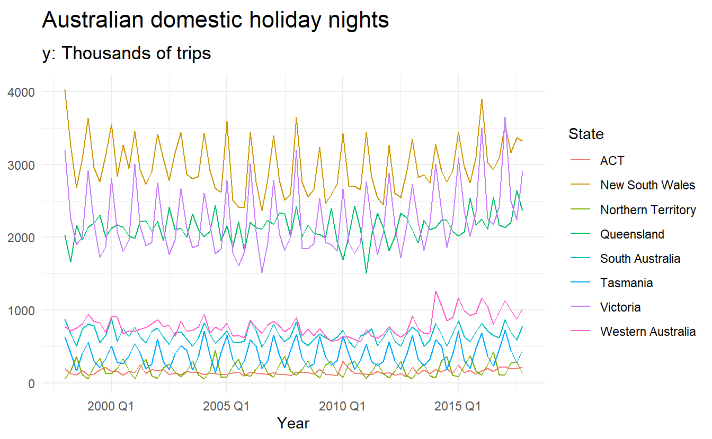

Time plots of each series shows that there is strong seasonality for most states, but that the seasonal peaks do not coincide.   

To see the timing of the seasonal peaks in each state, we can use a season plot.


```r
holidays %>% 
  gg_season(trips) +
  ylab("thousands of trips") +
  ggtitle("Australian domestic holiday nights")
```

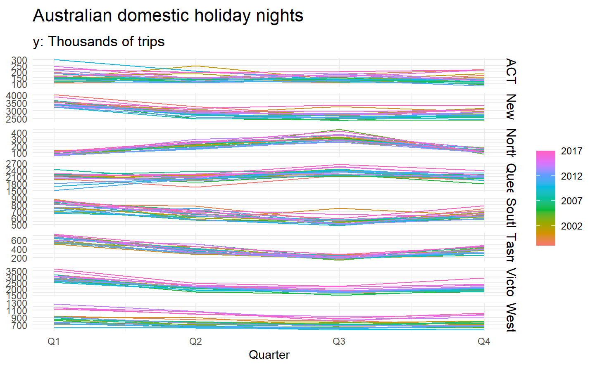

Here it is clear that the southern states of Australia (Tasmania, Victoria and South Australia) have strongest tourism in Q1 (their summer), while the northern states (Queensland and the Northern Territory) have the strongest tourism in Q3 (their dry season).  

The corresponding subseries plots are shown below:  


```r
holidays %>%
  gg_subseries(trips) + 
  ylab("thousands of trips") +
  ggtitle("Australian domestic holiday nights")
```

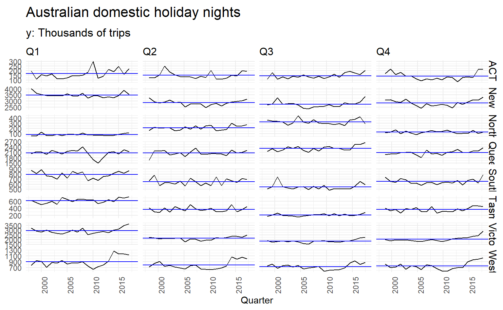

This figure makes it evident that Western Australian tourism has jumped markedly in recent years, while Victorian tourism has increased in Q1 and Q4 but not in the middle of the year.

## Visualization between time series  

While `autoplot()`, `gg_season()` and `gg_subseries()` is instrumental in visualizing individual time series, it is also useful to explore relationships between time series.   

`vic_elec` half-hourly electricity `Demand` (in Gigawatts) and `Temperature` (in degrees Celsius), for 2014 in Victoria, Australia. The temperatures are for Melbourne, the largest city in Victoria, while the demand values are for the entire state. Addition to draw two separate time series, we can make a scatter plot to see relationship between the two:   


```r
library(ggpointdensity)
vic_elec %>% 
  ggplot() + 
  geom_pointdensity(aes(Demand, Temperature)) + 
  scale_color_viridis_c()
```

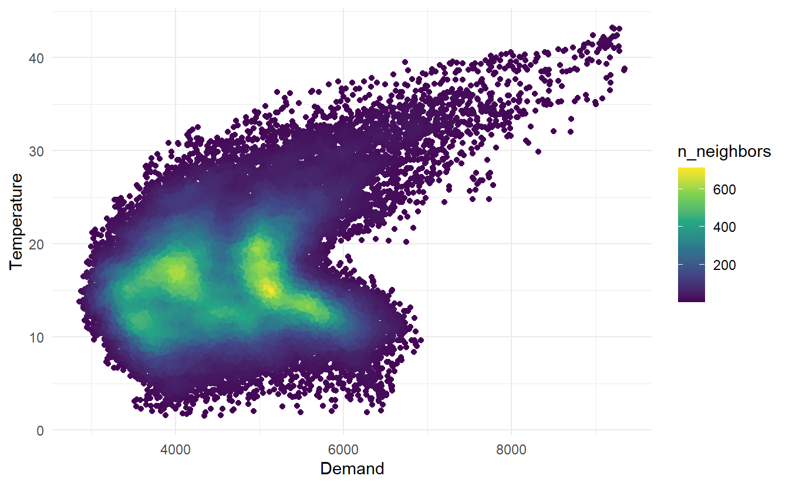

### scatterplot matrices  

When there are several potential predictor variables, it is useful to plot each variable against each other variable. Consider the eight time series shown below, showing quarterly visitor numbers across states and territories of Australia.


```r
visitors <- tourism %>%
  group_by(State) %>%
  summarise(trips = sum(Trips))
visitors %>%
  ggplot(aes(x = Quarter, y = trips)) +
    geom_line() +
    facet_grid(vars(State), scales = "free_y") +
    ylab("Number of visitor nights each quarter (millions)")
```

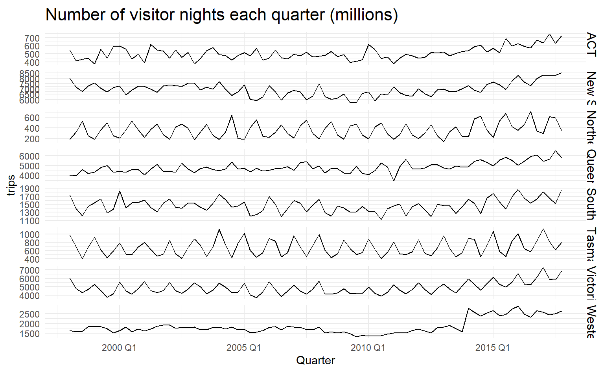
To better illustrate how number of visitors in different states are related, we could draw a scatterplot matrix by `GGally；:ggpairs()`


```r
library(GGally)
visitors %>%
  pivot_wider(names_from = State, values_from = trips) %>% 
  ggpairs(columns = 2:9)
```

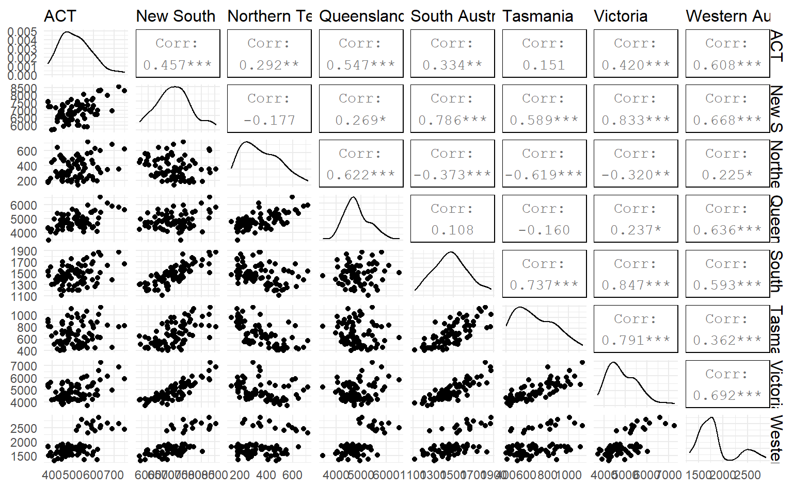

## Lag plots  

Lag plot is another useful tool in discerning seaonality, which display $y_t$ against $y_{t-k}$ in a time series, $k$ being a constant for each individual plot.  

Here we use the Australian beer production data to make a lag plot, in `gg_lag()`, `lags` determines different values of $k$ displayed (defaults to `1:9`) and `geom` types of geometry:  


```r
recent_production <- aus_production %>%
  filter(year(Quarter) >= 1992)

recent_production %>%
  gg_lag(y = Beer, lags = 1:9, geom = "point")
```

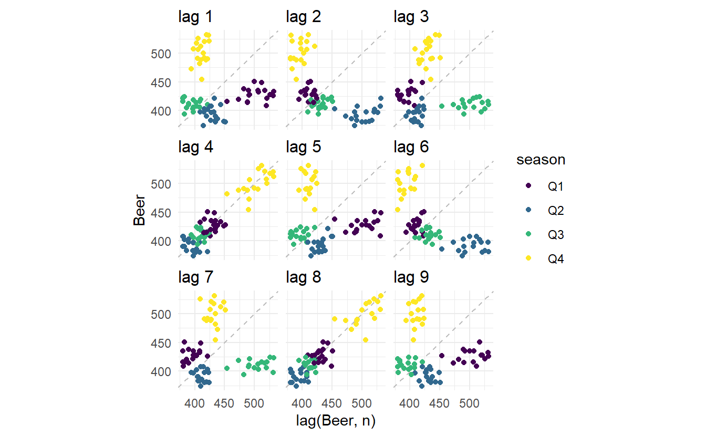

It's no surprise that strong relationship is detected for $k = 4$ and $k = 8$, since in these 2 panels data points are collected from the same quarter, and from this pattern strong seasonality of beer production can be found.    

### Autocorrelation

Just as correlation measures the extent of a linear relationship between two variables, autocorrelation measures the linear relationship between lagged values of a time series. 


There are several autocorrelation coefficients, corresponding to each panel in the lag plot. For example, $r_1$ measures the relationship between $y_t$ and $y_{t−1}$, $r_2$ measures the relationship between $y_t$ and $y_{t−2}$ and so on.  

As correlation coefficient (pearson) is defined as: 

$$
r_{x, y} = \frac{\sum{(x_t - \bar{x})(y_t - \bar{y})}}{\sqrt{\sum{(x_t - \bar{x}})^2} \times {\sqrt{\sum{(y_t - \bar{y}})^2}}}
$$

given $x_t = y_t$ and $y_t = y_{t-k}$ we get the autocorrelation coefficient: 

$$
r_k = r_{y_t,y_{t-k}} = \frac{\sum{(y_t - \bar{y})(y_{t-k} - \bar{y})}}{\sum{(y_t - \bar{y})^2}}
$$

The autocorrelation coefficients make up the *autocorrelation function* or **ACF**.  

The autocorrelation coefficients for the beer production data can be computed using the `ACF(.data, lag_max)` function, with `lag_max` defaulting to $10 \times \log{\frac{N}{M}}$ where $N$ is the number of observations and $M$ the number of series..  


```r
recent_production %>% ACF(Beer)
#> # A tsibble: 18 x 2 [1Q]
#>     lag     acf
#>   <lag>   <dbl>
#> 1    1Q -0.102 
#> 2    2Q -0.657 
#> 3    3Q -0.0603
#> 4    4Q  0.869 
#> 5    5Q -0.0892
#> 6    6Q -0.635 
#> # ... with 12 more rows
```


Similarly, the `ACF()` result could be plotted by `autoplot()`, which is oftern referred to as **correlogram**:     


```r
recent_production %>% 
  ACF(Beer) %>%
  autoplot()
```

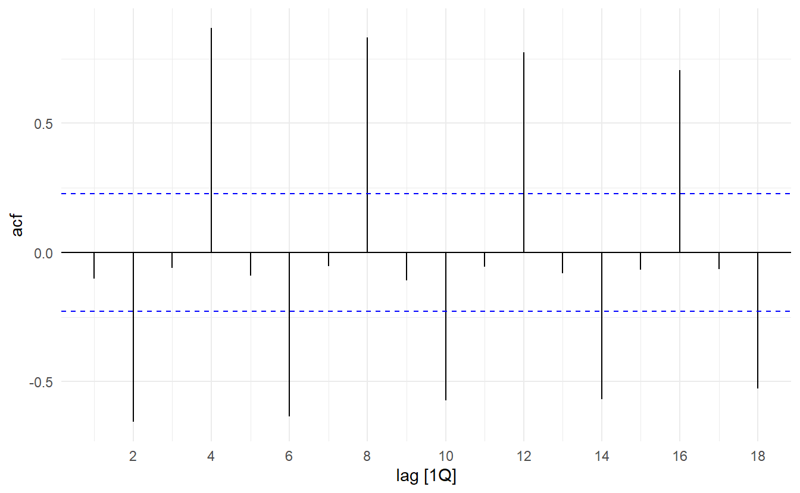


In this graph:

* $r_4$ is higher than for the other lags. This is due to the seasonal pattern in the data: the peaks tend to be four quarters apart and the troughs tend to be four quarters apart.  
* $r_2$ is more negative than for the other lags because troughs tend to be two quarters behind peaks.  
* The dashed blue lines indicate whether the correlations are significantly different from zero.

This seasonal pattern could also be visualized by `gg_season()`` 

```r
recent_production %>% gg_season()
recent_production %>% gg_subseries()
```

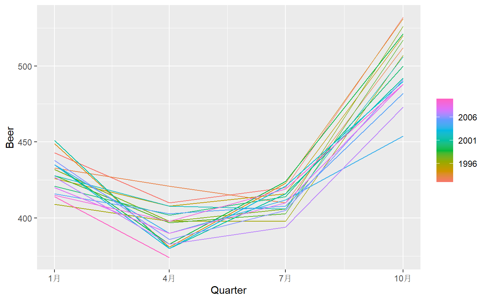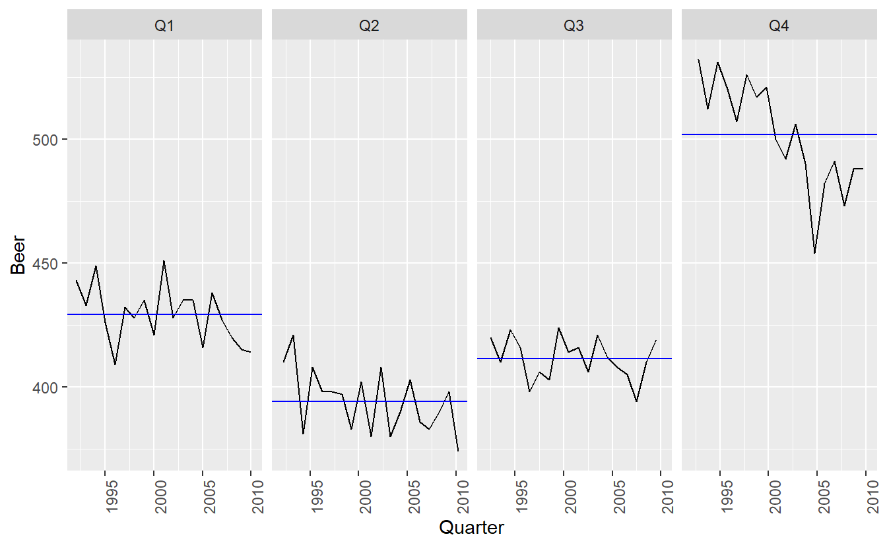

### Trend and seasonality in ACF plots  


When data have a trend, the autocorrelations for small lags tend to be large and positive because observations nearby in time are also nearby in size. So the ACF of trended time series tend to have positive values that slowly decrease as the lags increase.

When data are seasonal, the autocorrelations will be larger for the seasonal lags (at multiples of the seasonal frequency) than for other lags.

When data are both trended and seasonal, you see a combination of these effects, as shown below in the case of `a10`. 

```r
a10 %>% ACF(cost, lag_max = 48) %>% autoplot()
```

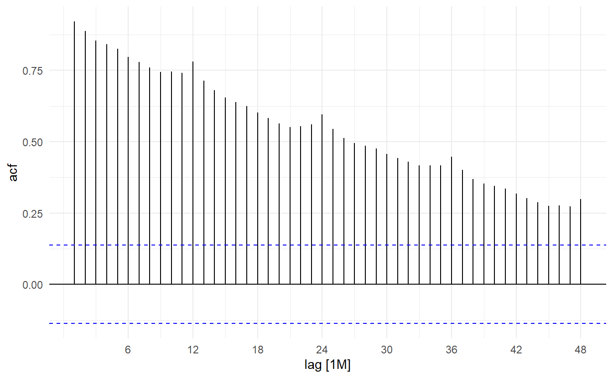


```r
a10 %>% autoplot()
```

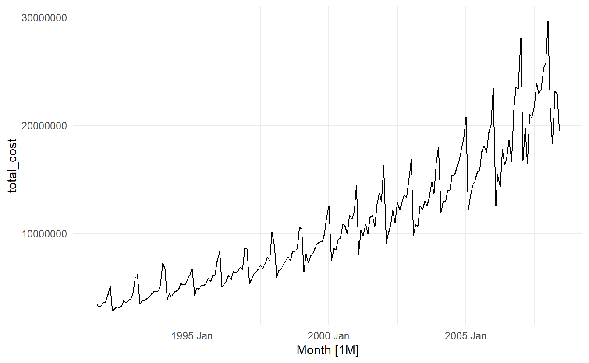


## Calendar plots


Calendar-based graphics arranges the values according to the corresponding dates into a calendar layout, which is comprised of weekdays in columns and weeks of a month in rows for a common monthly calendar. In `sugrrants` the built-in calendars include monthly, weekly, and daily types for the purpose of comparison between different temporal components. 


```r
# remotes::install_github("earowang/sugrrants")
library(sugrrants)
```

`facet_calender()` lay out panels in a calendar format, and a monthly calendar is set up as a 5 by 7 layout matrix


```r
hourly_peds %>%
  filter(Date < ymd("2016-04-01")) %>% 
  ggplot(aes(x = Time, y = Hourly_Counts, colour = Sensor_Name)) +
  geom_line() +
  facet_calendar(~ Date) + # a variable contains dates
  theme_bw() +
  theme(legend.position = "bottom")
```

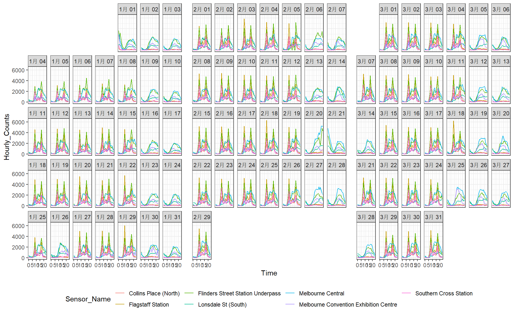


In contrast,  `frame_calendar()` display calendar plot not by facetting, but by computing a more compact calendar grids as a data frame or a tibble according to its data input, and `ggplot2` takes care of the plotting as you usually do with a data frame. This is a faster, more flexible alternative.    

Note `center` is just a normal tibble:  


```r
# sensor only–Melbourne Convention Exhibition Centre
center <- hourly_peds %>% 
  filter(Year == "2017", Sensor_Name == "Melbourne Convention Exhibition Centre")

center
#> # A tibble: 2,880 x 10
#>   Date_Time           Date        Year Month Mdate Day    Time Sensor_ID
#>   <dttm>              <date>     <dbl> <ord> <dbl> <ord> <dbl>     <dbl>
#> 1 2017-01-01 00:00:00 2017-01-01  2017 Janu~     1 Sund~     0        25
#> 2 2017-01-01 01:00:00 2017-01-01  2017 Janu~     1 Sund~     1        25
#> 3 2017-01-01 02:00:00 2017-01-01  2017 Janu~     1 Sund~     2        25
#> 4 2017-01-01 03:00:00 2017-01-01  2017 Janu~     1 Sund~     3        25
#> 5 2017-01-01 04:00:00 2017-01-01  2017 Janu~     1 Sund~     4        25
#> 6 2017-01-01 05:00:00 2017-01-01  2017 Janu~     1 Sund~     5        25
#> # ... with 2,874 more rows, and 2 more variables: Sensor_Name <chr>,
#> #   Hourly_Counts <dbl>
```

The first argument in `frame_calendar()`is the `data` so that the data frame can directly be piped into the function using `%>%`. `x` is a variable indicating time of day could be, `y` a value variable, `date` a Date variable to organise the data into a correct chronological order

In `center`, we have 24 `Hourly_Counts` observations per day, with the day indicated by `Date`, and time in that day by `Time`, $\text{Time} = 1, 2, \dots, 24$. So `x = Time`, `y = Hourly_Counts`, `date = Date`. We also use calendar = `"monthly"` to specify a calendar type, this could also be "weekly" or "daily" 


```r
center_calendar <- center %>%
  frame_calendar(x = Time, y = Hourly_Counts, date = Date, calendar = "monthly")
```

This generates two new columns `.x` and `.y`, in this case `.Time` and `.Hourly_Counts`. This two columns together give new corrdinates computed for different types of calenders. `date` groups the same dates in a chronical order which is useful `geom_line()` and `geom_path()`. The basic use is `ggplot(aes(x = .x, y = .y, group = date)) + geom_*`


```r
p1 <- center_calendar %>% 
  ggplot(aes(x = .Time, y = .Hourly_Counts, group = Date)) +
  geom_line()

p1
```

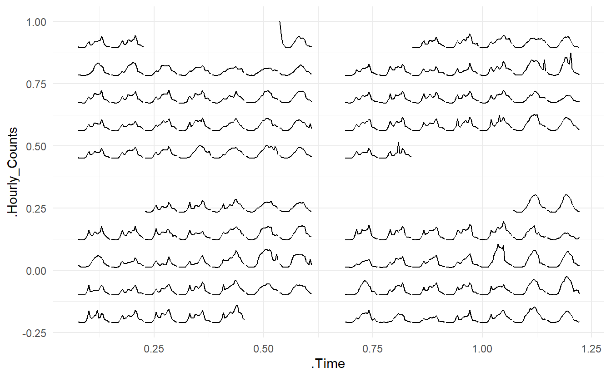


`prettify()` can be used to make the former plot more informative. It takes a `ggplot` object and gives sensible breaks and labels. It can be noted that the calendar-based graphic depicts time of day, day of week, and other calendar effects like public holiday in a clear manner.  


```r
prettify(p1)
```

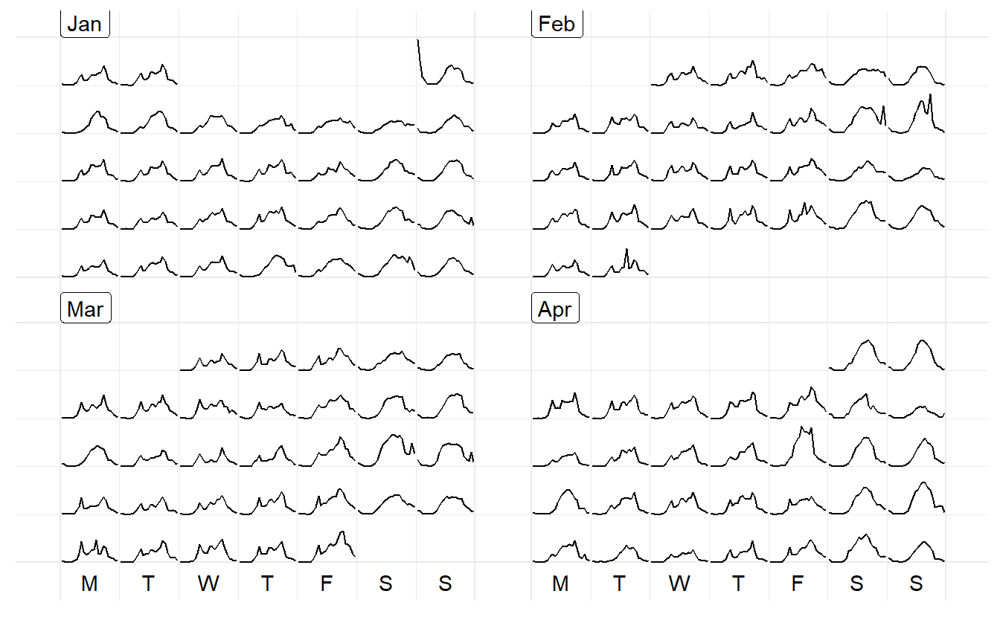


It’s not necessarily working with lines but other geoms too. And `y` can take multiple variable names in combination with `vars()`. The rectangular glyphs arranged on a “weekly” calendar are plotted to illustrate the usage of the multiple ys and the differences between sensors. 


```r
two_sensors_wide <- hourly_peds %>%
  filter(year(Date) == "2017", Sensor_Name %in% c("Lonsdale St (South)", "Melbourne Convention Exhibition Centre")) %>%
  select(-Sensor_ID) %>% 
  pivot_wider(names_from = Sensor_Name, values_from = "Hourly_Counts") %>% 
   rename(
    Lonsdale = `Lonsdale St (South)`,
    Centre = `Melbourne Convention Exhibition Centre`
  ) %>%
  mutate(
    diff = Centre - Lonsdale,
    more = if_else(diff > 0, "Centre", "Lonsdale")
  )

p2 <- two_sensors_wide %>% 
  frame_calendar(x = Time, y = vars(Lonsdale, Centre), 
                 date = Date, calendar = "weekly") %>% 
  ggplot(aes(.Time, group = Date)) + 
  geom_rect(aes(
    xmin = .Time, xmax = .Time + 0.005,
    ymin = .Lonsdale, ymax = .Centre, fill = more
  )) + 
  scale_fill_manual(name = "Which sensor spotted more pedestrians?",
                    values = c("#798234", "#d0587e")) + 
  theme_minimal() + 
  theme(legend.position = "top")  
  

prettify(p2)
```


More information in [Package vignette](https://pkg.earo.me/sugrrants/articles/frame-calendar.html)
