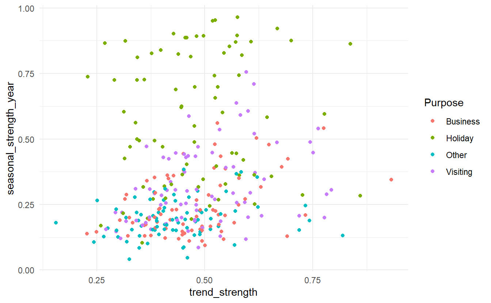
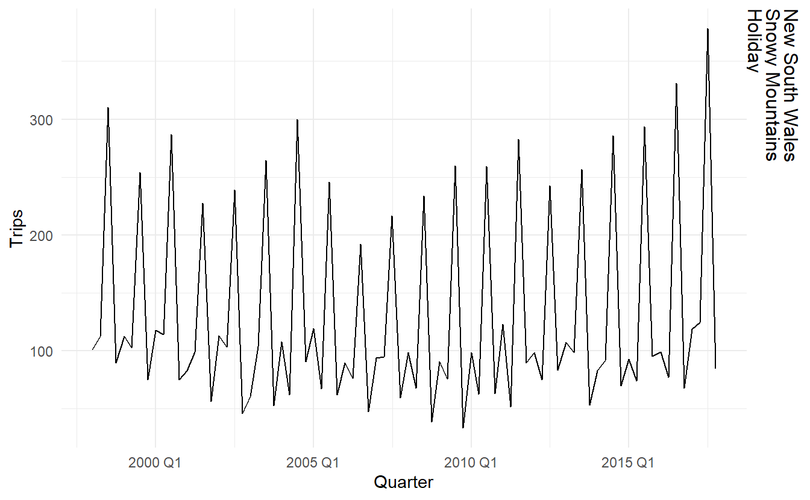
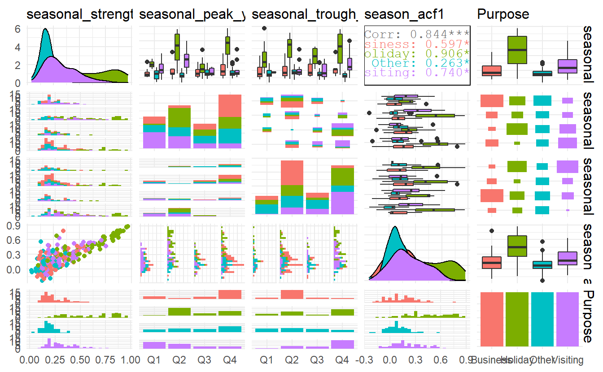

# Time series features  


The `feasts` package includes functions for computing features And statistics from time series (hence the name). We have already seen some time series features. For example, autocorrelations can be considered features of a time series — they are numerical summaries computed from the series. Another feature we saw in the last chapter was the Guerroro estimate of the Box-Cox transformation parameter — again, this is a number computed from a time series.

We can compute many different features on many different time series, and use them to explore the properties of the series.

In this chapter we will look at some features that have been found useful in time series exploration, and how they can be used to uncover interesting information about your data.


```r
library(tsibble)
library(tsibbledata)
library(fable)
library(feasts)
```


## Simple statistics   

Any numerical summary computed from a time series is a feature of that time series — the mean, minimum or maximum, for example.

The features can be computed using the `features()` function. For example, let’s compute the means of all the series in the Australian tourism data.  


```r
tourism %>% 
  features(Trips, mean)
#> # A tibble: 304 x 4
#>   Region         State           Purpose      V1
#>   <chr>          <chr>           <chr>     <dbl>
#> 1 Adelaide       South Australia Business 156.  
#> 2 Adelaide       South Australia Holiday  157.  
#> 3 Adelaide       South Australia Other     56.6 
#> 4 Adelaide       South Australia Visiting 205.  
#> 5 Adelaide Hills South Australia Business   2.66
#> 6 Adelaide Hills South Australia Holiday   10.5 
#> # ... with 298 more rows
```

The new column `V1` contains the mean of each time series.  

It is useful to give the resulting feature columns names to help us remember where they came from. This can be done by using a list of functions.  


```r
tourism %>% 
  features(Trips, list(mean = mean)) %>% 
  arrange(desc(mean))
#> # A tibble: 304 x 4
#>   Region          State           Purpose   mean
#>   <chr>           <chr>           <chr>    <dbl>
#> 1 Sydney          New South Wales Visiting  747.
#> 2 Melbourne       Victoria        Visiting  619.
#> 3 Sydney          New South Wales Business  602.
#> 4 North Coast NSW New South Wales Holiday   588.
#> 5 Sydney          New South Wales Holiday   550.
#> 6 Gold Coast      Queensland      Holiday   528.
#> # ... with 298 more rows
```


Rather than compute one feature at a time, it is convenient to compute many features at once. A common short summary of a data set is to compute five summary statistics: the minimum, first quartile, median, third quartile and maximum. These divide the data into four equal-size sections, each containing 25% of the data. The `quantile()` function can be used to compute them.  


```r
# as of now lambda expressions are not supported 2020.2.13
tourism %>% 
  features(Trips, quantile, prob = seq(0, 1, 0.25))
#> # A tibble: 304 x 8
#>   Region         State           Purpose   `0%`  `25%`  `50%`  `75%` `100%`
#>   <chr>          <chr>           <chr>    <dbl>  <dbl>  <dbl>  <dbl>  <dbl>
#> 1 Adelaide       South Australia Business  68.7 134.   153.   177.    242. 
#> 2 Adelaide       South Australia Holiday  108.  135.   154.   172.    224. 
#> 3 Adelaide       South Australia Other     25.9  43.9   53.8   62.5   107. 
#> 4 Adelaide       South Australia Visiting 137.  179.   206.   229.    270. 
#> 5 Adelaide Hills South Australia Business   0     0      1.26   3.92   28.6
#> 6 Adelaide Hills South Australia Holiday    0     5.77   8.52  14.1    35.8
#> # ... with 298 more rows
```


## ACF features   


All the autocorrelations of a series can be considered features of that series. We can also summarise the autocorrelations to produce new features; for example, the sum of the first ten squared autocorrelation coefficients is a useful summary of how much autocorrelation there is in a series, regardless of lag.

We can also compute autocorrelations of transformations of a time series. A useful transformation in this context is to look at changes in the series between periods. That is, we “difference” the data and create a new time series consisting of the differences between consecutive observations. Then we can compute the autocorrelations of this new differenced series.

Occasionally it is useful to apply the same differencing operation again, so we compute the differences of the differences. The autocorrelations of this double differenced series may provide useful information.

Another related approach is to compute seasonal differences of a series. If we had monthly data, for example, we would compute the difference between consecutive Januaries, consecutive Februaries, and so on. This enables us to look at how the series is changing between years, rather than between months. Again, the autocorrelations of the seasonally differenced series may provide useful information.  

The `feat_acf()` function computes a selection of the autocorrelations discussed here. It will return six or seven features:


* the first autocorrelation coefficient from the original data;  
* the sum of square of the first ten autocorrelation coefficients from the original data;   
* the first autocorrelation coefficient from the differenced data;  
* the sum of square of the first ten autocorrelation coefficients from the differenced data;  
* the first autocorrelation coefficient from the twice differenced data;  
* the sum of square of the first ten autocorrelation coefficients from the twice differenced data;
* For seasonal data, the autocorrelation coefficient at the first seasonal lag is also returned.

When applied to the Australian tourism data, we get the following output.  


```r
tourism %>% 
  features(Trips, feat_acf) %>% 
  select(-(1:3))
#> # A tibble: 304 x 7
#>     acf1 acf10 diff1_acf1 diff1_acf10 diff2_acf1 diff2_acf10 season_acf1
#>    <dbl> <dbl>      <dbl>       <dbl>      <dbl>       <dbl>       <dbl>
#> 1 0.0333 0.131     -0.520       0.463     -0.676       0.741      0.201 
#> 2 0.0456 0.372     -0.343       0.614     -0.487       0.558      0.351 
#> 3 0.517  1.15      -0.409       0.383     -0.675       0.792      0.342 
#> 4 0.0684 0.294     -0.394       0.452     -0.518       0.447      0.345 
#> 5 0.0709 0.134     -0.580       0.415     -0.750       0.746     -0.0628
#> 6 0.131  0.313     -0.536       0.500     -0.716       0.906      0.208 
#> # ... with 298 more rows
```


## STL features  

A time series decomposition can be used to measure the strength of trend and seasonality in a time series. Recall that the decomposition is written as 

$$
y_t = T_t + S_t + R_t
$$

For strongly trended data, the seasonally adjusted data should have stronger variation than that of the remainder component . Therefore $\text{Var}(R_t) / \text{Var}(T_t + R_t)$ should be relatively small. But for data with little or no trend, the two variances should be approximately the same. So we define the strength of trend as: 

$$
F_T = \max(0\,, 1- \frac{\text{Var}(R_t)}{\text{Var}(T_t + R_t)})
$$

The strength of seasonality is defined similarly, but with respect to the detrended data rather than the seasonally adjusted data:

$$
F_S = \max(0\,, 1- \frac{\text{Var}(R_t)}{\text{Var}(S_t + R_t)})
$$

These measures can be useful, for example, when you have a large collection of time series, and you need to find the series with the most trend or the most seasonality.

Other useful features based on STL include the timing of **peaks and troughs** — which month or quarter contains the largest seasonal component and which contains the smallest seasonal component.


```r
tourism %>%
  features(Trips, feat_stl)
#> # A tibble: 304 x 12
#>   Region State Purpose trend_strength seasonal_streng~ seasonal_peak_y~
#>   <chr>  <chr> <chr>            <dbl>            <dbl>            <dbl>
#> 1 Adela~ Sout~ Busine~          0.451            0.380                3
#> 2 Adela~ Sout~ Holiday          0.541            0.601                1
#> 3 Adela~ Sout~ Other            0.743            0.189                2
#> 4 Adela~ Sout~ Visiti~          0.433            0.446                1
#> 5 Adela~ Sout~ Busine~          0.453            0.140                3
#> 6 Adela~ Sout~ Holiday          0.512            0.244                2
#> # ... with 298 more rows, and 6 more variables: seasonal_trough_year <dbl>,
#> #   spikiness <dbl>, linearity <dbl>, curvature <dbl>, stl_e_acf1 <dbl>,
#> #   stl_e_acf10 <dbl>
```

We can then use these features in plots to identify what type of series are heavily trended and what are most seasonal.


```r
tourism %>%
  features(Trips, feat_stl) %>%
  ggplot() + 
  geom_point(aes(trend_strength, seasonal_strength_year, color = Purpose))
```



The most seasonal series can also be easily identified and plotted.  


```r
# most seasonal 
tourism %>%
  features(Trips, feat_stl) %>%
  filter(seasonal_strength_year == max(seasonal_strength_year)) %>%
  left_join(tourism, by = c("State", "Region", "Purpose")) %>%
  ggplot(aes(x = Quarter, y = Trips)) + 
  geom_line() +
  facet_grid(vars(State, Region, Purpose))
```



## Other features  


All of the features included in the `feasts` package can be computed in one line like this, which gives total 44 features (result not show).  


```r
tourism %>% 
  features(Trips, feature_set(pkgs = "feasts"))
```

all features related to stl decomposition


```r
tourism %>% 
  features(Trips, feature_set(tags = "stl"))
#> # A tibble: 304 x 12
#>   Region State Purpose trend_strength seasonal_streng~ seasonal_peak_y~
#>   <chr>  <chr> <chr>            <dbl>            <dbl>            <dbl>
#> 1 Adela~ Sout~ Busine~          0.451            0.380                3
#> 2 Adela~ Sout~ Holiday          0.541            0.601                1
#> 3 Adela~ Sout~ Other            0.743            0.189                2
#> 4 Adela~ Sout~ Visiti~          0.433            0.446                1
#> 5 Adela~ Sout~ Busine~          0.453            0.140                3
#> 6 Adela~ Sout~ Holiday          0.512            0.244                2
#> # ... with 298 more rows, and 6 more variables: seasonal_trough_year <dbl>,
#> #   spikiness <dbl>, linearity <dbl>, curvature <dbl>, stl_e_acf1 <dbl>,
#> #   stl_e_acf10 <dbl>
```


## Exporing Australian tourism data  

Specify multiple function


```r
tourism_tsl <- tourism %>%
  features(Trips, features = list(feat_stl, feat_acf))
```


```r
tourism_tsl %>% 
  select(contains("season"), Purpose) %>% 
  mutate(
    seasonal_peak_year = glue::glue("Q{seasonal_peak_year + 1}"),
    seasonal_trough_year = glue::glue("Q{seasonal_trough_year + 1}")) %>%
  GGally::ggpairs(aes(color = Purpose))
```




