# Exponential smoothing 


Exponential smoothing was proposed in the late 1950s ([@brown1959statistical; @holt1957forecasting; @winters1960forecasting]), and has motivated some of the most successful forecasting methods. Forecasts produced using exponential smoothing methods are weighted averages of past observations, with the weights decaying exponentially as the observations get older. In other words, the more recent the observation the higher the associated weight. This framework generates reliable forecasts quickly and for a wide range of time series, which is a great advantage and of major importance to applications in industry.


```r
library(tsibble)
library(tsibbledata)
library(feasts)
library(fable)
library(lubridate)
```


## Simple exponential smoothing  

The simplest of the exponentially smoothing methods is naturally called simple exponential smoothing (SES). This method is suitable for forecasting data with **no clear trend or seasonal pattern**.

For example, `algeria_economy` below do not display any clear trending behaviour or any seasonality. (There is a decline in the last few years, which might suggest a trend. We will consider whether a trended method would be better for this series later in this chapter.) 


```r
algeria_economy <- tsibbledata::global_economy %>%
  filter(Country == "Algeria")
algeria_economy %>%
  autoplot(Exports) +
  labs(y = "Exports (% of GDP)", x = "Year")
```

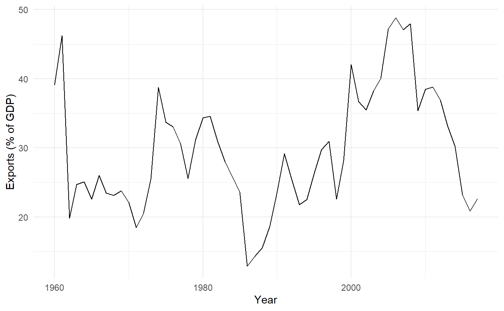

While the naïve method and average method can be considered as two extremes: all weight given to the last observation and equal weight given to all of the observations, we often want something in between. This is the idea behind the exponential smoothing method. Forecasts are calculated using weighted averages, where the weights decrease exponentially as observations come from further in the past — the smallest weights are associated with the oldest observations:

\begin{equation}
(\#eq:simple-smoothing)
\hat{y}_{T+1|T} = \alpha y_T + \alpha(1 - \alpha)y_{T-1} + \alpha(1-\alpha)^2y_{T-2} + \cdots
\end{equation}

where $0 < \alpha < 1$ is called a **smoothing parameter**, controlly the rate at which the weights decrease.  
A larger $\alpha$ means more weight is given to recent observations (large weight first and decrease quickly), and a smaller $\alpha$ means more weight is given to observations from the more distant past (small weight first but decrease slowly).  

We present two equivalent forms of simple exponential smoothing, each of which leads to the forecast Equation \@ref(eq:simple-smoothing)


### Weighted average form  

$$
\begin{aligned}
\hat{y}_{T+1|T} &= \alpha y_T + (1 - \alpha) \hat{y}_{T|T-1} \\ 
\hat{y}_{T|T-1} &= \alpha y_{T-1} + (1 - \alpha) \hat{y}_{T-1|T-2} \\
\vdots \\
\hat{y}_{4|3}  &= \alpha y_3 + (1 - \alpha) \hat{y}_{3|2} \\ 
\hat{y}_{3|2}  &= \alpha y_2 + (1 - \alpha) \hat{y}_{2|1} \\ 
\hat{y}_{2|1} &= \alpha y_1 + (1-\alpha) l_0 
\end{aligned}
$$
Note we denote $\hat{y}_1$ with $\ell_0$, which we will have to estimate.    

Substituting upwards, we get : 

$$
\begin{aligned}
\hat{y}_{2|1} &= \alpha y_1 + (1-\alpha) \ell_0 \\
\hat{y}_{3|2}  &= \alpha y_2 + (1 - \alpha) (\alpha y_1 + (1-\alpha) \ell_0) = \alpha y_2 + \alpha(1 - \alpha)y_1 + (1 - \alpha)^2 \ell_0 \\ 
\hat{y}_{4|3} &= \alpha{y}_3 + (1 - \alpha)(\alpha y_2 + \alpha(1 - \alpha)y_1 + (1 - \alpha)^2 \ell_0) = \alpha{y}_3 + \alpha(1- \alpha)y_2 + \alpha(1 - \alpha)^2y_1 + (1 -\alpha)^3\ell_0 \\
\vdots \\
\hat{y}_{T + 1|T} &= \sum_{j = 0}^{T-1}{\alpha(1 - \alpha)^jy_{T -j}} + (1 - \alpha)^T \ell_0
\end{aligned}
$$

When $T$ is large, $(1 - \alpha)^T \ell_0$ can be ignored. So the least average form approximate the same forecast Equation \@ref(eq:simple-smoothing).

### Component form  
An alternative representation is the component form. For simple exponential smoothing, the only component included is the level, $\ell$ ^[$\ell$ is just styled $l$, `\ell` in latex]. Component form representations of exponential smoothing methods comprise a forecast equation and a smoothing equation for each of the components included in the method. For $h = 1, 2, \dots$ (any step of forecast), we have 

$$
\begin{aligned}
\text{Forecast equation}  \;\;\;\; \hat{y}_{t+h|t} &= \ell_t \\
\text{Smoothing equation}  \;\;\;\;\;\;\;\; \ell_t &= \alpha y_t + (1 - \alpha) \ell_{t-1} 
\end{aligned}
$$

where $\ell_t$ is the level (or the smoothed value) of the series at time $t$. Setting $h=1$ gives the fitted values, while setting $t=T$ gives the true forecasts beyond the training data. 

The forecast equation shows that the forecast value at time $t+1$ is the level at time t, which is essentialy an weighted average of $y_t, y_{t-1}, \dots, y_1$. 

For now the component form seems nothing but a change of notations, yet it will be in the foreground once we start to add more components and build a formal statistical model.    


### Flat forecast 

Simple exponential smoothing has a “flat” forecast function (recall the component form, change $h$ does not affect the equation:   

$$
\hat{y}_{T + h | T} = \hat{y}_{T + 1 | T} = \hat{y}_{T + 2 | T} = \dots = \ell_t \;\;\;\;\; h = 1, 2, \dots
$$

### Estimation

The application of every exponential smoothing method requires the smoothing parameters and the initial values to be chosen. In particular, for simple exponential smoothing, we need to select the values of $\alpha$ and $\ell_0$. All forecasts can be computed from the data once we know those values. For the methods that follow there is usually more than one smoothing parameter and more than one initial component to be chosen.  

In some cases, the smoothing parameters may be chosen in a subjective manner — the forecaster specifies the value of the smoothing parameters based on previous experience. However, a more reliable and objective way to obtain values for the unknown parameters is to estimate them from the observed data. We find the values of the unknown parameters and the initial values that minimise 

$$
\text{SSE} = \sum_{t = 1}^T{y_t - \hat{y}_{t |t-1 }} = \sum_{t = 1}^T{e_t^2}
$$
An alternative to estimating the parameters by minimising the sum of squared errors is the maximum likelihood estimation. This method requires the probability distribution on the part of the response variable $y$, which follows a normal distribution assuming normally distributed errors. This is also discussed in Section \@ref(estimation-and-model-selection).  


### Example: Algerian exports  

In this example, simple exponential smoothing is applied to forecast exports of goods and services from Algeria.  


```r
# estimate parameters 
# default estimation: opt_crit = "lik"
algeria_fit <- algeria_economy %>% 
  model(ETS(Exports ~ error("A") + trend("N") + season("N"), opt_crit = "mse"))

algeria_fit %>% tidy()
#> # A tibble: 2 x 4
#>   Country .model                                                  term  estimate
#>   <fct>   <chr>                                                   <chr>    <dbl>
#> 1 Algeria "ETS(Exports ~ error(\"A\") + trend(\"N\") + season(\"~ alpha    0.840
#> 2 Algeria "ETS(Exports ~ error(\"A\") + trend(\"N\") + season(\"~ l       39.5
```


```r
algeria_fit %>% 
  forecast(h = "5 years") %>% 
  autoplot(algeria_economy, level = 95) + 
  geom_line(aes(y = .fitted, color = "Fitted"), data = augment(algeria_fit)) +
  scale_color_discrete(name = "")
```

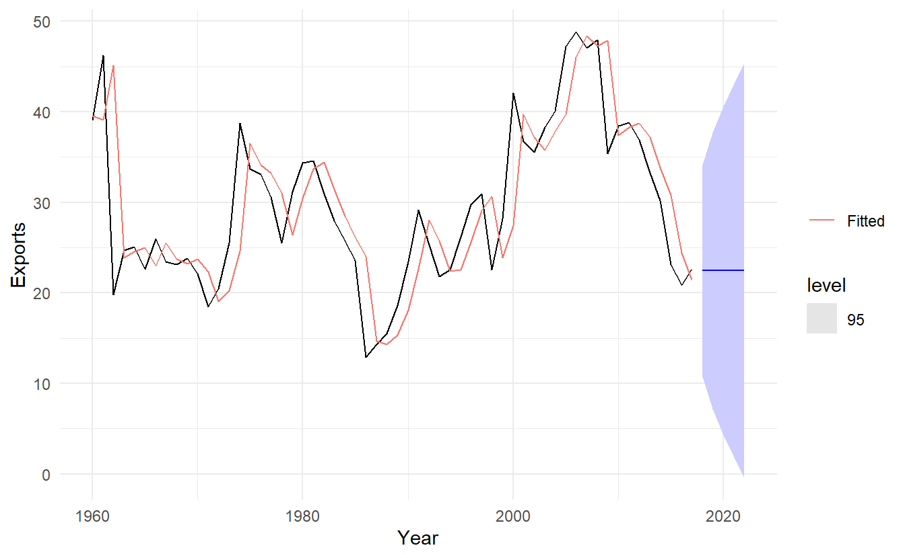


```r
algeria_fit <- algeria_economy %>% 
  model(ETS(Exports ~ error("A") + trend("N") + season("N"), opt_crit = "mse"))

algeria_fit %>% report()
#> Series: Exports 
#> Model: ETS(A,N,N) 
#>   Smoothing parameters:
#>     alpha = 0.84 
#> 
#>   Initial states:
#>     l
#>  39.5
#> 
#>   sigma^2:  35.6
#> 
#>  AIC AICc  BIC 
#>  447  447  453
```


This gives parameter estimates $\alpha = 0.84$ and $\ell_0 = 39.5$, obtained by minimising SSE over periods $t = 1, 2, \dots, 58$, subject to the restriction that $0 \le \alpha \le 1$.

The large value of $\alpha$ in this example is reflected in the large adjustment that takes place in the estimated level $\ell_t$ at each time. A smaller value of α would lead to smaller changes over time, and so the series of fitted values would be smoother.    

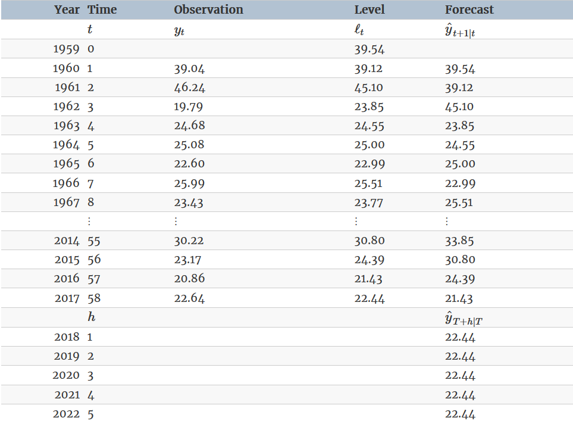


```r
algeria_fit %>% 
  forecast(h = "5 years") %>% 
  autoplot(algeria_economy, level = 95) + 
  geom_line(aes(y = .fitted, color = "Fitted"), data = augment(algeria_fit)) + 
  scale_color_discrete(name = "")
```


## Methods with trend and seasonality   

### Holt’s linear trend method

Holt [-@holt1957forecasting] extended simple exponential smoothing to allow the forecasting of data with a trend. This method involves a forecast equation and two smoothing equations (one for the level and one for the trend): 

$$
\begin{aligned}
\text{Forecast equation}  \;\;\; \hat{y}_{t+h|t} &= \ell_t + hb_t \\
\text{Level equation}  \;\;\;\;\;\;\;\; \ell_t &= \alpha y_t + (1 - \alpha) (\ell_{t-1} + b_{t-1}) \\
\text{Trend equation} \;\;\;\;\;\;\;  b_t &= \beta^*(\ell_t - \ell_{t - 1}) + (1 - \beta^*)b_{t-1}
\end{aligned}
$$

$b_t$ denotes the estimated **slope** of the series at time $t$, and $\beta^*$ is a smoothing parameter for the trend $0\le \beta^* \le 1$. For $b_t$ is an essentially weighted average of slope at $t=1, t = 2, \cdots, t = t - 1$. The following equation shows thta $\beta_0^*(\ell_t - \ell_{t - 1})$ is  weight $\beta_0^*$ attatched to the estimated slope at time $t$

$$
\begin{split}
\ell_t - \ell_{t - 1} &= [(\hat{y}_{t+1|t} - b_t) - (\hat{y}_{t|t-1} - b_{t-1})] \\
                      &= \hat{y}_{t+1|t} - \hat{y}_{t|t-1} - (b_t - b_{t-1}) \\ 
                      &= \frac{(\hat{y}_{t+1|t} - \hat{y}_{t|t-1})}{1} + \frac{(b_t - b_{t-1})}{1}
\end{split}
$$

In Holt's linear trend, the level equation here shows that $\ell_t$ is a weighted average of observation $y_t$ and the one-step-ahead training forecast for time $t$, here given by the level $\ell_t$ at time plus a rise after one observation unit $b_t \times 1$. The trend equation shows that $b_t$ is a weighted average of the estimated trend at time $t$ based on $\ell_t - \ell_{t-1}$ and $b_{t−1}$, the previous estimate of the trend. 

With the introduction of the trend component, now there are 4 parameters that have to be estimated. Two smoothing parameters $\alpha$, $\beta^*$ and two initials $\ell_0$, $b_0$

The forecast function is no longer flat but trending. The $h$
-step-ahead forecast is equal to the last estimated level plus $h$ times the last estimated trend value. Hence the forecasts are a linear function of $h$.

### Example: Australian population


```r
aus_economy <- global_economy %>%
  filter(Code == "AUS") %>%
  mutate(Pop = Population / 1e6)

pop_fit <- aus_economy %>% 
  model(ETS(Pop ~ error("A") + trend("A") + season("N"), opt_crit = "mse"))

pop_fit %>% report()
#> Series: Pop 
#> Model: ETS(A,A,N) 
#>   Smoothing parameters:
#>     alpha = 1 
#>     beta  = 0.327 
#> 
#>   Initial states:
#>     l     b
#>  10.1 0.223
#> 
#>   sigma^2:  0.0041
#> 
#>   AIC  AICc   BIC 
#> -77.0 -75.8 -66.7
```


The estimated smoothing coefficient for the level is $\alpha = 1$. The very high value shows that the level changes rapidly in order to capture the highly trended series. The estimated smoothing coefficient for the slope is $\beta^*= \alpha \beta= 1 \times0.33 = 0.33$ (See ETS(A, A, N) in Section \@ref(innovations-state-space-models-for-exponential-smoothing)).  


```r
pop_fit %>% 
  forecast(h = "5 years") %>% 
  autoplot(aus_economy) + 
  geom_line(aes(y = .fitted, color = ".fitted"), data = augment(pop_fit)) + 
  scale_color_discrete(name = "")
```

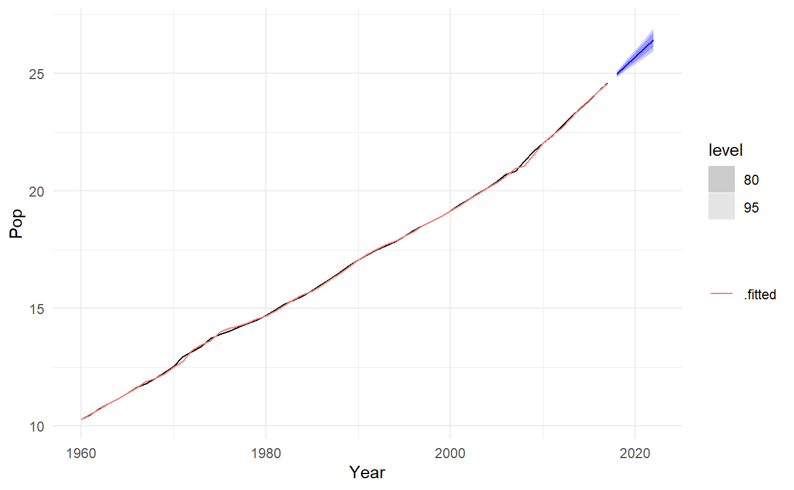

### Damped trend methods

The forecasts generated by Holt’s linear method display a constant trend (increasing or decreasing) indefinitely into the future. Empirical evidence indicates that these methods tend to over-forecast, especially for longer forecast horizons. Motivated by this observation, Gardner & McKenzie {-gardner1985forecasting} introduced a parameter that “dampens” the trend to a flat line some time in the future. Methods that include a damped trend have proven to be very successful, and are arguably the most popular individual methods when forecasts are required automatically for many series.

In conjunction with the smoothing parameters $\alpha$ and $\beta^*$ (with values between 0 and 1 as in Holt’s method), this method also includes a damping parameter $0 \lt \phi < 1$: 

$$
\begin{aligned}
\text{Forecast equation}  \;\;\; \hat{y}_{t+h|t} &= \ell_t + (\phi + \phi^2 + \cdots + \phi^h)b_t \\
\text{Level equation}  \;\;\;\;\;\;\;\; \ell_t &= \alpha y_t + (1 - \alpha) (\ell_{t-1} + \phi b_{t-1})\\
\text{Trend equation} \;\;\;\;\;\;\;  b_t &= \beta^*(\ell_t - \ell_{t - 1}) + (1 - \beta^*)b_{t-1}
\end{aligned}
$$

if $\phi = 1$, the method is identical to Holt's linear method. For values between 0 and 1, $\phi$ dampens the trend so that it approaches a constant some time in the future. To be precise, short-run forecasts are trended while long-run forecasts are constant.  

### Example: Australian Population (continued)  


```r
aus_economy %>%
  model(
    `Holt's method` = ETS(Pop ~ error("A") + trend("A") + season("N")),
    `Damped Holt's method` = ETS(Pop ~ error("A") + trend("Ad", phi = 0.9) + season("N"))
  ) %>%
  forecast(h = 15) %>%
  autoplot(aus_economy, level = NULL) +
  labs(title = "Forecasts from Holt's method",
       x = "Year", y = "Population of Australia (millions)") + 
  guides(colour = guide_legend(title = "Forecast"))
```

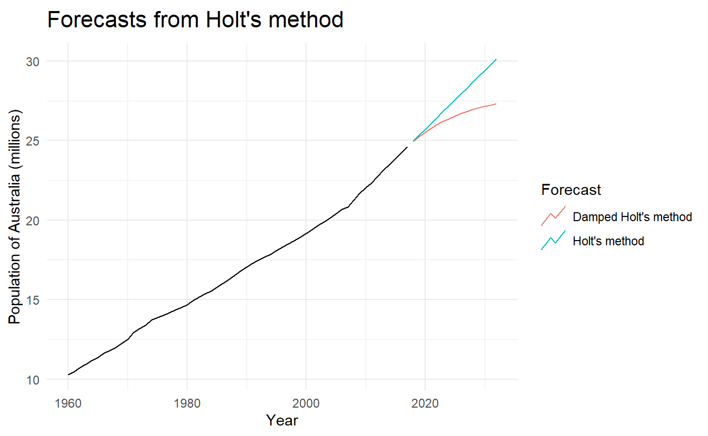

We have set the damping parameter to a relatively low number ($\phi = 0.90$) to exaggerate the effect of damping for comparison. Usually, we would estimate $\phi$ (simply `trend("Ad")`) along with the other parameters. We have also used a rather large forecast horizon ($h = 15$) to highlight the difference between a damped trend and a linear trend.  

### Example: Internet usage

In this example, we compare the forecasting performance of the three exponential smoothing methods that we have considered so far in forecasting the number of users connected to the internet via a server.   


```r
www_usage <- as_tsibble(WWWusage)
www_usage %>% autoplot(value) +
  xlab("Minute") + ylab("Number of users")
```

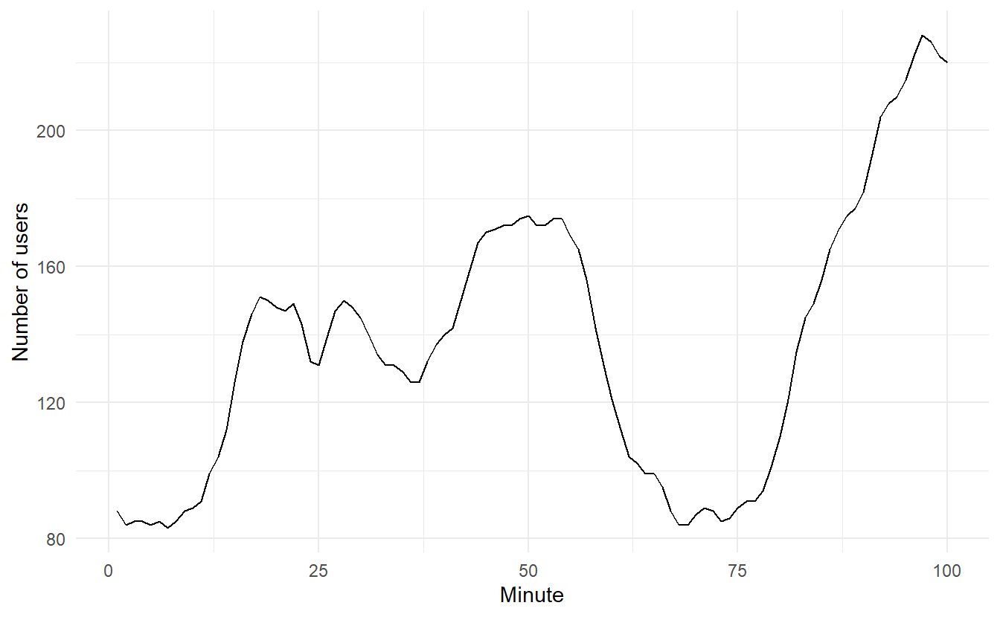


We will use time series cross-validation to compare the one-step forecast accuracy of the three methods. 


```r
www_usage %>%
  stretch_tsibble(.init = 10, .step = 1) %>%
  model(
    SES = ETS(value ~ error("A") + trend("N") + season("N")),
    Holt = ETS(value ~ error("A") + trend("A") + season("N")),
    Damped = ETS(value ~ error("A") + trend("Ad") + season("N"))
  ) %>%
  forecast(h = 1) %>%
  accuracy(www_usage)
#> # A tibble: 3 x 9
#>   .model .type     ME  RMSE   MAE   MPE  MAPE  MASE  ACF1
#>   <chr>  <chr>  <dbl> <dbl> <dbl> <dbl> <dbl> <dbl> <dbl>
#> 1 Damped Test  0.288   3.69  3.00 0.347  2.26 0.663 0.336
#> 2 Holt   Test  0.0610  3.87  3.17 0.244  2.38 0.701 0.296
#> 3 SES    Test  1.46    6.05  4.81 0.904  3.55 1.06  0.803
```


Damped Holt’s method is best whether you compare MAE or RMSE values. So we will proceed with using the damped Holt’s method and apply it to the whole data set to get forecasts for future years.  


```r
usage_fit <- www_usage %>% 
  model(ETS(value ~ error("A") + trend("Ad") + season("N")))

usage_fit %>% tidy()
#> # A tibble: 5 x 3
#>   .model                                                      term  estimate
#>   <chr>                                                       <chr>    <dbl>
#> 1 "ETS(value ~ error(\"A\") + trend(\"Ad\") + season(\"N\"))" alpha   1.00  
#> 2 "ETS(value ~ error(\"A\") + trend(\"Ad\") + season(\"N\"))" beta    0.997 
#> 3 "ETS(value ~ error(\"A\") + trend(\"Ad\") + season(\"N\"))" phi     0.815 
#> 4 "ETS(value ~ error(\"A\") + trend(\"Ad\") + season(\"N\"))" l      90.4   
#> 5 "ETS(value ~ error(\"A\") + trend(\"Ad\") + season(\"N\"))" b      -0.0173
usage_fit %>% report()
#> Series: value 
#> Model: ETS(A,Ad,N) 
#>   Smoothing parameters:
#>     alpha = 1 
#>     beta  = 0.997 
#>     phi   = 0.815 
#> 
#>   Initial states:
#>     l       b
#>  90.4 -0.0173
#> 
#>   sigma^2:  12.2
#> 
#>  AIC AICc  BIC 
#>  718  719  733
```

The smoothing parameter for the slope is estimated to be almost one, indicating that the trend changes to mostly reflect the slope between the last two minutes of internet usage. The decline in the last few years is captured by large $\beta^*$, so that $b_{T+1}, b_{T+2}, \dots, b_{T+10}$ is all negative. $\alpha$ is very close to one, showing that the level reacts strongly to each new observation.

```r
usage_fit %>%
  forecast(h = 10) %>%
  autoplot(www_usage)
```

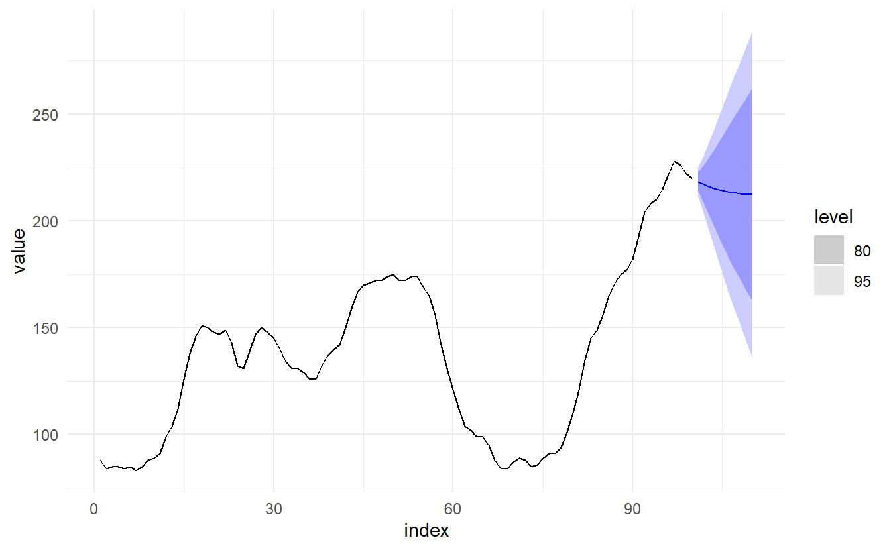


### Holt-Winters’ additive method    

Holt [-@holt1957forecasting]and Winters [-@winters1960forecasting] extended Holt’s method to capture seasonality. The Holt-Winters seasonal method comprises the forecast equation and three smoothing equations — one for the level $\ell_t$, one for the trend $b_t$, and one for the seasonal component $s_t$, with corresponding smoothing parameters $\alpha$, $\beta^*$ and $\gamma$. We use $m$ to denote the frequency of the seasonality, i.e., the number of seasons in a year. For example, for quarterly data $m = 4$, and for monthly data $m = 12$.  

There are two variations to this method that differ in the nature of the seasonal component. The additive method is preferred when the seasonal variations are roughly constant through the series, while the multiplicative method is preferred when the seasonal variations are changing proportional to the level of the series.


$$
\begin{aligned}
\hat{y}_{t + h | t} &= \ell_t + hb_t + s_{t + h -m(k + 1)} \\
\ell_t &= \alpha(y_t - s_{t - m}) + (1 - \alpha)(\ell_{t - 1} + b_{t - 1}) \\ 
b_t &= \beta^*(\ell_t - \ell_{t - 1}) + (1 - \beta^*)b_{t-1} \\
s_t &= \gamma(y_t - \ell_{t-1} - b_{t - 1}) + (1 - \gamma)s_{t-m} \\
\end{aligned}
$$
where $k$ is the integer part of $(h − 1) / m$, which ensures that the estimates of the seasonal indices used for forecasting come from the final year of the sample. The level equation shows a weighted average between the seasonally adjusted observation ($y_t−s_{t−m}$) and the non-seasonal forecast ($\ell_{t−1}+b_{t−1}$) for time t. The trend equation is identical to Holt’s linear method.


The seasonal equation shows a weighted average between the current seasonal index, ($y_t - \ell_{t-1} - b_{t - 1}$), and the seasonal index of the same season last year (i.e., $m$ time periods ago). This means we have $m$ more inital values to estimate $s_1, s_2, \dots, s_m$ in terms of the seasonal component. 


The equation for the seasonal component can be also expressed as 

$$
s_t = \gamma^*(y_t - \ell_t) + (1 - \gamma^*)s_{t-m}
$$

This is the case when we substitute the level equation for $\ell_t$: 

$$
\begin{split}
s_t &= \gamma^*(y_t - \ell_t) + (1 - \gamma^*)s_{t-m} \\
    &= \gamma^*[y_t - \alpha(y_t - s_{t - m}) - (1 - \alpha)(\ell_{t - 1} + b_{t - 1})] + (1 - \gamma^*)s_{t-m} \\
    &= \gamma^*y_t - \gamma^*y_t\alpha + \gamma^* \alpha s_{t - m} - \gamma^*(1 - \alpha)(\ell_{t - 1} + b_{t - 1}) + (1 - \gamma^*)s_{t-m} \\
    &=  \gamma^*(1 - \alpha)y_t - \gamma^*(1 - \alpha)(\ell_{t - 1} + b_{t - 1}) + \gamma^* \alpha s_{t - m} + [1 + y^*(\alpha - 1)]s_{t-m} \\
    &=  \gamma^*(1 - \alpha)(y_t - \ell_{t-1} - b_{t-1}) + [1 - y^*(1 - \alpha)]s_{t-m}
\end{split}
$$

which is identical to the smoothing equation for the seasonal component we specify here, with $\gamma  = \gamma^*(1 - \alpha)$. The usual parameter restriction is $0 \le \gamma^* \le 1$, which translates to $0 \le \gamma \le 1− \alpha$.  

### Holt-Winters’ multiplicative method  

The component form for the multiplicative method is: 

$$
\begin{aligned}
\hat{y}_{t + h | t} &= (\ell_t + hb_t)s_{t + h -m(k + 1)} \\
\ell_t &= \alpha(y_t / s_{t - m}) + (1 - \alpha)(\ell_{t - 1} + b_{t - 1}) \\ 
b_t &= \beta^*(\ell_t - \ell_{t - 1}) + (1 - \beta^*)b_{t-1} \\
s_t &= \gamma[y_t / (\ell_{t-1} + b_{t - 1})] + (1 - \gamma)s_{t-m} \\
\end{aligned}
$$

### Example: Domestic overnight trips in Australia

Here we use cross validation to compare the forecast of additive seasonality with that of multiplicative seasonality. 


```r
aus_holidays <- tourism %>%
  filter(Purpose == "Holiday") %>%
  summarize(Trips = sum(Trips))

holidays_fit <- aus_holidays %>% 
  model(
    additive = ETS(Trips ~ error("A") + trend("A") + season("A")),
    multiplicative = ETS(Trips ~ error("A") + trend("A") + season("M"))
  ) 

holidays_fit %>% glance()
#> # A tibble: 2 x 9
#>   .model          sigma2 log_ik   AIC  AICc   BIC     MSE    AMSE   MAE
#>   <chr>            <dbl>  <dbl> <dbl> <dbl> <dbl>   <dbl>   <dbl> <dbl>
#> 1 additive       189416.  -657. 1332. 1335. 1354. 170475. 180856.  315.
#> 2 multiplicative 187599.  -657. 1331. 1334. 1353. 168839. 179731.  307.
  
holidays_fit %>% 
  forecast(h = "3 years") %>% 
  autoplot(aus_holidays, level = NULL)
```

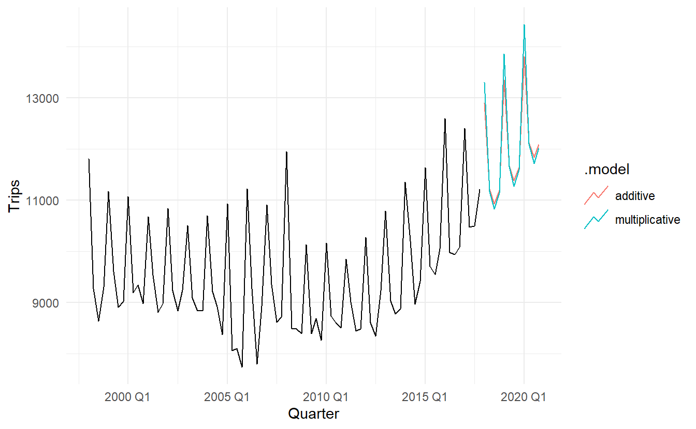

Because both methods have exactly the same number of parameters to estimate, we can compare the training RMSE from both models. In this case, the method with multiplicative seasonality fits the data best. This was to be expected, as the time plot shows that the **seasonal variation in the data increases as the level of the series increases**. This is also reflected in the two sets of forecasts; the forecasts generated by the method with the multiplicative seasonality display larger and increasing seasonal variation as the level of the forecasts increases compared to the forecasts generated by the method with additive seasonality.  


### Holt-Winters’ damped method  

Damping is possible with both additive and multiplicative Holt-Winters’ methods. A method that often provides accurate and robust forecasts for seasonal data is the Holt-Winters method with a damped trend and multiplicative seasonality:  

$$
\begin{aligned}
\hat{y}_{t + h | t} &= [\ell_t + (\phi + \phi^2  + \dots + \phi^h)b_t]s_{t + h -m(k + 1)} \\
\ell_t &= \alpha(y_t / s_{t - m}) + (1 - \alpha)(\ell_{t - 1} + \phi b_{t - 1}) \\ 
b_t &= \beta^*(\ell_t - \ell_{t - 1}) + (1 - \beta^*)\phi b_{t-1} \\
s_t &= \gamma[y_t / (\ell_{t-1} + \phi b_{t - 1})] + (1 - \gamma)s_{t-m} \\
\end{aligned}
$$

### Example: Holt-Winters method with daily data  

The Holt-Winters method can also be used for daily type of data, where the seasonal period is $m = 7$. Here we forecast pedestrian traffic at a busy Melbourne train station in July 2016.


```r
pedestrian_per_day <- pedestrian %>%
  filter(Sensor == "Southern Cross Station", yearmonth(Date) == yearmonth("2016 July")) %>%
  index_by(Date) %>%
  summarise(Count = sum(Count))

pedestrian_fit <- pedestrian_per_day %>% 
  model(ETS(Count ~ error("A") + trend("Ad") + season("M")))

pedestrian_fit %>% report()
#> Series: Count 
#> Model: ETS(A,Ad,M) 
#>   Smoothing parameters:
#>     alpha = 0.19 
#>     beta  = 0.00218 
#>     gamma = 0.000901 
#>     phi   = 0.973 
#> 
#>   Initial states:
#>      l    b   s1   s2   s3   s4    s5    s6   s7
#>  12372 94.7 1.35 1.32 1.32 1.31 0.144 0.208 1.34
#> 
#>   sigma^2:  184620
#> 
#>  AIC AICc  BIC 
#>  493  515  512
```

Here we estimate 9 inital values, 1 for level, 1 for slope, and 7 for seasonal index.  


```r
pedestrian_fit %>% 
  forecast(h = "2 weeks") %>% 
  autoplot(pedestrian_per_day)
```

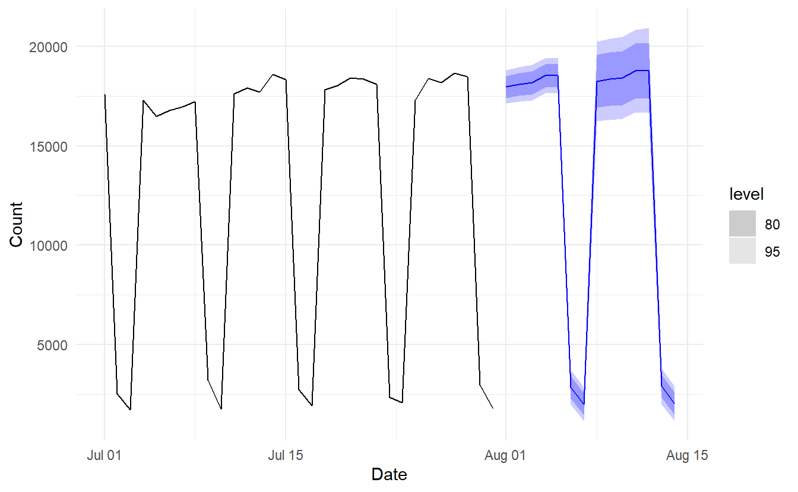


## A taxonomy of exponential smoothing methods  

By considering variations in the combinations of the trend($N$, $A$ and $A_d$) and seasonal components($N$, $A$, and $M$), nine exponential smoothing methods are possible, listed in below 

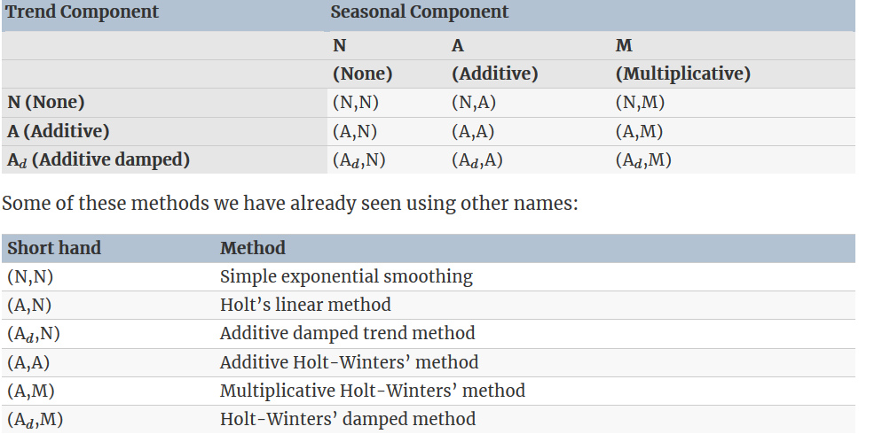


Multiplicative trend methods are not included as they tend to produce poor forecasts. See @hyndman2008forecasting for a more thorough discussion of all exponential smoothing methods.  

The following table gives the recursive formulas for applying the nine exponential smoothing methods. Each cell includes the forecast equation for generating h-step-ahead forecasts, and the smoothing equations for applying the method.

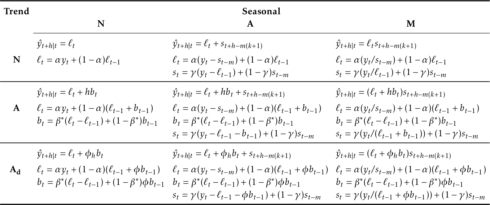


## Innovations state space models for exponential smoothing    

Now we study the statistical models that underlie the exponential smoothing methods we have considered so far. All the exponential smoothing methods presented so far are **algorithms** which generate point forecasts, instead of a **statistical model**.  

The statistical models in this section generate the same point forecasts, but can also generate prediction (or forecast) intervals. A statistical model is a stochastic (or random) data generating process that can produce an entire forecast distribution.   

Each model consists of a measurement equation that describes the observed data, and some state equations that describe how the unobserved components or states (level, trend, seasonal) change over time. Hence, these are referred to as **state space models**.

For each method there exist two models: one with additive errors and one with multiplicative errors. **The point forecasts produced by the models are identical if they use the same smoothing parameter values. They will, however, generate different prediction intervals.**  


Notations :  
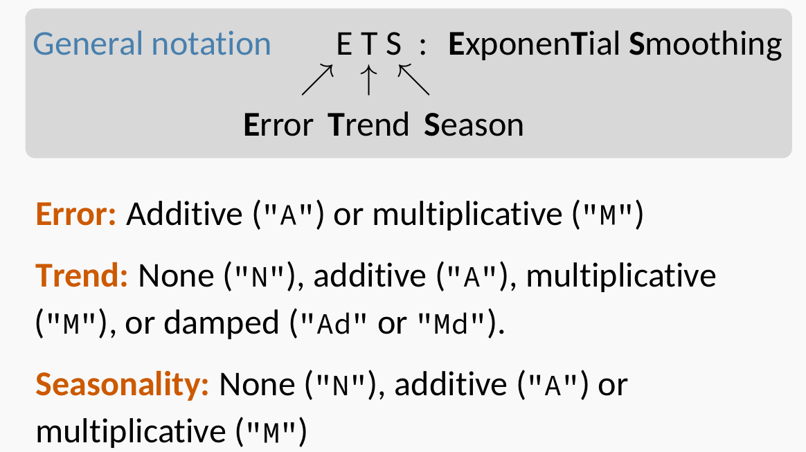


### ETS(A,N,N): simple exponential smoothing with additive errors  

Recall the simple exponential smoothing Equation (component form, 1-step forecast) :  

$$
\begin{aligned}
\text{Forecast equation}  \;\;\;\; \hat{y}_{t+1|t} &= \ell_t \\
\text{Smoothing equation}  \;\;\;\;\;\;\;\; \ell_t &= \alpha y_t + (1 - \alpha) \ell_{t-1} 
\end{aligned}
$$

Let $e_t = y_{t} -\hat{y}_{t|t-1} = y_{t} - \ell_{t-1}$, some then substitute $e_t + \ell_{t - 1}$ for $y_{t}$. We get  


\begin{equation}
y_t = \ell_{t - 1} + e_t  (\#eq:measurement)
\end{equation}

\begin{equation}
\ell_t = \ell_{t-1} + \alpha e_t (\#eq:state)
\end{equation}


We refer to Equation \@ref(eq:measurement) as the **measurement** (or observation) equation and Equation \@ref(eq:state) as the **stat**e (or transition) equation. These two equations, together with the statistical distribution of the errors, form a fully specified statistical model. Specifically, these constitute an innovations state space model underlying simple exponential smoothing.  

The term “**innovations**” comes from the fact that all equations use the same random error process, $\varepsilon_t$. For the same reason, this formulation is also referred to as a “single source of error” model. There are alternative multiple source of error formulations that is not presented here.  

The state equation shows the evolution of the state through time. The influence of the smoothing parameter $\alpha$ is the same as for the methods discussed earlier. For example, $\alpha$ governs the amount of change in successive levels: high values of α allow rapid changes in the level; low values of α lead to smooth changes. If $\alpha = 0$, the level of the series does not change over time; if $\alpha = 1$, the model reduces to a random walk model, $y_t = \ell_{t-1} + \varvarepsilon_t = y_{t−1} + \varepsilon_t$. (See Section \@ref(stationarity) for a discussion of this model.)

### ETS(M,N,N): simple exponential smoothing with multiplicative errors  

A multiplicative error is defined as: 

$$
\varepsilon_t = \frac{y_{t} - \hat{y}_{t|t-1}}{\hat{y}_{t|t-1}}
$$
where $\varepsilon_t \sim N(0, \sigma^2)$.

From the above equaiton we know $y_t = \ell_{t-1}(1 + \varepsilon_t)$, so that

$$
\begin{split}
\ell_t &= \alpha y_t + (1 - \alpha) \ell_{t-1}  \\
       &=  \alpha(1 + \varepsilon_t)\ell_{t-1} + (1-\alpha)\ell_{t-1} \\
       &=\ell_{t-1} (1 + \alpha\varepsilon_t)
\end{split}
$$


Then we can write the multiplicative form of the state space model as 

$$
\begin{aligned}
y_t &= \ell_{t-1} (1 + \varepsilon_t)\\
l_t &= \ell_{t-1}(1 + \alpha\varepsilon_t) 
\end{aligned}
$$

### ETS(A,A,N): Holt’s linear method with additive errors  

Recall in Holt's linear trend method, we have:  

$$
\begin{aligned}
\hat{y}_{t + h | t} &= \ell_t + hb_t  \\
\ell_t &= \alpha y_t + (1 - \alpha)(\ell_{t - 1} + b_{t - 1}) \\ 
b_t &= \beta^*(\ell_t - \ell_{t - 1}) + (1 - \beta^*)b_{t-1} \\
\end{aligned}
$$

In the second equation, we have  

$$
\begin{split}
\ell_t &= \alpha (\ell_{t -1} + b_{t-1} + e_t) + (1 - \alpha)(\ell_{t - 1} + b_{t - 1}) \\
       &= \ell_{t-1} + b_{t-1} + \alpha e_t
\end{split}
$$

and in the third (from $\ell_t - \ell_{t-1} = b_{t-1} + \alpha e_t$ we just derived)

$$
\begin{split}
b_t &= \beta^*(b_{t-1} + \alpha e_t) + (1 - \beta^*)b_{t-1} \\
    &= b_{t-1} + \alpha \beta^*e_t
\end{split}
$$

Finally, assuiming NID errors $\varepsilon_t = e_t \sim (0, \sigma^2)$ and let $\beta = \alpha\beta^*$, we get

$$
\begin{aligned}
y_{t} &= \ell_{t- 1} + b_{t-1} + \varepsilon_t \\
\ell_t &= \ell_{t-1} + b_{t-1} + \alpha \varepsilon_t \\
b_t  &= b_{t-1} + \beta \varepsilon_t
\end{aligned}
$$

### ETS(M,A,N): Holt’s linear method with multiplicative errors   {#ets-man}

Specifying one-step-ahead training errors as relative errors such that   

$$
\varepsilon_t = \frac{y_t - (\ell_{t-1} + b_{t-1})}{(\ell_{t-1} + b_{t-1})}
$$

and that $y_t = (1 + \varepsilon_t)(\ell_{t-1} + b_{t-1})$, so

$$
\begin{split}
\ell_t &= \alpha(1 + \varepsilon_t)(\ell_{t-1} + b_{t-1}) + (1 - \alpha)(\ell_{t-1} + b_{t-1}) \\
    &= (1 + \alpha \varepsilon_t) \ell_{t-1} + (1 + \alpha \varepsilon_t)b_{t-1} \\
    &= (\ell_{t-1} + b_{t-1})(1 + \alpha \varepsilon_t)
\end{split}
$$

and 

$$
\begin{split}
b_t &= \beta^*(\ell_t - \ell_{t-1}) + (1 - \beta^*)b_{t-1} \\
    &= \beta^* \ell_t + b_{t-1} - \beta^* (\ell_{t-1} + b_{t-1}) \\
    &= \beta^* (\ell_{t-1} + b_{t-1})(1 + \alpha \varepsilon_t) + b_{t-1} - \beta^* (\ell_{t-1} + b_{t-1}) \\
    &= \alpha\beta^*(\ell_{t-1} + b_{t-1})\varepsilon_t + b_{t-1} \\
    &= b_{t-1}  + \beta(\ell_{t-1} + b_{t-1})\varepsilon_t
\end{split}
$$

And our final state space model is:  

$$
\begin{aligned}
y_t &= (\ell_{t-1} + b_{t-1})(1 + \varepsilon_t) \\
\ell_t &= (\ell_{t-1} + b_{t-1})(1 + \alpha \varepsilon_t)\\
b_t  &=  b_{t-1}  + \beta(\ell_{t-1} + b_{t-1})\varepsilon_t
\end{aligned}
$$


### Other ETS models

In a similar fashion, we can write an innovations state space model for each of the exponential smoothing methods in the following table   

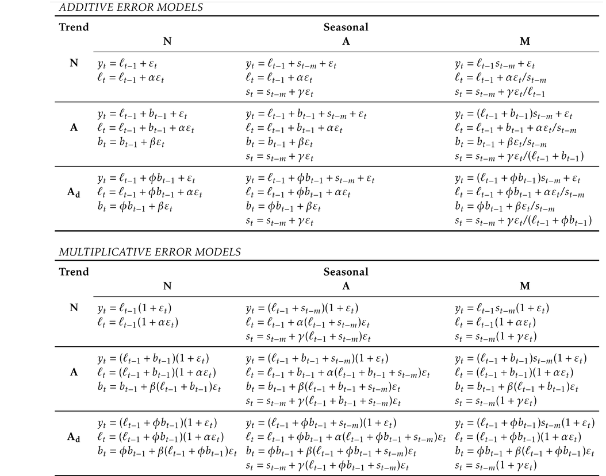


## Estimation and model selection   

### Estimating ETS models 

In Section \@ref(estimation) we use `opt_crit = "mse"` to estimate smoothing parameters and initial values. However, the default method is maximum likelihood estimation. In this section, we will estimate the smoothing parameters $\alpha$, $\beta$, $\gamma$ and $\phi$, and the initial states $\ell_0$, $b_9$, $s_0$,$s_1$, $\dots$, $s_{m-1}$, by maximising the likelihood.


The possible values that the smoothing parameters can take are restricted. Traditionally, the parameters have been constrained to lie between 0 and 1 so that the equations can be interpreted as weighted averages. That is, $0 <\alpha,\beta^*,\gamma^*,\phi < 1$(<span style="color: red;">Why $\gamma^*$ instead of $\gamma$?, \@ref(holt-winters-additive-method)</span>). For the state space models, we have set $\beta = \alpha \beta^∗$ and $\gamma = (1− \alpha)\gamma^*$. Therefore, the traditional restrictions translate to 

$$
\begin{aligned}
1 \lt &\alpha \lt 1 \\
0 \lt &\beta \lt \alpha \\
0 \lt &\gamma \lt 1- \alpha
\end{aligned}
$$


In practice, the damping parameter $\phi$ is usually constrained further to prevent numerical difficulties in estimating the model. In R, it is restricted so that $0.8 < \phi < 0.98$.  


Another way to view the parameters is through a consideration of the mathematical properties of the state space models. The parameters are constrained in order to prevent observations in the distant past having a continuing effect on current forecasts. From this standing points, restrictions are usually (but not always) looser. For example, for the ETS(A, N, N) model, the traditional parameter region is $0 < \alpha < 1$ but the admissible region is $0 < \alpha < 1$. For the ETS(A, A, N) model, the traditional parameter region is $0 < \alpha < 1$ and $0 < \beta <\alpha$ but the admissible region is $0 < \alpha <2$ and $0< \beta < 4−2\alpha$.  

### Model selection criteria

$\text{AIC}$, $\text{AIC}_c$and $\text{BIC}$, introduced in Section \@ref(selecting-predictors), can be used here to determine which of the ETS models is most appropriate for a given time series. 

For ETS models, Akaike’s Information Criterion (AIC) is defined as 

$$
\text{AIC} = -2\log{(L)} + 2k 
$$

where $L$ is the likelihood of the model and $k$ is the total number of parameters and initial states that have been estimated (including the residual variance).  

The AIC corrected for small sample bias ($\text{AIC}_c$) is defined as 

$$
\text{AIC}_c = \text{AIC} + \frac{2k(k + 1)}{T  - k - 1}
$$

and the Bayesian Information Criterion (BIC) is 

$$
\text{BIC} = \text{AIC} + k[\log{(T)} - 2]
$$

Three of the combinations of (Error, Trend, Seasonal) can lead to numerical difficulties. Specifically, the models that can cause such instabilities are multiplicative seasonality and additive error, ETS(A, N, M), ETS(A, A, M), and ETS(A, Ad, M), due to division by values potentially close to zero in the state equations. We normally do not consider these particular combinations when selecting a model.  

**Models with multiplicative errors are useful when the data are strictly positive**, but are not numerically stable when the data contain zeros or negative values. Therefore, multiplicative error models will not be considered if the time series is not strictly positive. In that case, only the six fully additive models will be applied.

### Example: Domestic holiday tourist visitor nights in Australia  

If not explicitly set `error()`, `trend()` or `season()`, `ETS()` use MLE to estimtate the corresponding parameters.  


```r
aus_holidays <- tourism %>%
  filter(Purpose == "Holiday") %>%
  summarise(Trips = sum(Trips))  

holidays_fit <- aus_holidays %>% 
  model(ETS(Trips))

holidays_fit %>% report()
#> Series: Trips 
#> Model: ETS(M,N,M) 
#>   Smoothing parameters:
#>     alpha = 0.358 
#>     gamma = 0.000969 
#> 
#>   Initial states:
#>     l    s1    s2    s3   s4
#>  9667 0.943 0.927 0.968 1.16
#> 
#>   sigma^2:  0.0022
#> 
#>  AIC AICc  BIC 
#> 1331 1333 1348
```

The model selected is ETS(M, N, M) (`Trips` are strictly positive): 

$$
\begin{aligned}
y_t &= \ell_{t-1}s_{t-m}(1 + \varepsilon_t) \\
\ell_t &= \ell_{t-1}(1 + \alpha \varepsilon_ t) \\
s_t &= s_{t-1}(1 + \gamma \varepsilon_t)
\end{aligned}
$$


```r
holidays_fit %>% 
  components() %>% 
  autoplot()
```

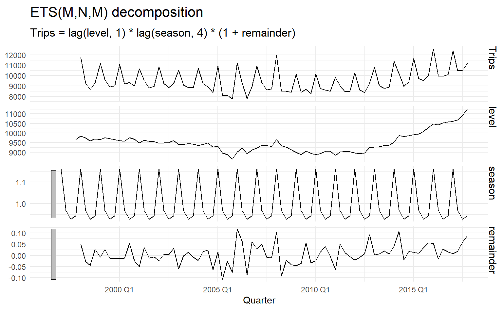


Because this model has multiplicative errors, the residuals are not equivalent to the one-step training errors. The residuals are given by $\hat{\varepsilon}_t$, while the one-step training errors are defined as $y_t − \hat{y}_{t|t−1}$.


```r
residuals(holidays_fit) %>% 
  autoplot() + 
  ggtitle("Innovation errors")

residuals(holidays_fit, type = "response") %>%  
  autoplot() + 
  ggtitle("Response errors")
```

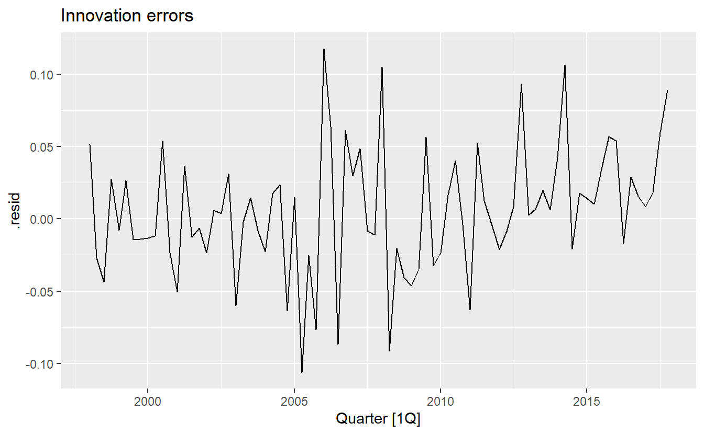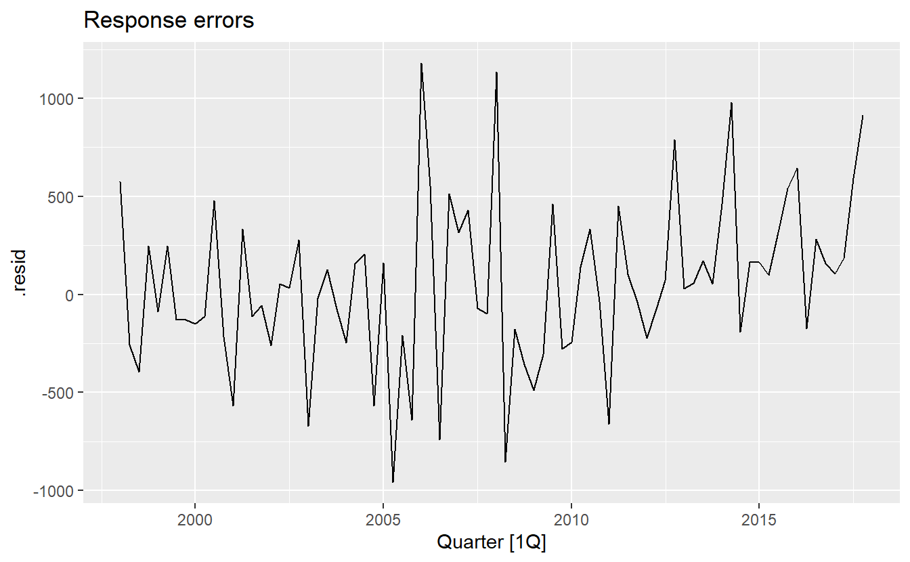


## Forecasting with ETS models 

For model ETS(M, A, N), we have $y_{T+1} = (l_t + b_t)(1 + \varepsilon_t)$. Therefore $\hat{y}_{T+1} = l_t + b_t$. Similarly (check Section \@ref(ets-man) for formula of $\ell_{T+1}$ and $b_{T+1}$)

$$
\begin{split}
y_{T+2} &= (\ell_{T + 1} + b_{T + 1})(1 + \varepsilon_{T+1}) \\
              &= [(\ell_{T} + b_T)(1 + \alpha \varepsilon_t) + b_T  + \beta(\ell_T + b_T)\varepsilon_t] (1 + \varepsilon_{T+1})
\end{split}
$$

By setting $\varepsilon_{T+1} = 0$, we get $y_{T+2} =\ell_T + 2b_T$, which is the same to Holt’s linear methodin Section \@ref(holts-linear-trend-method), where innovation state space model is not formally introduced. Thus, the point forecasts obtained from the method and from the two models that underlie the method are identical (assuming that the same parameter values are used).   


ETS point forecasts are equal to the **medians** of the forecast distributions. For models with only additive components, the forecast distributions are normal, so the medians and means are equal. For ETS models with multiplicative errors, or with multiplicative seasonality, the point forecasts will not be equal to the means of the forecast distributions.  


```r
holidays_fit %>% 
  forecast(h = 8) %>% 
  autoplot(aus_holidays, level = 95)
```

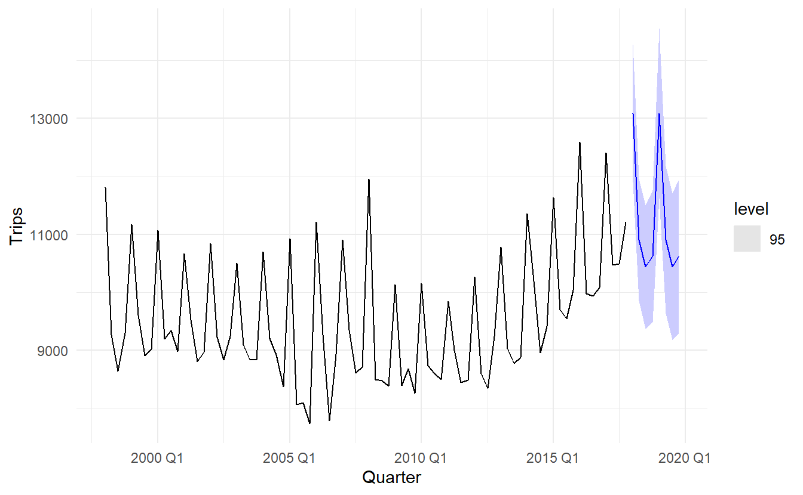

### Example: Australia gas production  


```r
gas_fit <- aus_production %>% 
  model(ETS(Gas))

gas_fit %>% report()  
#> Series: Gas 
#> Model: ETS(M,A,M) 
#>   Smoothing parameters:
#>     alpha = 0.653 
#>     beta  = 0.144 
#>     gamma = 0.0978 
#> 
#>   Initial states:
#>     l      b    s1   s2   s3    s4
#>  5.95 0.0706 0.931 1.18 1.07 0.816
#> 
#>   sigma^2:  0.0032
#> 
#>  AIC AICc  BIC 
#> 1681 1682 1711
```

Why is multiplicative seasonality necessary here?

A model ETS(M, A, M)


```r
gas_fit %>% 
  forecast(h = "5 years") %>% 
  autoplot(aus_production, level = 95)
```

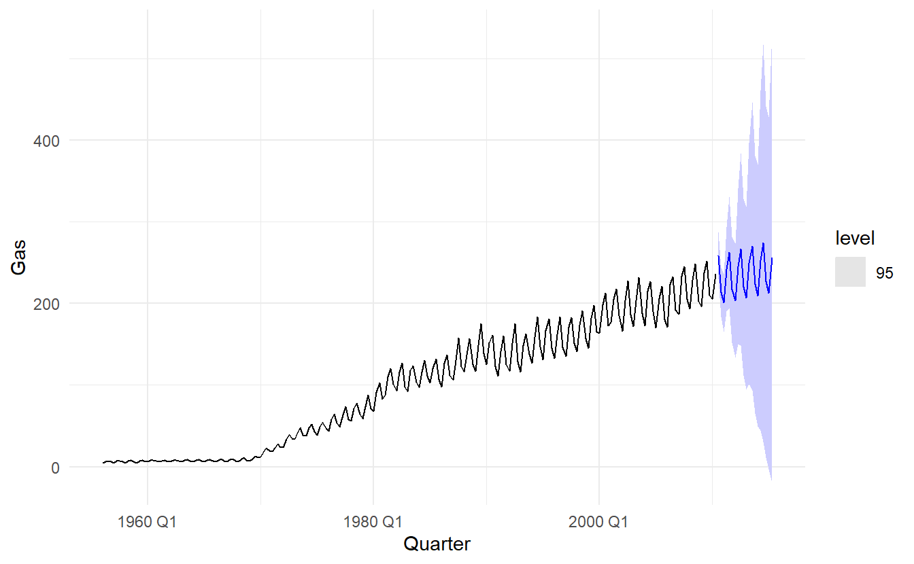

Experiment with making the trend damped, not improving $\text{AIC}_c$


```r
gas_fit_damped <- aus_production %>% 
  model(ETS(Gas ~ trend("Ad")))

gas_fit_damped %>% report()
#> Series: Gas 
#> Model: ETS(M,Ad,M) 
#>   Smoothing parameters:
#>     alpha = 0.649 
#>     beta  = 0.155 
#>     gamma = 0.0937 
#>     phi   = 0.98 
#> 
#>   Initial states:
#>     l      b    s1   s2   s3    s4
#>  5.86 0.0994 0.928 1.18 1.08 0.817
#> 
#>   sigma^2:  0.0033
#> 
#>  AIC AICc  BIC 
#> 1684 1685 1718
```


### Prediction intervals  

Since $y_{T + h| T} = \hat{y}_{T+h|h} + \varepsilon_{T+h}$, and h-step residuals are assumed to be normally distributed and have standard deviation $\hat{\sigma}_h$, mean 0, we have 

$$
y_{T + h| T} \sim N(\hat{y}_{T+h|h},\hat{\sigma}_h^2)
$$
(For the purpose of reviewing, in section \@ref(predict-interval) we conclude that when forecasting is one step ahead, the standard deviation of the forecast distribution is almost the same as the standard deviation of the residuals. And for multi-step forecast, $\sigma_h$ usually increases with $h$, and some more complex estimate methods may be required). 

For most ETS models, a prediction interval can be written as: 

$$
\hat{y}_{T+h|h} \pm c\hat{\sigma}_h
$$

where $c$ depends on the coverage probability. For ETS models, formulas for $\sigma_h$ can be complicated; the details are given in Chapter 6 of https://robjhyndman.com/expsmooth/. In the following table we give the formulas for the additive ETS models, which are the simplest.


<center>
Forecast variance expressions for each additive state space model, where $\sigma_h^2$ is the residual variance of a h-step forecast, $m$ is the seasonal period, and $k$ is the integer part of $(h−1)/m$ (i.e., the number of complete years in the forecast period prior to time $T+h$)
</center>


