# ARIMA models 


```r
library(tsibble)
library(tsibbledata)
library(fable)
library(feasts)
library(lubridate)
library(pins)
library(slider)
```

## Differencing  

All processes (AR, MA, ARMA) disscussed in Chapter \@ref(univariate-stationary-processes) belong to a larger family called *linear stationary processes*. This means our models would normally be confined to a stataionry data-generating system.  

By **differencing**, we compute the differences between consecutive observations, and this has been shown as a easy but effective way to make a non-stationary time series stationary. While transformations such as logarithms can help to stabilise the variance of a time series, differencing can help stabilise the mean of a time series by removing changes in the level of a time series, and therefore eliminating (or reducing) trend and seasonality.  

Suppose there is a undelying linear trend behind the observed time series
$$
y_t = \beta_0 + \beta_1t + \varepsilon_t  
$$
where $\varepsilon_t$ is white noise. The first difference is defined as 

$$
\begin{split}
y'_t &= y_t - y_{t-1} \\
     &= (\beta_0 + \beta_1t + \varepsilon_t) - [\beta_0 + \beta_1(t-1) + \varepsilon_{t-1}] \\ 
     &= \beta_1 + (\varepsilon_t - \varepsilon_{t-1})

\end{split}
$$

Note that $y'_t$ satisfies all stationary conditions, $\text{E}(y'_t) =0$, $\text{Var}(y'_t) = 2\sigma^2$, $\text{Cov}(y'_t, y'_{t+k}) = 0$. So it can be modelled as previously discussed.  

Another example is a (biased) random walk process \@ref(random-walk), where the first difference is 

$$
y'_t = c + \varepsilon_t
$$

### Second-order differencing  

Occasionally the differenced data will not appear to be stationary and it may be necessary to difference the data a second time to obtain a stationary series: 

$$
\begin{aligned}
y''_t &= (y_t - y_{t-1}) - (y_{t-1} - y_{t-2}) \\
      &= y_t - 2y_{t-1} +  y_{t-2}
\end{aligned}
$$
In practice, it is almost never necessary to go beyond second-order differences.  

### Seasonal differencing 

A seasonal difference is the difference between an observation and the previous observation from the same season. So 

$$
y'_t = y_t - y_{t-m}
$$

If seasonally differenced data appear to be white noise, then an appropriate model for the original data is   

$$
y_t = y_{t-m} + \varepsilon_t
$$
Forecasts from this model are equal to the last observation from the relevant season. That is, this model gives seasonal naïve forecasts, introduced in Section \@ref(some-simple-forecasting-methods).

And second seasonal difference is 

$$
\begin{split}
y''_t &= y't - y'_{t-1} \\
      &= (y_t - y_{t-m}) - (y_{t-1} - y_{t-1-m}) \\ 
      &= y_t - y_{t-1} - y_{t-m} + y_{t-1-m}
\end{split}
$$


When both seasonal and first differences are applied, it makes no difference which is done first—the result will be the same. However, **if the data have a strong seasonal pattern, it is recommended that seasonal differencing be done first**, because the resulting series will sometimes be stationary and there will be no need for a further first difference. If first differencing is done first, there will still be seasonality present. 

Sometimes it is necessary to take both a seasonal difference and a first difference to obtain stationary data, as is shown below. Here, the data are first transformed using logarithms (second panel), then seasonal differences are calculated (third panel). The data still seem somewhat non-stationary, and so a further lot of first differences are computed (bottom panel).


```r
PBS %>%
  filter(ATC2 == "H02") %>%
  summarize(Cost = sum(Cost) / 1e6) %>%
  transmute(
     sales = Cost,
     sales_log = log(Cost),
     seasonal_difference = log(Cost) %>% difference(lag = 12),
     double_difference = log(Cost) %>% difference(lag = 12) %>% difference(lag = 1)
  ) %>% 
  pivot_longer(-Month, names_to = "measure") %>% 
  mutate(measure = fct_relevel(measure, 
                               c("sales", 
                                 "sales_log", 
                                 "seasonal_difference", 
                                 "double_difference"))) %>%
  ggplot() + 
  geom_line(aes(Month, value)) + 
  facet_wrap(~ measure, ncol = 1, scales = "free_y") + 
  labs(title = "Corticosteroid drug sales", x = "Year", y = NULL)
```

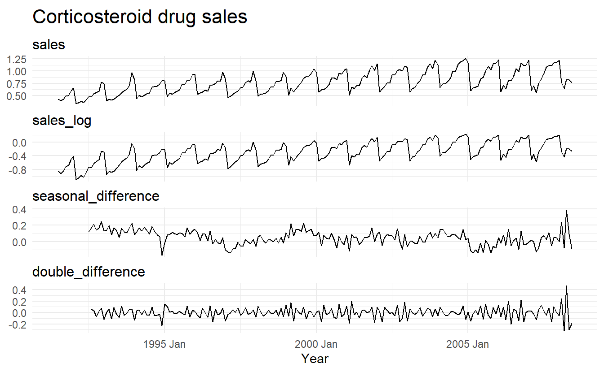


### Unit root tests

One way to determine more objectively whether differencing is required is to use a **unit root test**. These are statistical hypothesis tests of stationarity that are designed for determining whether differencing is required. 

A number of unit root tests are available, which are based on different assumptions and may lead to conflicting answers. Here we use the Kwiatkowski-Phillips-Schmidt-Shin (KPSS) test implemented by `urca::ur.kpss()`. In this test, the null hypothesis is that the data are stationary, and we look for evidence that the null hypothesis is false. Consequently, small p-values suggest that differencing is required.   


```r
google_2015 <- gafa_stock %>%
  filter(Symbol == "GOOG") %>%
  mutate(day = row_number()) %>%
  update_tsibble(index = day, regular = TRUE) %>% 
  filter(year(Date) == 2015)

google_2015 %>%
  features(Close, unitroot_kpss)
#> # A tibble: 1 x 3
#>   Symbol kpss_stat kpss_pvalue
#>   <chr>      <dbl>       <dbl>
#> 1 GOOG        3.56        0.01
```

The test statistic is much bigger than the 1% critical value, indicating that the null hypothesis is rejected. That is, the data are not stationary. We can difference the data, and apply the test again.  


```r
google_2015 %>%
  mutate(Close = difference(Close, 1)) %>% 
  features(Close, unitroot_kpss)
#> # A tibble: 1 x 3
#>   Symbol kpss_stat kpss_pvalue
#>   <chr>      <dbl>       <dbl>
#> 1 GOOG      0.0989         0.1
```

This time, the test statistic is tiny, and well within the range we would expect for stationary data. So we can conclude that the differenced data are stationary.  

This process of using a sequence of KPSS tests to determine the appropriate number of first differences is carried out using the `unitroot_ndiffs()` feature. 


```r
# 1st difference is needed
google_2015 %>% 
  features(Close, unitroot_ndiffs)
#> # A tibble: 1 x 2
#>   Symbol ndiffs
#>   <chr>   <int>
#> 1 GOOG        1
```

A similar feature for determining whether seasonal differencing is required is `unitroot_nsdiffs()`, which uses the measure of seasonal strength introduced in Section \@ref(stl-features). Recall that the strength of seasonality $F_s$ is defined as 

$$
F_S = \max(0\,, 1- \frac{\text{Var}(R_t)}{\text{Var}(S_t + R_t)})
$$
where $R_t$ is the remainder component and $S_t$ the seasonal component. No seasonal differences are suggested if $F_S < 0.64$, otherwise one seasonal difference is suggested.

We can apply `unitroot_nsdiffs()` to the monthly total Australian retail turnover.


```r
aus_total_retail <- aus_retail %>%
  summarize(Turnover = sum(Turnover))
aus_total_retail %>%
  mutate(log_turnover = log(Turnover)) %>% 
  features(log_turnover, unitroot_nsdiffs)
#> # A tibble: 1 x 1
#>   nsdiffs
#>     <int>
#> 1       1
```


```r
aus_total_retail %>%
  mutate(log_turnover = log(Turnover) %>% difference(12)) %>%
  features(log_turnover, unitroot_ndiffs)
#> # A tibble: 1 x 1
#>   ndiffs
#>    <int>
#> 1      1
```


Because `unitroot_nsdiffs()` returns 1 (indicating one seasonal difference is required), we apply the `unitroot_ndiffs()` function to the seasonally differenced data. These functions suggest we should do both a seasonal difference and a first difference.  


```r
aus_total_retail %>% 
  mutate(log_turnover = log(Turnover) %>% 
           difference(12) %>%
           difference(1)) %>% 
  autoplot(log_turnover)
```

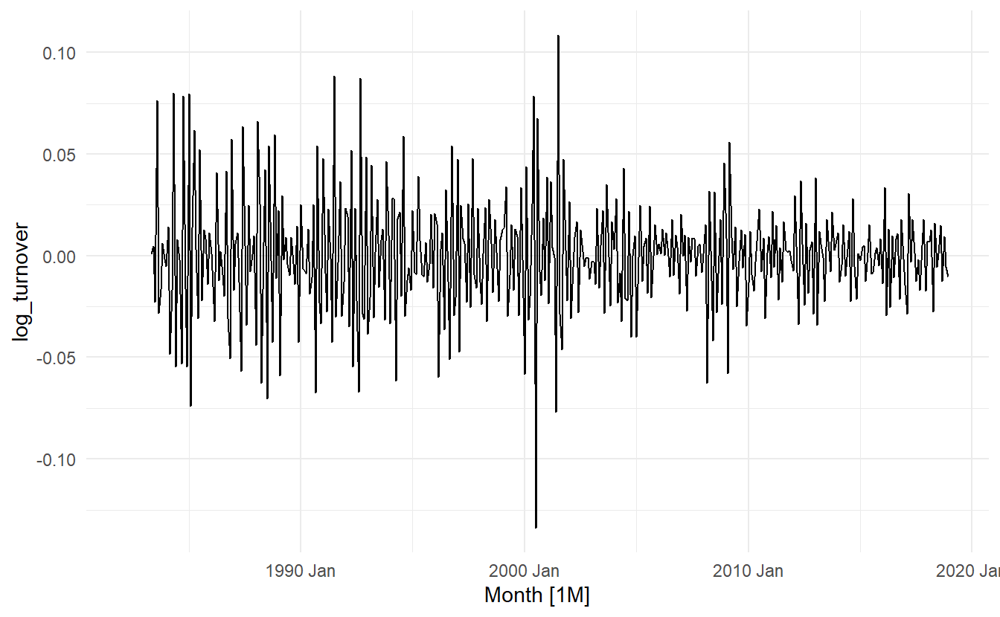


## Non-seasonal ARIMA models 


If we combine differencing with autoregression and a moving average model, we obtain a non-seasonal ARIMA model. ARIMA is an acronym for **A**uto**R**egressive **I**ntegrated **M**oving **A**verage (in this context, “integration” is the reverse of differencing). The full model can be written as   

\begin{equation}
(\#eq:arima)
y'_t =c + \phi_1y_{t-1} + \cdots + \phi_py_{t-p} + \theta_1\varepsilon_{t-1} + \cdots \theta_q\varepsilon_{t-q} + \varepsilon_t  
\end{equation}

We call this an ARIMA(p, d, q) model, where 
$$
\begin{aligned}
p &= \text{order of the autoregressive part} \\
d &= \text{degree of first differencing involved} \\
q &= \text{order of the moving average part}
\end{aligned}
$$

The same stationarity and invertibility conditions that are used for autoregressive and moving average models also apply to an ARIMA model.

Many of the models we have already discussed are special cases of the ARIMA model


Once we start combining components in this way to form more complicated models, it is much easier to work with the backshift notation. For example, Equation \@ref(eq:arima) can be written in backshift notation as 

$$
(1 - \phi_1B - \cdots - \phi_pB^p)(1 - B)^dy_t = c + (1 + \theta_1B + \cdots + \theta_1B^q)\varepsilon_t
$$


### Understanding ARIMA models  

The constant $c$ has an important effect on the long-term forecasts obtained from these models.

- If $c = 0$ and $d = 0$ , the long-term forecasts will go to zero.

- If $c = 0$ and $d = 1$, the long-term forecasts will go to a non-zero constant.

- If $c = 0$ and $d = 2$, the long-term forecasts will follow a straight line.

- If $c \not= 0$ and $d = 0$, the long-term forecasts will go to the mean of the data.

- If $c \not= 0$ and $d = 1$ , the long-term forecasts will follow a straight line.

- If $c \not= 0$ and $d = 2$, the long-term forecasts will follow a quadratic trend.  

The value of $d$ also has an effect on the prediction intervals — the higher the value of $d$, the more rapidly the prediction intervals increase in size. For $d = 0$, the long-term forecast standard deviation will go to the standard deviation of the historical data, so the prediction intervals will all be essentially the same.  

In the case of `us_change_fit`, $c \not= 0$ and $d = 0$, long-term forecasts go to the mean of the data. 

The value of $p$ is important if the data show cycles. To obtain cyclic forecasts, it is necessary to have $p \ge 2$, along with some additional conditions on the parameters. For an AR(2) model, cyclic behaviour occurs if $\phi_1^2 + 4\phi_2<0$. In that case, the average period of the cycles is  

$$
\frac{2\pi}{\arccos[-\phi_1(1 - \phi_2) / 4\phi_2]}
$$


## Estimation and order selection  


Recall how ACF and PACF plot would help us pick an appropriate AR(p) or MA(q) model. 
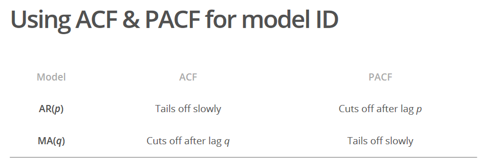

However, for ARIMA models, **ACF and PACF plots are only helpful when one of $p$ and $q$ is zero**. If $p$ and $q$ are both positive, then the plots do not help in finding suitable values of $p$ and $q$. (Think of an ARMA(p, q) process, neither its autocorrelation nor its partial autocorrelation function breaks off)

The data may follow an ARIMA(p, d, 0) model if the ACF and PACF plots of the differenced data show the following patterns:

- the ACF is exponentially decaying or sinusoidal;

- there is a significant spike at lag p in the PACF, but none beyond lag p  

The `us_change` data may follow an ARIMA(0, d, q) model if the ACF and PACF plots of the differenced data show the following patterns: 

- the PACF is exponentially decaying or sinusoidal;

- there is a significant spike at lag q in the ACF, but none beyond lag q.  


```r
us_change <- read_csv(pin("https://otexts.com/fpp3/extrafiles/us_change.csv")) %>% 
  mutate(time = yearquarter(Time)) %>% 
  as_tsibble(index = time)  

us_change %>% ACF(Consumption) %>% autoplot()
us_change %>% PACF(Consumption) %>% autoplot()
```

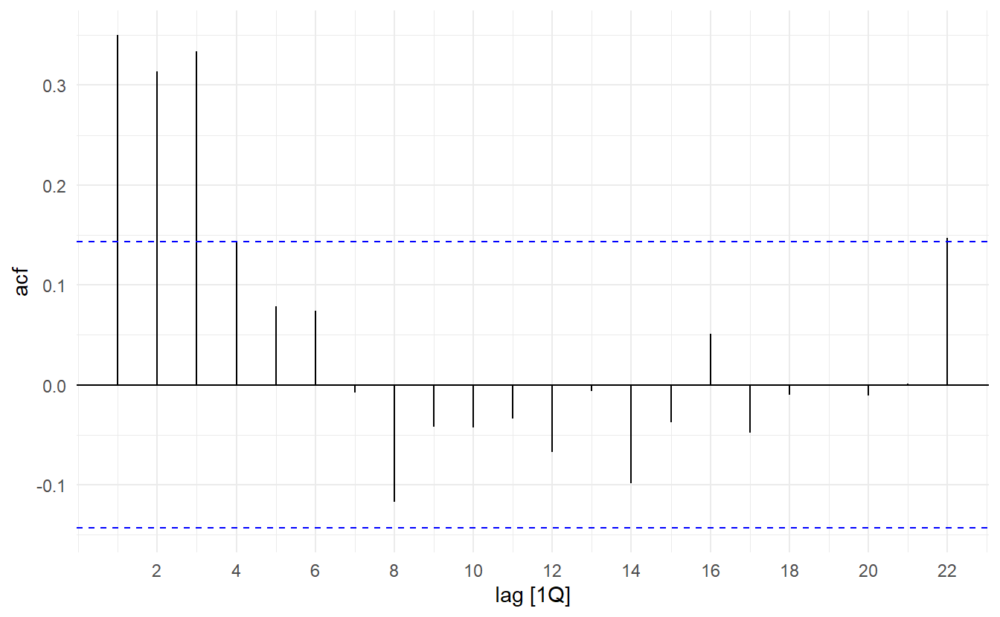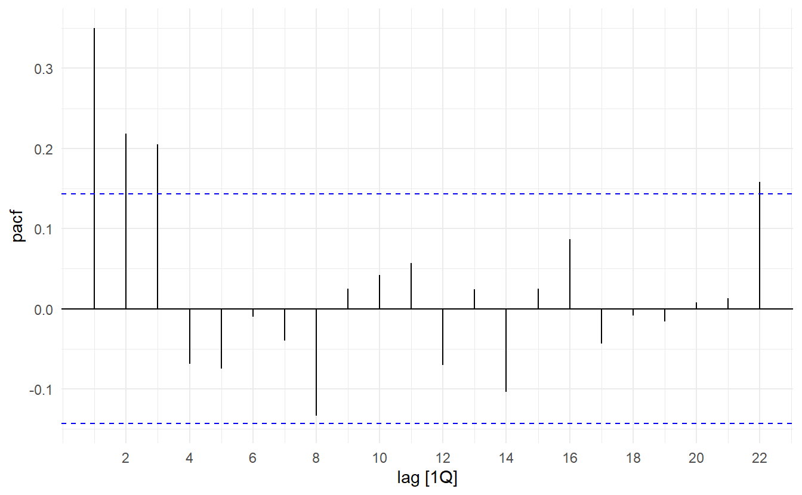

The pattern in the first three spikes is what we would expect from an ARIMA(3, 0, 0), as the PACF tends to decrease. So in this case, the ACF and PACF lead us to think an ARIMA(3, 0, 0) model might be appropriate.   


```r
us_change_fit2 <- us_change %>% 
  model(ARIMA(Consumption ~ PDQ(0, 0, 0) + pdq(3, 0, 0)))

us_change_fit2 %>% report()
#> Series: Consumption 
#> Model: ARIMA(3,0,0) w/ mean 
#> 
#> Coefficients:
#>          ar1     ar2     ar3  constant
#>       0.2274  0.1604  0.2027    0.3050
#> s.e.  0.0713  0.0723  0.0712    0.0421
#> 
#> sigma^2 estimated as 0.3494:  log likelihood=-165
#> AIC=340   AICc=341   BIC=356
```

This model is actually slightly better than the model identified by `ARIMA()` (with an AICc value of 340.67 compared to 342.08). The `ARIMA()` function did not find this model because it does not consider all possible models in its search. Use `stepwise = FALSE` and `approximation = FALSE` to expand search region 


```r
us_change_fit3 <- us_change %>%
  model(ARIMA(Consumption ~ PDQ(0, 0, 0),
              stepwise = FALSE, 
              approximation = FALSE))

report(us_change_fit3)
#> Series: Consumption 
#> Model: ARIMA(3,0,0) w/ mean 
#> 
#> Coefficients:
#>          ar1     ar2     ar3  constant
#>       0.2274  0.1604  0.2027    0.3050
#> s.e.  0.0713  0.0723  0.0712    0.0421
#> 
#> sigma^2 estimated as 0.3494:  log likelihood=-165
#> AIC=340   AICc=341   BIC=356
```


### MLE

Once the model order has been identified (i.e., the values of p, d and q), we need to estimate the parameters $c, \phi_1, \dots, \phi_p, \theta_1, \dots, \theta_q$. When R estimates the ARIMA model, it uses MLE. For ARIMA models, MLE is similar to the least squares estimates that would be obtained by minimising 

$$
\sum_{t=1}^{T}{\varepsilon_t^2}
$$

### Information Criteria  

Akaike’s Information Criterion (AIC), which was useful in selecting predictors for regression, is also useful for determining the order of an ARIMA model. It can be written as   

$$
\text{AIC} = -2\log{L} + 2(p + q + k + 1)
$$

where $L$ is the likelihood of the data. Note that the last term in parentheses is the number of parameters in the model (including $\sigma^2$, the variance of the residuals). 

For ARIMA models, the corrected AIC can be written as   

$$
\text{AIC}_c = AIC + \frac{2(p + q + k + 1)(p + q + k + 2)}{T - p -q -k -2}
$$


and the Bayesian Information Criterion can be written as   

$$
\text{BIC} = \text{AIC} + (\log{T} - 2)(p + q + k + 1)
$$

**It is important to note that these information criteria tend not to be good guides to selecting the appropriate order of differencing ($d$) of a model**, but only for selecting the values of $p$ and $q$. This is because the differencing changes the data on which the likelihood is computed, making the AIC values between models with different orders of differencing not comparable. So we need to use some other approach to choose $d$, and then we can use the AICc to select $p$ and $q$. **However**, when comparing models using a test set, it does not matter how the forecasts were produced — the comparisons are always valid.

## The `ARIMA()` function   

By default `ARIMA(value)` creates a automatic specification where the model space are confined to non-seasonal component $p \in \{1, 2, 3, 4, 5\}, d \in \{0, 1, 2\}, q \in \{0, 1, 2, 3, 4, 5\}$ and seasonal component (Section \@ref(seasonal-arima-models)) $P \in \{0, 1, 2\}, D \in \{0, 1\}, Q \in \{0, 1, 2\}$. We can also use `p_init` andn `q_init` to specify the initial value for $p$ and $q$ if a stepwise procedure indroduced in the next section is used.  

We can also achieve manual specification of the model space in `pdq()` and `PDQ()` where `pdq()` specifies the non-seasonal part and `PDQ()` the seasonal part. In the case of  a non-seasonal model, it is common to set `ARIMA(value ~ PDQ(0, 0, 0))`. This eliminates the seasonal part and keeps the default process of searching for a optimal seasonal part. Further, to search the best non-seasonal ARIMA model with $p \in \{1, 2, 3\}$, $q \in \{0, 1, 2\}$ and $d = 1$, you could use `ARIMA(y ~ pdq(1:3, 1, 0:2) + PDQ(0, 0, 0))`.

The default procedure uses some approximations to speed up the search. These approximations can be avoided with the argument `approximation = FALSE`. It is possible that the minimum AICc model will not be found due to these approximations, or because of the use of a stepwise procedure. A much larger set of models will be searched if the argument `stepwise = FALSE` is used.   

### Algorithm  

The `ARIMA()` function in R uses a variation of the Hyndman-Khandakar algorithm [-@JSSv027i03]. The algorithm combines unit root tests, minimization of $\text{AIC}_c$ and $\text{MLE}$ to obtain a "optimal" ARIMA model. The default behaviour is discussed in minute details at https://otexts.com/fpp3/arima-r.html. Here we only cover non-seasonal model, and the procedure for a SARIMA model is quite the same, $P$ and $Q$ are ultimately determined by minimizing $\text{AIC}_c$.   

1. The number of differences $0 \le d \le 2$ is determined using repeated KPSS tests \@ref(unit-root-tests). (For $D$, use `unitroot_nsdiffs()`)  

2. Use a stepwise search (rather than exhaustive) to determine $p$ and $q$ after differencing the time series $d$ times. Four initial models are fitted:   
  - ARIMA(0, $d$, 0)  
  - ARIMA(2, $d$, 2)  
  - ARIMA(1, $d$, 0)  
  - ARIMA(0, $d$, 1)  
  
A constant is included unless $d = 2$. If $d \le 1$, an additional model is also fitted: ARIMA(0, $d$, 0). The best model (with the smallest $\text{AIC}_c$ value) fitted in the previous step is set to be the "current" model. Then variations on the current model are considered: vary $p$ and/or $q$ from the current model by $\pm1$ and exclude / include the constant term $c$ in the model  

3. The best model considered so far (either the current model or one of these variations) becomes the new current model. Then the second step is repeated until no lower AICc can be found.  

### Modelling procedure  

A general strategy is recommended when fitting non-seasonanl arima models  

1. Plot the data and identify any unusual observations  https://github.com/business-science/anomalize  

2. If necessary, transform the data (such as a Box-Cox transformation(`ts %>% features(var, features = guerrero)`) or a logrithm transformation) to stabilise the variance.  

3. If the data are non-stationary, take first differences of the data until the data are stationary.  

4. Examine the ACF/PACF: Is an `ARIMA(p, d, 0)` or `ARIMA(0, d, q)` model appropriate? 

5. Try your chosen model(s), and use the $\text{AIC}_c$ to search for a better model.  

6. Check the residuals from your chosen model by plotting the ACF of the residuals, and doing a portmanteau test of the residuals(\@ref(tests-for-autocorrelation-and-normality)). If they do not look like white noise, try a modified model.  

7. Once the residuals look like white noise, calculate forecasts.  

The `ARIMA()` function takes care of step 3 - 5, so there are still possible needs to transform the data, to diagnose residuals and to give forecasts.  


### Example: Seasonally adjusted electrical equipment orders  

`elec_equip` is highly seasonal. Instead of creating a seaonal ARIMA model, we tend to use the seasonal adjusted series to build a non-seasonal model here
    

```r
elec_equip <- as_tsibble(fpp2::elecequip)

elec_equip %>% autoplot()
```

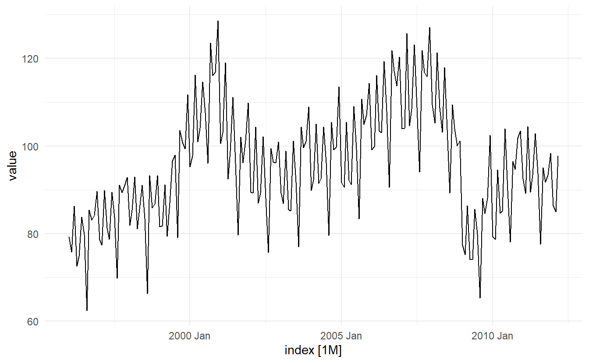

```r

elec_equip %>% 
  ACF() %>% 
  autoplot()
```

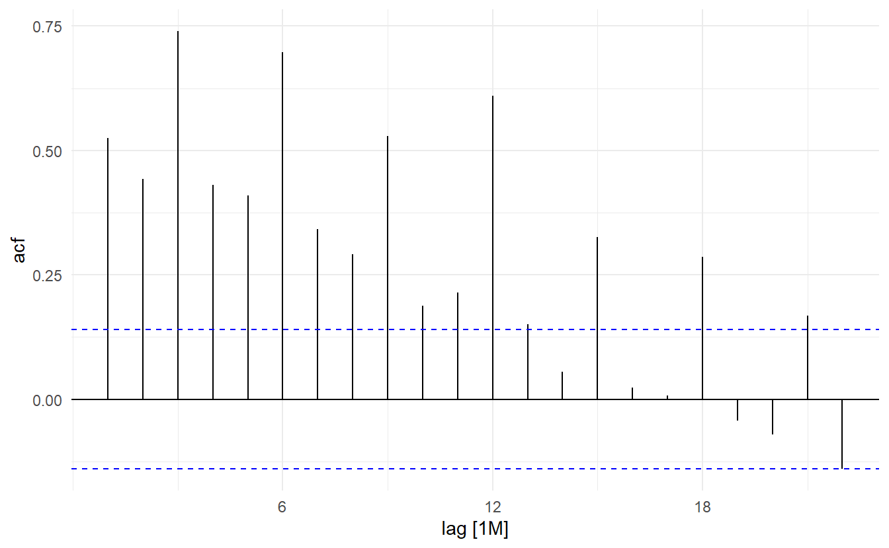

```r

elec_equip %>% features(value, feat_stl)
#> # A tibble: 1 x 9
#>   trend_strength seasonal_streng~ seasonal_peak_y~ seasonal_trough~ spikiness
#>            <dbl>            <dbl>            <dbl>            <dbl>     <dbl>
#> 1          0.943            0.908                0                8   0.00251
#> # ... with 4 more variables: linearity <dbl>, curvature <dbl>,
#> #   stl_e_acf1 <dbl>, stl_e_acf10 <dbl>
```

Use STL decomposition to obtain the seasonal adjusted data  

```r
elec_adjusted <- elec_equip %>% 
  model(STL(value)) %>% 
  components() %>% 
  select(index, season_adjust) %>% 
  as_tsibble(index = index)

elec_adjusted %>% features(season_adjust, feat_stl)
#> # A tibble: 1 x 9
#>   trend_strength seasonal_streng~ seasonal_peak_y~ seasonal_trough~ spikiness
#>            <dbl>            <dbl>            <dbl>            <dbl>     <dbl>
#> 1          0.944           0.0300                0                6   0.00249
#> # ... with 4 more variables: linearity <dbl>, curvature <dbl>,
#> #   stl_e_acf1 <dbl>, stl_e_acf10 <dbl>
```

Plot the data for detection of outliers and anomalies


```r
elec_adjusted %>% autoplot()
```

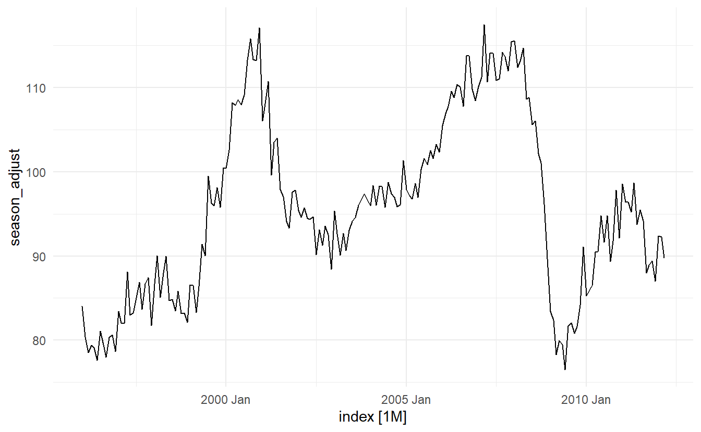

Is there a need for transformation ?  


```r
# close to 1
elec_adjusted %>% features(season_adjust, guerrero)
#> # A tibble: 1 x 1
#>   lambda_guerrero
#>             <dbl>
#> 1           -1.00
```

Fit a ARIMA model:  


```r
elec_fit <- elec_adjusted %>% 
  model(ARIMA(season_adjust ~ PDQ()))

# ARIMA(1, 1, 5) without constant 
elec_fit %>% report()
#> Series: season_adjust 
#> Model: ARIMA(1,1,5) 
#> 
#> Coefficients:
#>         ar1     ma1    ma2     ma3      ma4     ma5
#>       0.567  -0.954  0.322  0.2300  -0.2863  0.2745
#> s.e.  0.149   0.149  0.106  0.0924   0.0913  0.0774
#> 
#> sigma^2 estimated as 8.348:  log likelihood=-478
#> AIC=971   AICc=972   BIC=994
```


Visualization and statistical tests on residuals  


```r
elec_fit %>% 
  gg_tsresiduals()
```

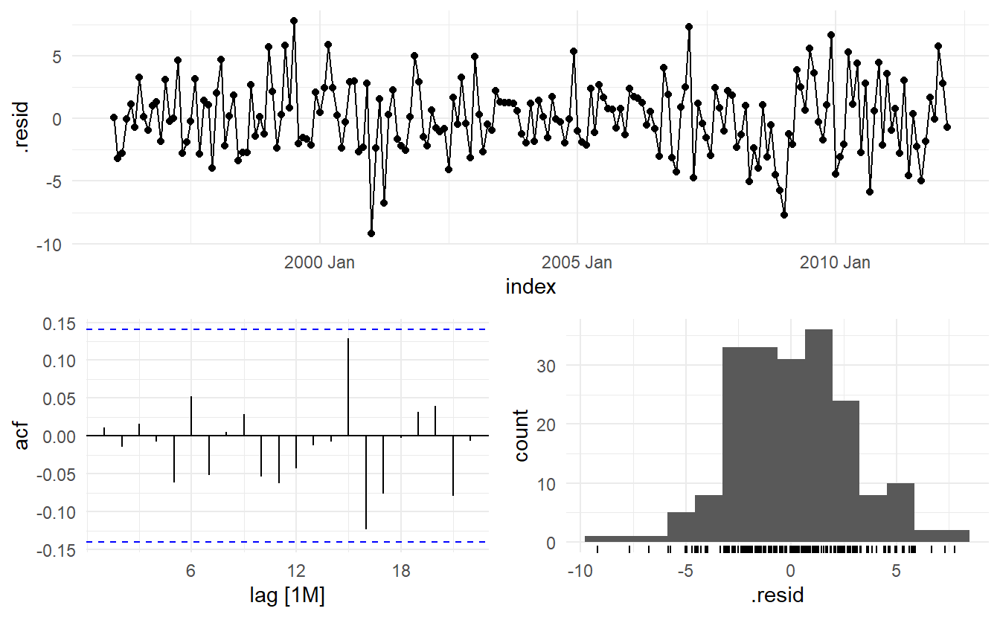

```r

elec_aug <- elec_fit %>% 
  augment()

elec_aug %>% 
  features(.resid, ljung_box, lag = 8, dof = 7)
#> # A tibble: 1 x 3
#>   .model                       lb_stat lb_pvalue
#>   <chr>                          <dbl>     <dbl>
#> 1 ARIMA(season_adjust ~ PDQ())    2.03     0.155
```

Producing forecasts 

```r
elec_fit %>% 
  forecast(h = 24) %>% 
  autoplot(elec_adjusted)
```

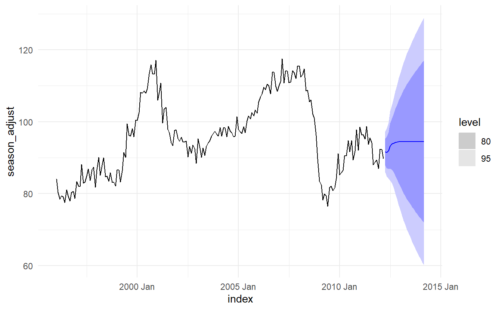

Note that Section \@ref(understanding-arima-models), we mentioned that the long term forecast of an ARIMA model with no constant and $d = 1$ will go to a constant.  

### Plotting the characteristic roots  

The stationarity conditions for the model are that the p complex roots of $\Phi(B)$ lie outside the unit circle, and the invertibility conditions are that the q complex roots of $\Theta(B)$ lie outside the unit circle. So we can see whether the model is close to invertibility or stationarity by a plot of the roots in relation to the complex unit circle.

It is easier to plot the **inverse** roots instead, as they should all lie within the unit circle. This is easily done in R. For the $\text{ARIMA}(3, 1, 1)$ model fitted to the seasonally adjusted electrical equipment index   


```r
gg_arma(elec_fit)
```

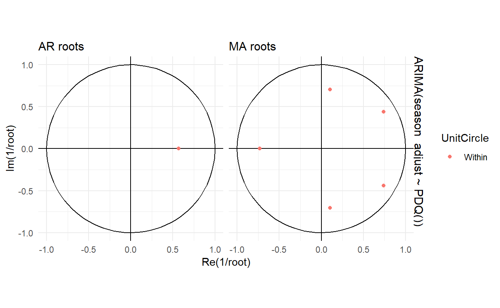
**The `ARIMA()` function will never return a model with inverse roots outside the unit circle**. Models automatically selected by the ARIMA() function will not select a model with roots close to the unit circle.

## Forecasting with ARIMA models  

### Point forecasts  

https://otexts.com/fpp3/arima-forecasting.html  

### Prediction intervals  

The calculation of ARIMA prediction intervals is more difficult, and here only a simple case is presented.  

The first prediction interval is easy to calculate. If $\hat{\sigma}^2$ is the standard deviation of the residuals, then a 95% prediction interval is given by $\hat{y}_{T + 1|T} \pm 1.96 \hat{\sigma}^2$. This result is true for all ARIMA models regardless of their parameters and orders.

Multi-step prediction intervals for ARIMA(0, 0, q) models are relatively easy to calculate. We can write the model as  

$$
y_t = \varvarepsilon_t + \sum_{i=1}^{q}\theta_i\varepsilon_{t-i}
$$

Then, the estimated forecast variance can be written as   

$$
\hat{\sigma}_h = \hat{\sigma}^2[1 + \sum_{i = 1}^{h - 1}\hat{\theta}_i^2]
$$

and a 95% prediction interval is given by $y_{T+h|T}±1.96 \sqrt{\hat{\sigma}_h^2}$. 

In Section \@ref(koyck-transformation-and-invertibility), we showed that an AR(1) model can be written as an MA($\infty$) model. Using this equivalence, the above result for MA(q) models can also be used to obtain prediction intervals for AR(1) models.  

The prediction intervals for ARIMA models are based on assumptions that the residuals are uncorrelated and normally distributed. If either of these assumptions does not hold, then the prediction intervals may be incorrect. For this reason, always plot the ACF and histogram of the residuals to check the assumptions before producing prediction intervals.

In general, prediction intervals from ARIMA models increase as the forecast horizon increases. For stationary models (i.e., with $d = 0$) they will converge, so that prediction intervals for long horizons are all essentially the same. For $d \ge 1$, the prediction intervals will continue to grow into the future.   

As with most prediction interval calculations, ARIMA-based intervals tend to be too narrow. This occurs because only the variation in the errors has been accounted for. There is also variation in the parameter estimates, and in the model order, that has not been included in the calculation. In addition, the calculation assumes that the historical patterns that have been modelled will continue into the forecast period.  

## Seasonal ARIMA models    

So far, we have restricted our attention to non-seasonal data and non-seasonal ARIMA models. However, ARIMA models are also capable of modelling a wide range of seasonal data.  

A seasonal ARIMA model includes additional seasonal terms, written as follows  

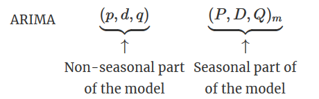
where $m$ is number of observations per year.   

The seasonal part of the model consists of terms that are similar to the non-seasonal components of the model, but involve backshifts of the seasonal period. For example, an $\text{ARIMA}(1, 1, 1)(1, 1, 1)_4$ model (without a constant) is for quarterly data (m = 4), and can be written as (Not that a seasonal difference is **not** a m order difference) 

$$
(1 - \Phi_1B^4)(1 - \phi_1B)(1 - B^4)(1 - B)y_t = \varepsilon_t(1 - \theta_1B)(1 - \Theta_1B^4)
$$

It can be easily shown that a SARIMA model can be converted to an ARMA model. For autoregression terms


$$
ar = (1 - \phi_1B - \cdots - \phi_pB^p)(1 - B)^d \\
sar = (1 - \Phi_1 B^m - \cdots - B^{Pm})(1 - B^m)^D 
$$
Then, the AR polynomial of the inverted ARMA model can be written as  

$$
AR = ar \times sar
$$

For moving average terms, we have

$$
ma = (1 + \theta_1B + \cdots + \theta_qB^q) \\
sma = (1 + \Theta_1B^m + \cdots + \Theta_1B^{Pm})(1 - B^m)^D 
$$

Then, the MA polynomial of the inverted ARMA model can be written as 

$$
MA = ma \times sma
$$


In this way, we can get the ARMA(u, v) model inverted from the SARIMA model. It can be written as 

$$
(1 - \phi_1'B - \cdots - \phi_u'B^u)y_t = (1 - \theta_1'B - \cdots - \theta_v'B^v)\varepsilon_t
$$

From Section \@ref(three-representations-of-an-arma-model), we also know that an ARMA model can be converted to AR or MA models under certain circumstances, so that SARIMA models can be further transformed in a similar way.  


### ACF and PACF

The seasonal part of an AR or MA model will be seen in the seasonal lags of the PACF and ACF. For example, an $\text{ARIMA}(0, 0, 0)(0, 0, 1)_{12}$ model will show: 


- a spike at lag 12 in the ACF but no other significant spikes;  

- exponential decay in the seasonal lags of the PACF (i.e., at lags 12, 24, 36, …).


Similarly, an $\text{ARIMA}(0, 0, 0)(1, 0, 0)_{12}$ model will show:


- exponential decay in the seasonal lags of the ACF;  

- a single significant spike at lag 12 in the PACF.


### Example: European quarterly retail trade    

`eu_retail`: quarterly European retail trade data from 1996 to 2011


```r
eu_retail <- as_tsibble(fpp2::euretail)
eu_retail %>% autoplot(value)
```

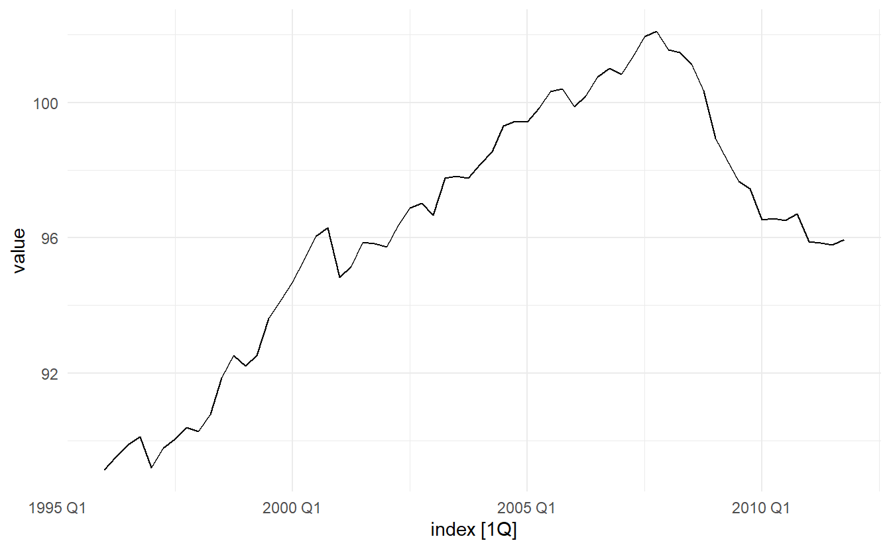

The data is non-stationary, with a degree of seasonality 


```r
eu_retail %>% features(value, feat_stl)
#> # A tibble: 1 x 9
#>   trend_strength seasonal_streng~ seasonal_peak_y~ seasonal_trough~ spikiness
#>            <dbl>            <dbl>            <dbl>            <dbl>     <dbl>
#> 1          0.998            0.703                0                1   3.77e-7
#> # ... with 4 more variables: linearity <dbl>, curvature <dbl>,
#> #   stl_e_acf1 <dbl>, stl_e_acf10 <dbl>
```


We will first take a seasonal difference. These still appear to be some sort of nonstationarity, so we take an additional first difference


```r
eu_retail %>% 
  gg_tsdisplay(difference(value, 4), plot_type='partial')
```

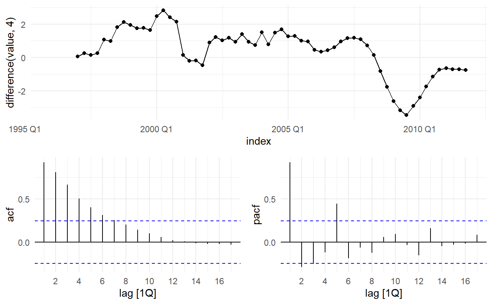


```r
eu_retail %>% 
  gg_tsdisplay(value %>% difference(4) %>% difference(),
  plot_type='partial')
```

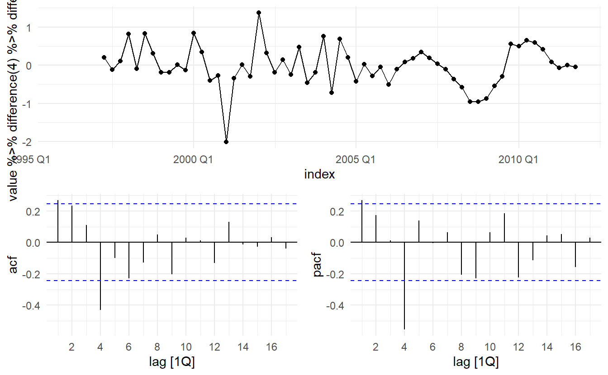


Our aim now is to find an appropriate ARIMA model based on the ACF and PACF plots. The significant spike at lag 1 in the ACF suggests a non-seasonal MA(1) component, and the significant spike at lag 4 in the ACF suggests a seasonal MA(1) component. Consequently, we begin with an $\text{ARIMA}(0, 1, 1)(0, 1, 1)_4$ model, indicating a first and seasonal difference, and non-seasonal and seasonal MA(1) components. By analogous logic applied to the PACF, we could also have started with an $\text{ARIMA}(1,1,0)(1,1,0)_4$ model. (Not that only either $p$ and $q$ is zero can ACF and PACF plots be used to decide orders. \@ref(arma-models))   
  
  

```r
eu_retail_fit <- eu_retail %>% 
  model(ARIMA(value ~ pdq(0, 1, 1) + PDQ(0, 1, 1)))

eu_retail_fit %>% report()
#> Series: value 
#> Model: ARIMA(0,1,1)(0,1,1)[4] 
#> 
#> Coefficients:
#>         ma1    sma1
#>       0.290  -0.691
#> s.e.  0.112   0.119
#> 
#> sigma^2 estimated as 0.188:  log likelihood=-34.6
#> AIC=75.3   AICc=75.7   BIC=81.5
```

Check residuals 


```r
eu_retail_aug <- eu_retail_fit %>% augment()

eu_retail_aug %>% 
  ACF(.resid) %>% 
  autoplot()

eu_retail_aug %>% 
  PACF(.resid) %>% 
  autoplot()
```

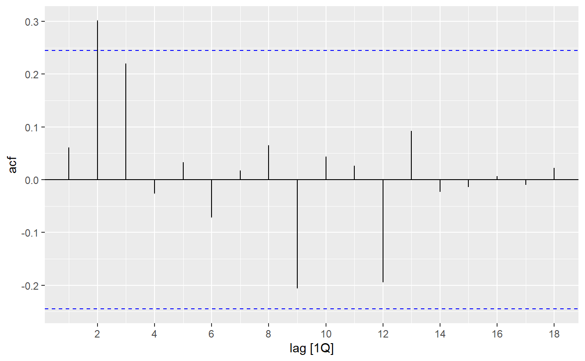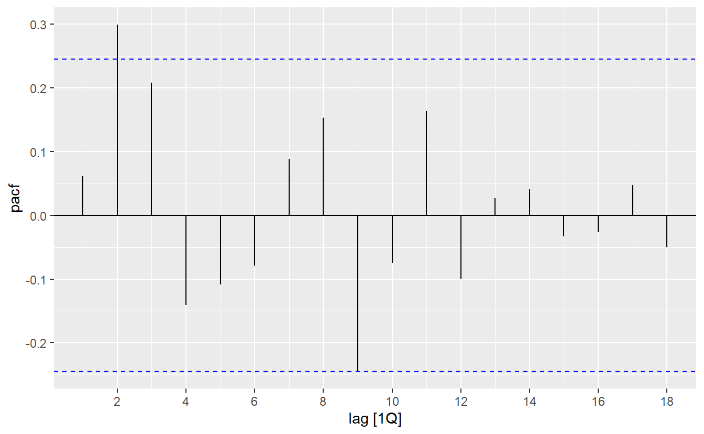

Both the ACF and PACF show significant spikes at lag 2, and almost significant spikes at lag 3, indicating that some additional non-seasonal terms need to be included in the model. What if we just let `ARIMA()` pick a model for us?  


```r
eu_retail_fit2 <- eu_retail %>% 
  model(ARIMA(value))

eu_retail_fit2 %>% report()
#> Series: value 
#> Model: ARIMA(0,1,3)(0,1,1)[4] 
#> 
#> Coefficients:
#>         ma1    ma2    ma3    sma1
#>       0.263  0.369  0.420  -0.664
#> s.e.  0.124  0.126  0.129   0.154
#> 
#> sigma^2 estimated as 0.156:  log likelihood=-28.6
#> AIC=67.3   AICc=68.4   BIC=77.7
```

The automatic picked model is $\text{ARIMA}(0, 1, 3)(0, 1, 1)_4$, and has lower $\text{AIC}_c$, 68.39 compared to 75.72. This in some sense explains why previous residuals show some non-seaonal correlation pattern and how it is fixed. 


```r
eu_retail_fit2 %>% 
  gg_tsresiduals()
```

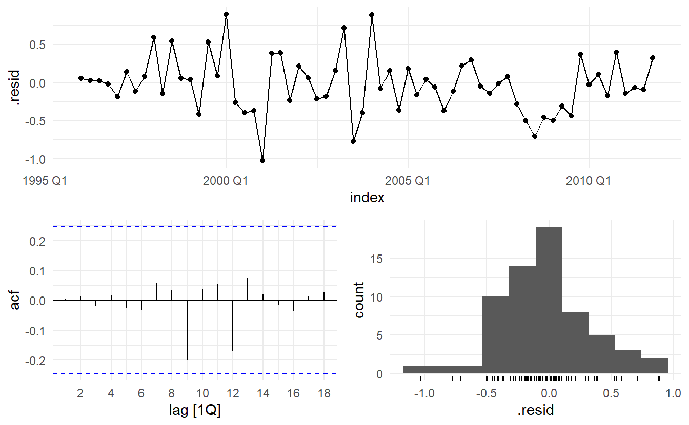

```r

eu_retail_fit2 %>%
  augment() %>% 
  features(.resid, ljung_box, lag = 8, dof = 5)
#> # A tibble: 1 x 3
#>   .model       lb_stat lb_pvalue
#>   <chr>          <dbl>     <dbl>
#> 1 ARIMA(value)   0.511     0.916
```
Forecasts from the model for the next three years are shown below 


```r
eu_retail_fit2 %>% 
  forecast(h = 12) %>% 
  autoplot(eu_retail)
```

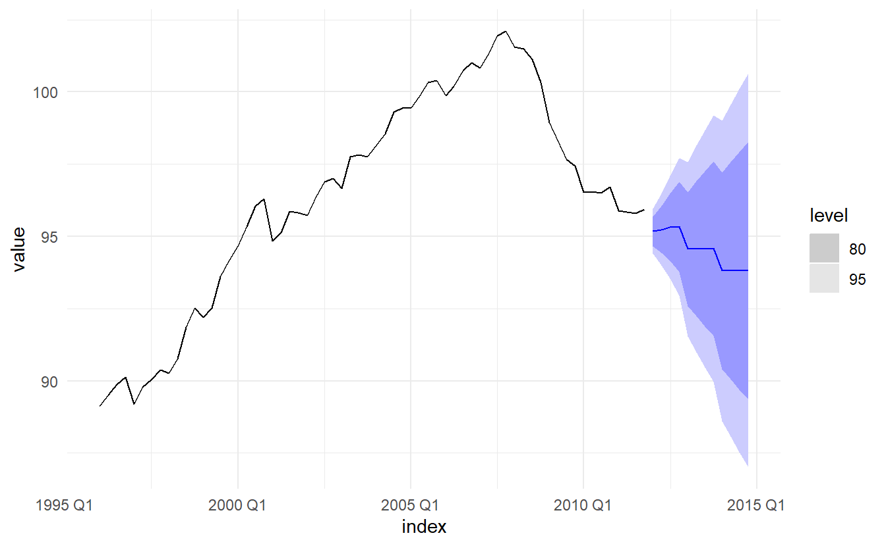

The forecasts follow the recent trend in the data, because of the double differencing. The large and rapidly increasing prediction intervals show that the retail trade index could start increasing or decreasing at any time — while the point forecasts trend downwards, the prediction intervals allow for the data to trend upwards during the forecast period.

### Example: Corticosteroid drug sales in Australia  

We will try to forecast monthly corticosteroid drug sales in Australia. There is a small increase in the variance with the level, so we take logarithms to stabilise the variance.    


```r
h02 <- tsibbledata::PBS %>%
  filter(ATC2 == "H02") %>%
  summarize(cost = sum(Cost) / 1e6)  

h02 %>%
  mutate(cost_log = log(cost)) %>% 
  pivot_longer(c(cost, cost_log), names_to = "measure", values_to = "value") %>% 
  ggplot() + 
  geom_line(aes(Month, value)) + 
  facet_wrap(~ measure, scales = "free_y", nrow = 2)
```

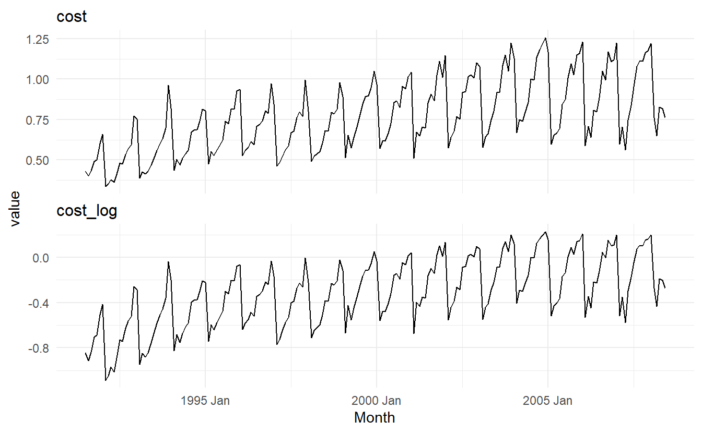

The data are strongly seasonal and obviously non-stationary, so seasonal differencing will be used. It is unclear that whether another difference should be used at this point, though we decide not to. The last few observations appear to be different (more variable) from the earlier data. This may be due to the fact that data are sometimes revised when earlier sales are reported late.


```r
h02 %>% 
  gg_tsdisplay(difference(log(cost), 12), 
               plot_type='partial', 
               lag_max = 24) 
```

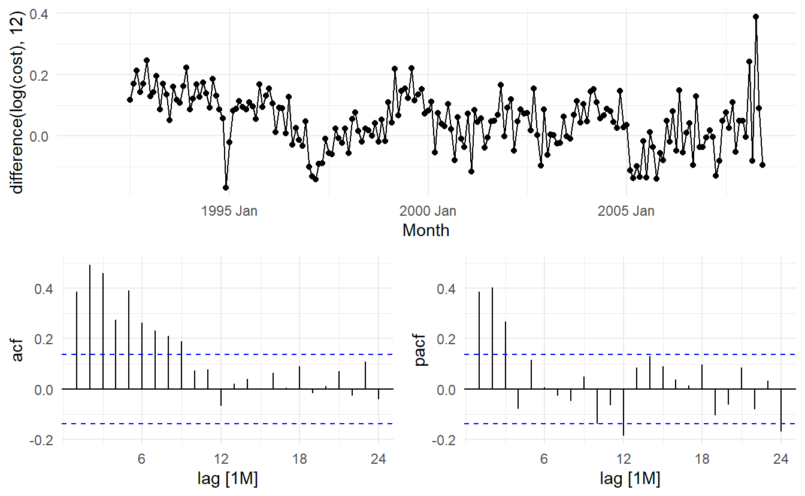
In the plots of the seasonally differenced data, there are spikes in the PACF at lags 12 and 24, but nothing at seasonal lags in the ACF. This may be suggestive of a seasonal AR(2) term. In the non-seasonal lags, there are three significant spikes in the PACF, suggesting a possible AR(3) term. The pattern in the ACF is not indicative of any simple model.

Consequently, this initial analysis suggests that a possible model for these data is an $\text{ARIMA}(3, 0, 0)(2, 1, 0)_12$. The $\text{AIC}_c$ of such model and some variations are shown: 


Of these models, the best is the $ARIMA(3, 0, 1)(0, 1, 2)_12$ model  


```r
h02_fit <- h02 %>% 
  model(ARIMA(log(cost) ~ 0 + pdq(3, 0, 1) + PDQ(0, 1, 2))) # without constant

h02_fit %>% report()
#> Series: cost 
#> Model: ARIMA(3,0,1)(0,1,2)[12] 
#> Transformation: log(.x) 
#> 
#> Coefficients:
#>          ar1     ar2     ar3    ma1     sma1     sma2
#>       -0.160  0.5481  0.5678  0.383  -0.5222  -0.1768
#> s.e.   0.164  0.0878  0.0942  0.190   0.0861   0.0872
#> 
#> sigma^2 estimated as 0.004278:  log likelihood=250
#> AIC=-486   AICc=-485   BIC=-463
```


```r
h02_aug <- h02_fit %>% augment()

h02_aug %>% 
  ACF(.resid, lag_max = 36) %>%
  autoplot()

h02_aug %>% 
  PACF(.resid, lag_max = 36) %>%
  autoplot()
```

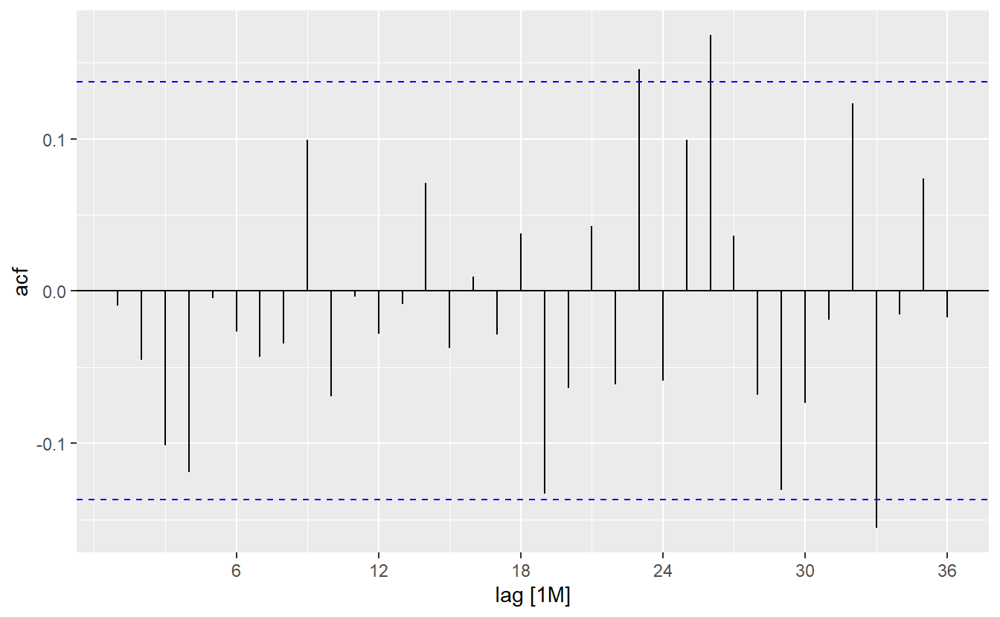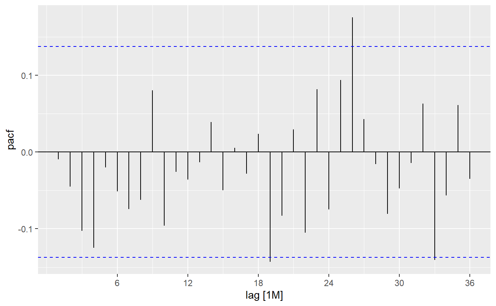


```r
h02_aug %>% 
  features(.resid, ljung_box, lag = 24, dof = 7) # h = 2m for seasonal data 
#> # A tibble: 1 x 3
#>   .model                                             lb_stat lb_pvalue
#>   <chr>                                                <dbl>     <dbl>
#> 1 ARIMA(log(cost) ~ 0 + pdq(3, 0, 1) + PDQ(0, 1, 2))    23.7     0.129
```


Produce forecasts 


```r
h02_fit %>% 
  forecast() %>% 
  autoplot(h02)
```

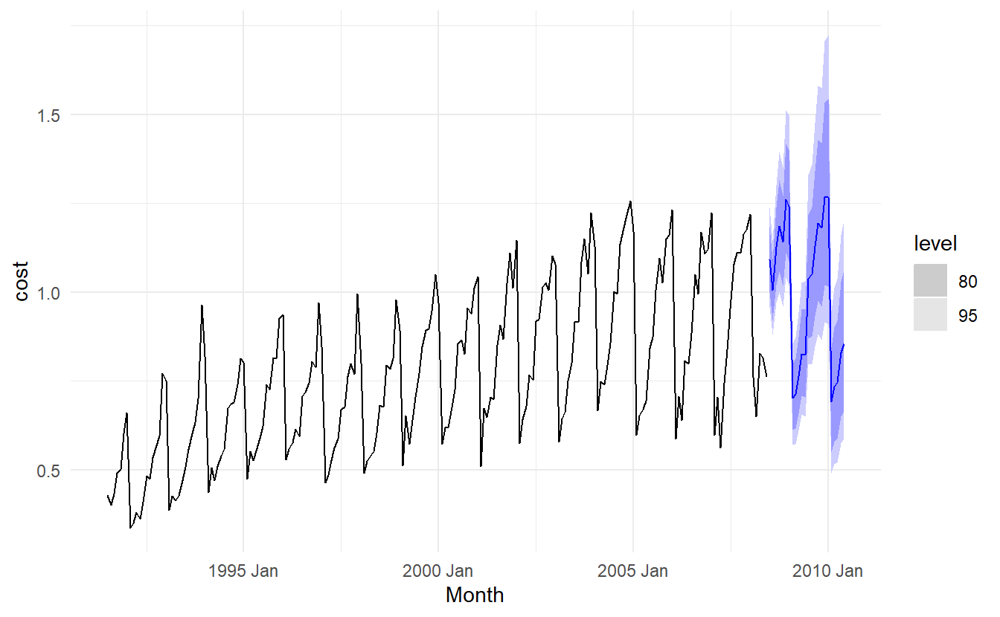


## ETS and ARIMA   

While linear exponential smoothing models are all special cases of ARIMA models, the non-linear exponential smoothing models have no equivalent ARIMA counterparts. On the other hand, there are also many ARIMA models that have no exponential smoothing counterparts. In particular, all ETS models are non-stationary, while some ARIMA models are stationary.

The ETS models with seasonality or non-damped trend or both have two unit roots (i.e., they need two levels of differencing to make them stationary). All other ETS models have one unit root (they need one level of differencing to make them stationary).  

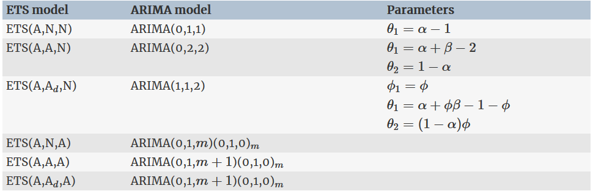

The AICc is useful for selecting between models in the same class. For example, we can use it to select an ARIMA model between candidate ARIMA models or an ETS model between candidate ETS models. **However, it cannot be used to compare between ETS and ARIMA models because they are in different model classes**, and the likelihood is computed in different ways. The examples below demonstrate selecting between these classes of models.    

### Example: Comparing `ARIMA()` and `ETS()` on non-seasonal data  

We can use time series cross-validation to compare an ARIMA model and an ETS model. Let’s consider the Australian population from the `global_economy` dataset  


```r
aus_economy <- global_economy %>% 
  filter(Code == "AUS") %>%
  mutate(Population = Population/1e6)

aus_economy %>%
  slice(-n()) %>%
  stretch_tsibble(.init = 10) %>%
  model(
    ETS(Population),
    ARIMA(Population)
  ) %>%
  forecast(h = 1) %>%
  accuracy(aus_economy)
#> # A tibble: 2 x 10
#>   .model            Country   .type     ME   RMSE    MAE   MPE  MAPE  MASE  ACF1
#>   <chr>             <fct>     <chr>  <dbl>  <dbl>  <dbl> <dbl> <dbl> <dbl> <dbl>
#> 1 ARIMA(Population) Australia Test  0.0420 0.194  0.0789 0.277 0.509 0.317 0.188
#> 2 ETS(Population)   Australia Test  0.0202 0.0774 0.0543 0.112 0.327 0.218 0.506
```

In this case the ETS model has higher accuracy on the cross-validated performance measures. Below we generate and plot forecasts for the next 5 years generated from an ETS model.  


```r
aus_economy %>%
  model(ETS(Population)) %>%
  forecast(h = "5 years") %>%
  autoplot(aus_economy)
```

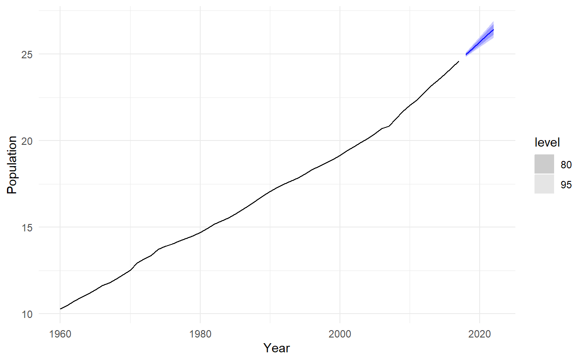

### Example: Comparing `ARIMA()` and `ETS()` on seasonal data

In this case we want to compare seasonal ARIMA and ETS models applied to the quarterly cement production data (from aus_production). This time we separate the original data into testing set and training set.  We create a training set from the beginning of 1988 to the end of 2007 and select an ARIMA and an ETS model using the `ARIMA()` and `ETS()` functions.    


```r
# Consider the cement data beginning in 1988
cement <- aus_production %>%
  filter(year(Quarter) >= 1988)

# Use 20 years of the data as the training set
train <- cement %>%
  filter(year(Quarter) <= 2007)
```


```r
cement_fit_arima <- train %>% model(ARIMA(Cement))

report(cement_fit_arima)
#> Series: Cement 
#> Model: ARIMA(1,0,1)(2,1,1)[4] w/ drift 
#> 
#> Coefficients:
#>          ar1     ma1   sar1    sar2    sma1  constant
#>       0.8886  -0.237  0.081  -0.234  -0.898      5.39
#> s.e.  0.0842   0.133  0.157   0.139   0.178      1.48
#> 
#> sigma^2 estimated as 11456:  log likelihood=-464
#> AIC=941   AICc=943   BIC=957
```

Residuals from the ARIMA model appear to be white noise.

```r
cement_fit_arima %>% gg_tsresiduals()
```

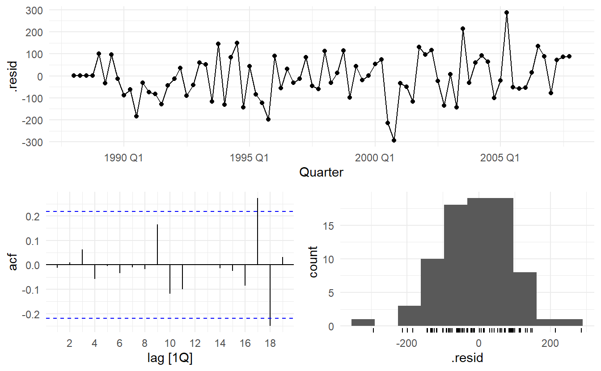

```r

augment(cement_fit_arima) %>%
  features(.resid, ljung_box, lag = 8, dof = 7)
#> # A tibble: 1 x 3
#>   .model        lb_stat lb_pvalue
#>   <chr>           <dbl>     <dbl>
#> 1 ARIMA(Cement)   0.783     0.376
```


The output below also shows the ETS model selected and estimated by `ETS()`. This model also does well in capturing all the dynamics in the data  


```r
cement_fit_ets <- train %>% model(ETS(Cement))
report(cement_fit_ets)
#> Series: Cement 
#> Model: ETS(M,N,M) 
#>   Smoothing parameters:
#>     alpha = 0.753 
#>     gamma = 0.0001 
#> 
#>   Initial states:
#>     l   s1   s2   s3    s4
#>  1695 1.03 1.05 1.01 0.912
#> 
#>   sigma^2:  0.0034
#> 
#>  AIC AICc  BIC 
#> 1104 1106 1121

cement_fit_ets %>% gg_tsresiduals()
```

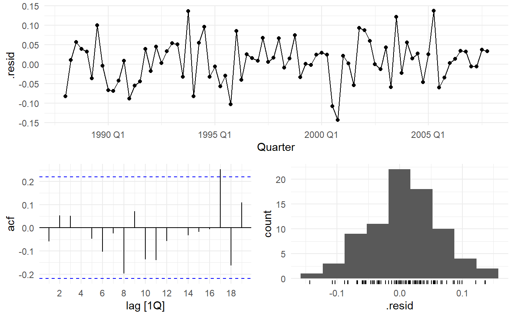

```r

augment(cement_fit_ets) %>%
  features(.resid, ljung_box, lag = 8, dof = 6)
#> # A tibble: 1 x 3
#>   .model      lb_stat lb_pvalue
#>   <chr>         <dbl>     <dbl>
#> 1 ETS(Cement)    5.49    0.0642
```


The output below evaluates the forecasting performance of the two competing models over the test set. In this case the ARIMA model seems to be the slightly more accurate model based on the test set RMSE, MAPE and MASE.  


```r
bind_rows(
  cement_fit_arima %>% accuracy(),
  cement_fit_ets %>% accuracy(),
  cement_fit_arima %>% forecast(h = "2 years 6 months") %>%
    accuracy(cement),
  cement_fit_ets %>% forecast(h = "2 years 6 months") %>%
    accuracy(cement)
)
#> # A tibble: 4 x 9
#>   .model        .type         ME  RMSE   MAE    MPE  MAPE  MASE    ACF1
#>   <chr>         <chr>      <dbl> <dbl> <dbl>  <dbl> <dbl> <dbl>   <dbl>
#> 1 ARIMA(Cement) Training   -6.21  100.  79.9 -0.670  4.37 0.546 -0.0113
#> 2 ETS(Cement)   Training   12.8   103.  80.0  0.427  4.41 0.547 -0.0528
#> 3 ARIMA(Cement) Test     -161.    216. 186.  -7.71   8.68 1.27   0.387 
#> 4 ETS(Cement)   Test     -171.    222. 191.  -8.07   8.85 1.30   0.579
```

Notice that the ETS model fits the training data slightly better than the ARIMA model, but that the ARIMA model provides more accurate forecasts on the test set. A good fit to training data is never an indication that the model will forecast well. Below we generate and plot forecasts from an ETS model for the next 3 years.  


```r
# Generate forecasts from an ETS model
cement %>% 
  model(ETS(Cement)) %>% 
  forecast(h = "3 years") %>%
  autoplot(cement)
```

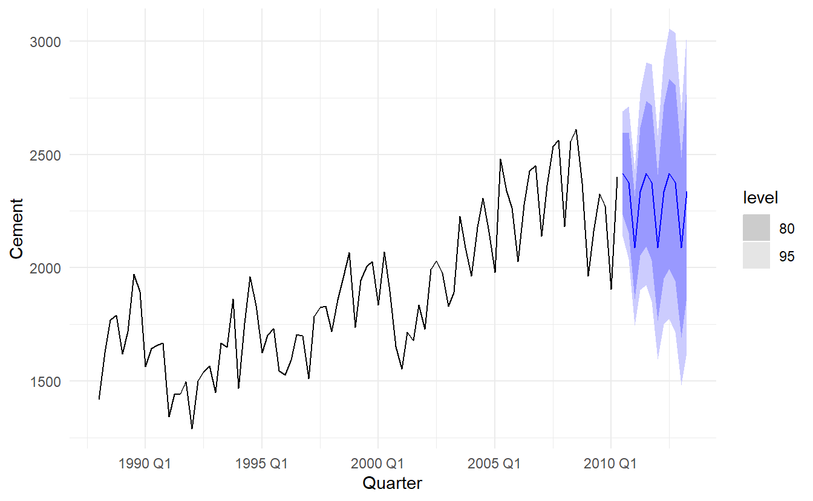

